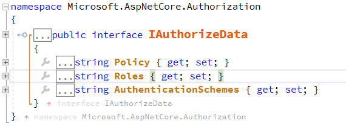

在前面5篇博客中介绍了OAuth2和OIDC(OpenId Connect)，其作用是授权和认证。那么当我们得到OAuth2的`Access Token`或者OIDC的`Id Token`之后，我们的**资源服务**如何来验证这些token是否有权限来执行对资源的某一项操作呢？比如我有一个API `/book`，它具有如下5个操作 :

1. POST /book : 添加一本书
2. GET /book/{id} : 获取一本书
3. PUT /book/{id} : 更新一本书
4. DELETE /book/{id} : 删除一本书
5. GET /book : 获取书的列表

其伪代码如下 :

```csharp
[Route("book")]
public class BookController : Controller
{
    [HttpGet("")]
    public Book[] Get() { return null; }

    [HttpGet("{id}")]
    public Book Get(int id) { return null; }

    [HttpPost("")]
    public Book Post(Book book) { return null; }

    [HttpPut("{id}")]
    public Book Put(int id, Book book) { return null; }

    [HttpDelete("{id}")]
    public Book Delete(int id) { return null; }
}
```

那么我们先看看基于OAuth2的Access Token，OIDC的Id Token和传统的基于角色的权限控制是如何处理控制这些资源的操作。

# 1 OAuth2 Access Token scope {#1-oauth2-access-token-scope}

[01-authorization-code]:../01-oauth2-authorization/#5-1-authorization-code
[01-implicit]:../01-oauth2-authorization/#5-2-implicit
[01-resource-owner-password-credentials-grant]:../01-oauth2-authorization/#5-3-resource-owner-password-credentials-grant
[01-client-credentials-grant]:../01-oauth2-authorization/#5-4-client-credentials-grant

我们都知道OAuth2的最终产物是提供给我们一个`Access Token`，而这个Access Token中包含了一个[Scope][01-scope]的字段，这个字段代表的是**授权服务器**或者**资源拥有者**授予第三方客户端允许操作**资源服务器**的哪些资源的范围。这里有一点需要注意的是，这个授权过程可以有**资源拥有者**的参与([Authorization Code][01-authorization-code],[Implicit][01-implicit],[Resource Owner Password Credentials Grant][01-resource-owner-password-credentials-grant])，也可以没有**资源拥有者**的参与([Client Credentials Grant][01-client-credentials-grant])。那么基于上述的book的资源，我们可以定义一个`user_manager`的Scope，来控制对book的五个操作的权限控制。那么book的基于Scope的权限控制看起来就像是这样的 :

```csharp
[Route("book")]
public class BookController : Controller
{
    [HttpGet("")]
    [Scope("book_manager")]
    public Book[] Get() { return null; }

    [HttpGet("{id}")]
    [Scope("book_manager")]
    public Book Get(int id) { return null; }

    [HttpPost("")]
    [Scope("book_manager")]
    public Book Post(Book book) { return null; }

    [HttpPut("{id}")]
    [Scope("book_manager")]
    public Book Put(int id, Book book) { return null; }

    [HttpDelete("{id}")]
    [Scope("book_manager")]
    public Book Delete(int id) { return null; }
}
```

注意看红色的部分，为每一个操作都添加了一个`[Scope("book_manager")]`的描述。如果Access Token拥有`user_manager`这个Scope(不管他是OAuth2的哪一个授权方式颁发的，我们的最终代码部分只认Scope)，那么对这些API的调用就是被允许的，否则视为无权操作。

# 2 OIDC Id Token sub {#2-oidc-id-token-sub}

关于`Id Token`的用途以及其包含哪些信息请参考[Id Token][04-id-token]。**Id Token和Access Token的不同之处在于它一定是包含某一个用户的标识`sub`，但是没有Scope，这是因为Id Token的用途是认证当前用户是谁，所以用户是必须存在的；由于仅仅是认证，则不会包含被认证用户可以做哪些操作之类的授权相关的事情**。那么针对Id Token，我们的API应该如何进行权限管控呢？通常的做法是使用传统的基于校色的权限控制(Role Based Access Control)。其实现细节就不解释了，它的模型大致是 : 一个实体(用户或者组织)拥有一组角色，每一个角色代表着一组权限集合。感觉是不是和Scope很像呢，其实差不多。我们定义一个这样的角色`图书管理员`吧。这里是故意和Scope的命名区分开的，因为其来源不同，那么我们最终实现的时候也会是独立开来的。

```csharp
 [Route("book")]
public class BookController : Controller
{
    [HttpGet("")]
    [Scope("book_manager")]
    [Role("图书管理员")]
    public Book[] Get() { return null; }

    [HttpGet("{id}")]
    [Scope("book_manager")]
    [Role("图书管理员")]
    public Book Get(int id) { return null; }

    [HttpPost("")]
    [Scope("book_manager")]
    [Role("图书管理员")]
    public Book Post(Book book) { return null; }

    [HttpPut("{id}")]
    [Scope("book_manager")]
    [Role("图书管理员")]
    public Book Put(int id, Book book) { return null; }

    [HttpDelete("{id}")]
    [Scope("book_manager")]
    [Role("图书管理员")]
    public Book Delete(int id) { return null; }
}
```

如果`sub`代表的用户自身拥有或者其所属的组织机构拥有(不管其是怎么组织管理的吧，最终我们可以知道这个用户是否具有某一个角色)`图书管理员`这个角色。则允许其访问book的这些操作。

# 3 以上两种方式的弊端在哪里？ {#3-problem}

其实不止以上两种，比如在Asp.Net Core中有内置的这些授权控制组件 :


以上这些本质上和上面的基于Scope和基于Role的属于同一种类型。我们这样做当然可以工作，但是问题来了，**它们是不是理解起来很混乱？能满足我们变化的需求吗？总有着一种把简单的事情搞复杂的感觉**。比如现在我增需要增加一个角色，超级管理员，那么上述的代码是不是需要我们做出改变呢？

```csharp
[HttpGet("")]
[Scope("book_manager")]
[Role("图书管理员","超级管理员")]
public Book[] Get() { return null; }
```

再比如，现在需要增加一个Scope`book_reader`，它只能执行读取的操作，又要做出改变了吧。况且即使我们把Scope和Role合二为一了，还是混乱不堪。

# 4 基于权限为最小粒度的解决方案 {#4-permission}

那么造成这些问题的根本原因是什么？答 : **不管是Scope还是Role它们体现的都是一个隐式的描述信息，而不是某一个具体的操作行为的描述信息**。既然我们知道了其症结所在，那么怎么解决这个问题呢？原理很简单，使用权限作为我们的最小单元，把Scope和Role等等还有其他的一些管理组织权限的概念都作为一个中间层，禁止它们出现在接口权限验证的地方，而是仅作为管理组织`Permission`的手段存在。然后改造上面的代码如下 : 

```csharp
[Route("book")]
public class BookController : Controller
{
    [HttpGet("")]
    [Permission("book.read")]
    public Book[] Get() { return null; }

    [HttpGet("{id}")]
    [Permission("book.read")]
    public Book Get(int id) { return null; }

    [HttpPost("")]
    [Permission("book.add")]
    public Book Post(Book book) { return null; }

    [HttpPut("{id}")]
    [Permission("book.edit")]
    public Book Put(int id, Book book) { return null; }

    [HttpDelete("{id}")]
    [Permission("book.delete")]
    public Book Delete(int id) { return null; }
}
```

我们把每一个操作都定义一个权限Permission，不管你是Access Token的Scope，还是Role，都不会在这里出现。比如在检查**超级管理员**是否允许操作的时候，我们可以直接放行(把这些检查和我们对接口的操作权限的描述分开)。如果是名为`book_reader`的Scope的时候，我们让book_reader只关联`book.read`这个Permission即可，而这种关联关系的管理，我们是可以通过数据存储来维持的，也很方便的提供管理页面来灵活的配置。而最终的代码上关心的只是`Permission`。这种方式可以称为**Resource Based Access Control**或者**Permission Based Access Control**。
# 5 Apache Shiro {#5-apache-shiro}

以上是我自己的一些理解和思路，然后我发现了Apache Shiro这个项目，感觉就像是找到了组织，Apache Shiro走的更远，而且为Permission定义了一套规则。强烈建议读一读<https://shiro.apache.org/permissions.html>这篇文档。而.Net这边就没有这么好的福气了，，，Asp.Net Core中的默认授权过滤器还是传统的方式。


不过基于Asp.Net Core的Filter : IAuthorizationFilter，我们可以把这一整套授权控制方式给替换掉。示例代码 : 

1. 定义Filter : <https://github.com/linianhui/oidc.example/tree/master/1-src/aspnetcore.filters.permissions>
2. 消费Filter : <https://github.com/linianhui/oidc.example/tree/master/1-src/web.oauth2.resources.aspnetcore>


从此和讨厌的`[Authorize(Roles = "图书管理员",Policy = "XXX")]`说再见了。

以上只是个人的一些理解，如有错误，欢迎指正。

# 6 参考资料 {#6-reference}

强烈推荐 : https://shiro.apache.org/permissions.html

https://shiro.apache.org/

https://stormpath.com/blog/new-rbac-resource-based-access-control

https://docs.microsoft.com/en-us/aspnet/core/security/authorization/


[01-scope]:../01-oauth2-authorization/#5-1-1-authorization-request
[01-authorization-code]:../01-oauth2-authorization/#5-1-authorization-code
[01-implicit]:../01-oauth2-authorization/#5-2-implicit
[01-resource-owner-password-credentials-grant]:../01-oauth2-authorization/#5-3-resource-owner-password-credentials-grant
[01-client-credentials-grant]:../01-oauth2-authorization/#5-4-client-credentials-grant
[04-id-token]:../04-openid-connect-core/