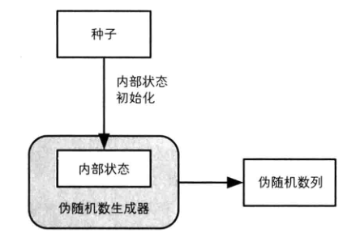
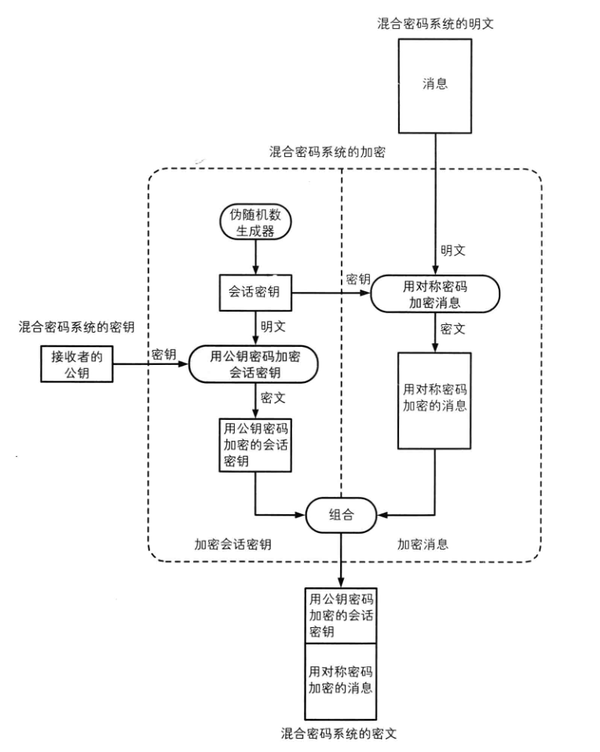

在上一篇[[信息安全] 01 密码工具箱 第1部分](../01-cryptography-toolbox-1/)中介绍了一些密码技术相关的一些基本工具，同时遗留了**一个鸡生蛋蛋生鸡的问题**和**公钥的认证问题**(￣▽￣)"，这里再补充几个常用的工具先。

# 1 伪随机数(Pseudo-Random Number) {#1-pseudo-random-number}

随机数大家不陌生，但是随机数怎么就和信息安全扯上关系了呢?其实想一想我们在给自己的账号设置密码的时候，是不是都会尽量的让其他人不会轻易的猜到我们的密码，虽然并不是随机，但是它就像是满足了随机数的一个特征 :  **不可预测性**。那么对于信息安全来说来说，也是用到了这个特定，当然还有随机数的**随机性**，**不可重复性**这两点特征。

1. 随机性 :  完全杂乱的序列，没有统计学偏差；
2. 不可预测性 :  不能由已经得到的随机数才猜测出下一个随机数是什么；
3. 不可重复性 :  不能生成重复的随机数。

根据生成的随机数是否满足这3点要求(1<2<3，依次增强)。大致可以划分伪弱伪随机数，强伪随机数，真随机数(强度依次增大)。

|            | 随机性 | 不可预测性 | 不可重复性 |                    |
| ---------- | ------ | ---------- | ---------- | ------------------ |
| 弱伪随机数 | ✔      | ✘          | ✘          | 只具备随机性       |
| 强伪随机数 | ✔      | ✔          | ✘          | 同时具备不可预测性 |
| 真随机数   | ✔      | ✔          | ✔          | 同时具备不可重复性 |

仅仅依靠软件我们是无法生成真随机数的，这里我们只关注以下伪随机数(即强伪随机数的生成，可用于密码学安全)的生成，比如一个典型的生成器如下 :  


生成器自己维护一个内部状态，同时接受一个随机数的种子，来生成具体的随机数。具体是实现方式有利用**密码散列函数**(单向性支撑了不可预测性)、利用加密密钥作为随机数的种子的一部分(密钥的机密性支持了不可预测性)等等。

在C#可以使用的伪随机数生成方式 :  

```csharp
//1. Random
var random = new Random();
var random1 = random.Next(100);
Console.WriteLine(random1);

//2. Guid 
var random2 = Guid.NewGuid().ToString("N");
Console.WriteLine(random2);

//3. RNGCryptoServiceProvider
RandomNumberGenerator randomNumberGenerator = new RNGCryptoServiceProvider();
var random3Bytes = new byte[32];
randomNumberGenerator.GetBytes(random3Bytes);
var random3 = random3Bytes.ToHexString();
Console.WriteLine(random3);
```

一般情况下，Guid即可满足要求(但是只有固定的16byte)，如需更高强度的伪随机数，可以使用 `RNGCryptoServiceProvider` 来生成任意长度的随机数。

## 1.1 伪随机数的实际应用 {#1-1-practical-use-of-pseudo-random-number}

1.  生成密钥 :  [对称密码]和[消息认证码]；
2.  生成密钥对 :  [公钥密码]和[数字签名]；
3.  生成nonce :  防止重放攻击；
4.  生成salt :  盐用于增强基于口令的密码的加密。

## 1.2 针对伪随机数生成器的攻击 {#1-2-attack-pseudo-random-number-generator}

伪随机数的程序结构可以说很简单，但是其中的每个环节都有可能成为被攻击的突破口。

1. 对种子的攻击 :  如果暴露了种子，那么其实攻击者就可以得到其所有的伪随机数(假设攻击者知道其内部算法的情况下)。
2. 对伪随机数池的攻击 :  如果我们实现生成了一大堆的伪随机数，用的时候从里面取一个，那么这个存储这些预先生成的伪随机数的地方，就可能会被泄露。

# 2 混合密码系统 {#2-hybrid-cryptosystem}

针对密码相关的基本工具介绍就暂时可以告一段落了，回顾总结以下有这6个[对称密码],[公钥密码],[密码散列函数],[消息认证码],[数字签名],[伪随机数]基本工具，下面我们用这6个基本工具来组合一些高级的工具出来。

上一篇中介绍到了对称密码(比如AES)和公钥密码(比如RSA)，公钥密码解决了对称密码的密钥配送问题(其实是绕过了)。

> 复习以下公钥密码的核心流程 :  发送消息这一方先从消息接收方这里请求一个公钥，然后用公钥加密需要发送的信息，接收方使用自己独自持有的私钥来解密信息。

那么如果作为接收方我想要回复发送方的消息怎么办？按照公钥密码的机制，我是不能用自己的私钥加密信息发出去的，因为拥有持有我的公钥的任何人都是可以解密这个信息的。所以，如果仅使用公钥密码，那么就需要通信双方都持有对方的公钥+自己的私钥。这个成本是很高昂的，首先公钥加密解密的速度是会比对称密码加密低2~3个数量级，也就是几百倍的差异；其次双方都面临着针对公钥的认证问题(防止中间人攻击)。

那么我们可以结合之前提到的一些工具，组合一下，来得到一个性价比高的加密通信方式，即使用以下三个基本工具，组合一个高级点的工具(同时具备对称密码和公钥密码的优点) :  

1. [对称密码] :  因为其加密解密的速度比较快，所消耗的资源相对来说比较小，所以用来在通信中承担真正的加密和解密任务。
2. [公钥密码] :  用来传递对称密码所需的密钥。
3. [伪随机数] :  用来生成对称密码的密钥。

看一下混合密码的加密过程 :  


上图是用伪随机数生成器生成一个加密用的会话密钥，来加密明文；同时，把这个会话密钥作为公钥密码中的明文，用公钥加密；然后把这两个密文组合在一起，同时发送给接收方。这里的公钥密钥起到的是一个保证会话密钥机密性的作用，并未直接用来加密真正的明文(又想起来一句话 :  计算机科学的中任何问题，都可以通过添加一个中间层来解决，此言不虚；在另外一个[认证授权](/authentication-and-authorization)系列的博客中，笔者也有这样的体会)。来看以下接收方解密的流程 :  


相对于加密过程来说，是完全反过来的一个过程，就不再解释了。看一段C#中实际使用的代码 :  

```csharp
static void Main()
{
    string privateKey;
    string publicKey;
    using (var asymmetricAlgorithm = RSA.Create())
    {
        privateKey = asymmetricAlgorithm.ToXmlString(true);
        publicKey = asymmetricAlgorithm.ToXmlString(false);
    }
    // 发送者加密
    var hybridCiphertext = HybridEncrypt(publicKey, "lnh-明文");
    Console.WriteLine(hybridCiphertext);

    // 接收者解密
    var plaintext = HybridDecrypt(privateKey, hybridCiphertext);
    Console.WriteLine(plaintext);

    Console.ReadKey();
}

static string HybridEncrypt(string publicKey, string plaintext)
{
    var plaintextBytes = plaintext.ToBytes(Encoding.UTF8);

    //1. 生成伪随机数，作为会话签名
    var sessionKey = SecurityHelper.BuildPseudoRandomNumber(16);

    //2. 使用sessionKey作为AES的密钥进行加密
    var ciphertextBytes = plaintextBytes.AESEncrypt(sessionKey);

    //3. 使用公钥对会话密钥进行加密
    var sessionkeyCiphertextBytes = sessionKey.RSAEncrypt(publicKey);

    //4. 模拟合成的消息
    var hybridCiphertext = ciphertextBytes.ToHex() + "." + sessionkeyCiphertextBytes.ToHex();

    return hybridCiphertext;
}

static string HybridDecrypt(string privateKey, string hybridCiphertext)
{
    //1. 分离合成的密文
    var ciphertext = hybridCiphertext.Split('.')[0];
    var sessionkeyCiphertext = hybridCiphertext.Split('.')[1];

    var ciphertextBytes = ciphertext.HexToBytes();
    var sessionkeyCiphertextBytes = sessionkeyCiphertext.HexToBytes();

    //2. 用私钥解密得到会话密钥
    var sessionkey = sessionkeyCiphertextBytes.RSADecrypt(privateKey);

    //3. 用会话密码解密
    var plaintextBytes = ciphertextBytes.AESDecrypt(sessionkey);

    return plaintextBytes.GetString(Encoding.UTF8);
}
```

## 2.1 混合密码系统的实际应用 {#2-1-practical-use-of-hybrid-cryptosystem}

SSL/TLS :  最常见的一个应用场景了，后续会介绍。

## 2.2 遗留问题 {#2-2-leftover-problem}

混合密码系统只能说是降低了单纯的公钥密码带来的成本问题，而公钥密码遗留的公钥认证问题，在混合密码系统中依然存在。同时使用了伪随机数生成器，混合密码系统也会面临针对伪随机生成器的一些攻击。

# 3. 证书(Certificate)- 为公钥添加数字签名 {#3-certificate}

总结一下[上篇的数字签名遗留的问题]和上一小节遗留的问题，汇总在一起的核心就是验证公钥必须是真正的发送者提供的。

> 数字签名遗留的问题 :  数字签名可以识别出篡改和伪装，还可以防止否认，也就是说数字签名可以提供信息安全中的**完整性**、**认证**和**不可否认性**这3点的保障(很强大有木有)。然而这一切都基于一个假设**公钥必须是真正的发送者提供的**，和公钥密钥陷入了同一个问题。**我们发现自己陷入了一个死循环 :  数字签名可以用来识别篡改、伪装以及否认的，但是为此我们又需要从一个没有被伪装的真正的发送者那里得到一个没有被篡改的密钥......**这是一个鸡生蛋蛋生鸡的问题。

所以，想要解决这个问题单靠纯粹的技术手段是行不通了，我们陷入了一个死循环，因此引入了一个社会学中的信任体系来转移我们所面临的问题，即证书以及相关体系结构，提供逐级的信任保障。我们先看看证书是一个什么东西，以及证书的这套相关体系如何提供这种**信任**保障的。

我们从一出生就会和各种各样的证书打交道，比如出生证，学生证，身份证，驾照，学位证等等，它们都有一个共同点，就是有你本人的真实信息以及开具证明的机构的盖章。那么在需要提供证明你就是你的地方，出具这个证书即可，如果对方不信任你的证书，则可以到开具证书的机构来校验。假如你提供一个假证，而对方没有严格的审查的话，或许你是可以蒙混过关的。

计算机领域的证书和现实社会中的各种证书的工作原理是完全一样的，因为其工作在计算机体系中，也被称为**数字证书**。计算机中**数字证书**是这样定义的 :  **由证书授权中心进行数字签名的，包含公钥以及其拥有者信息的一个文件。注意 :  证书的真正用途在于为公钥提供认证功能，所以有时候也叫做公钥证书。**我们使用这个被称做证书的文件来**转移我们在信息安全层面所面临的死循环的问题**，**为什么说是转移而不是解决呢**，这是因为你拿到一个证书后，也需要进行校验吧，而校验又需要一个真正的发送者提供的公钥才行，那么你就需要另外一个证书来保障，然后你就会一直的循环下去，，，这也是为什么在计算机体系中有根证书的存在，以及相关的证书授权认证中心会是一个层级的关系，这就是为了在你不信任一个证书的时候，可以继续往上一个层级来寻求验证，直到根证书。那么问题就来了，假如你也不相信根证书怎么办？这其实是一个无法回答的问题，笔者想起来之前读《[人类简史](https://book.douban.com/subject/25985021/)》的时候，有一个至今烙印在脑海中的观点 :  **如今的社会，是一个由想象所构建的秩序**。其实想一想，也确实是如此。比如你为何相信国家的存在呢，为何会把钱存进银行呢。你拿出来一张毛爷爷(从物理的角度来看，它就是一张纸而已)为什么就能从饭店买来一堆食物，这其实就是你相信它，对方也相信它，所有人都相信它，背后有银行体系为其担保，那么什么为银行提供担保呢，背后有我们的国家提供保障，这就是一个信任的体系。**计算机体系的数字证书也是基于这么一个共同的想象所构建的信任秩序**。补充一个新闻 :  Google 宣布将完全取消对沃通和 StartCom 所有证书的信任([https://news.cnblogs.com/n/573409/](https://news.cnblogs.com/n/573409/))，这就是对方不再信任你的根证书的情况。

## 3.1 PKI(Public Key Infrastructure) {#3-1-public-key-infrastructure}

证书得以运行的这个基本的体系称为PKI(Public Key Infrastructure)，即公钥基础设施，它是一套以公钥密码为核心的技术规范标准的一个代名词。总体来说，PKI由3个要素组成 :  PKI的消费者；认证机构(**Certificate Authority**，简称CA)；证书仓库。我们常说的CA证书，就是由CA机构签名颁发的证书。CA负责生成密钥对(也可由用户提供)、负责对用户身份进行认证、负责生成并颁发证书、负责作废证书([https://en.wikipedia.org/wiki/Certificate_revocation_list](https://en.wikipedia.org/wiki/Certificate_revocation_list))。CA是由层级结构的，正是这个层级结构构建了一套证书的验证链条，其中Root CA的证书是自签名的(也就是自己证明自己)，其下级机构逐层签名，构成一个金字塔似的结构。当然你平时自己也可以生成自签名的证书，但是除了你自己，其他地方是不认可你这个证书的(就好比你拿一张白纸，写上这是100块，然后别人就相信你它值100块吗?)，想要得以正常运行，是需要用户主动确认表示认可你这个证书才行。比如我们用Fiddler抓取HTTPS的内容的时候，其实Fiddler自己生成了一个自签名的根证书，然后你主动的确认信赖它，只有这样，证书构造的这个验证链才能得以正常运行。想起来12306就自己搞了一个自签名的证书，想必大家都有印象吧，，，需要自己下载下来证书，然后导入到计算机中，再确认信任它；其实这也是一个很尴尬的事情，全球最大的几家CA清一色不是美国就是俄罗斯。

## 3.2 公钥证书 {#3-2-public-key-certificate}

好了，分析完数字证书这套体系为什么能够运转起来为我们提供公钥的认证的保障之后。看看计算机中的公钥证书是什么样的，我们拿[https://www.google.com](https://www.google.com/ncr)的做例子(F12，打开安全选项卡即可)，证书的相关信息如下 :  


证书除了包含公钥、签名算法和证书的层级结构(比如google这个的顶级颁发机构是GeoTurst Global CA)，还有一些证书的序号，版本信息，有效时间等等。这些信息由一个证书数据格式的标准规范来规定的，一个很通用的格式是[x509](https://en.wikipedia.org/wiki/X.509)，感兴趣的可以了解一下，这里就不介绍了。C#中有很多X509相关的类可以供我们使用。比如来读取一下上述google的这个证书信息(我把证书导出为了base64格式的数据，可以方便的直接包含在代码中) :  

```csharp
private static readonly string GoogleBase64FormatPublicKeyCertificate = @"
-----BEGIN CERTIFICATE-----
MIIEgDCCA2igAwIBAgIIaCtCibL6TxQwDQYJKoZIhvcNAQELBQAwSTELMAkGA1UE
BhMCVVMxEzARBgNVBAoTCkdvb2dsZSBJbmMxJTAjBgNVBAMTHEdvb2dsZSBJbnRl
cm5ldCBBdXRob3JpdHkgRzIwHhcNMTcwNjIxMTQzNTUwWhcNMTcwOTEzMTM1MzAw
WjBoMQswCQYDVQQGEwJVUzETMBEGA1UECAwKQ2FsaWZvcm5pYTEWMBQGA1UEBwwN
TW91bnRhaW4gVmlldzETMBEGA1UECgwKR29vZ2xlIEluYzEXMBUGA1UEAwwOd3d3
Lmdvb2dsZS5jb20wggEiMA0GCSqGSIb3DQEBAQUAA4IBDwAwggEKAoIBAQDFHtwc
1ECzMNuXPshUwS9IkyKPuHYA6WXa3ohXW/wMHo0IKnu5WgXmduLS6cGoFlT3oq3P
PXJz11gKpdBJeoLs/g4lG3mOnGRSQbjtsWsXCPsunMjeq0vTfidJ2Gt+1eMHh5B4
qcgOxbXEK9AE6GZGCL3MSV2lE2oG0GDpStZkLhKt11GE+qrLSQCpH9XgzknHdrvz
OU6Kl3e5W+4QO6rTq5285D18Ep6Cugf39JbZQZHSu0ejLnmtSOHwUg1i/vbJrDN/
yVwEySn+drxv0CzPDrTMiqGLVxBOSwN9wU9cRphiLLSdE4Sy2p77jCNLWzbcQQ5P
5f+2hLXb2Z/N1kAZAgMBAAGjggFLMIIBRzAdBgNVHSUEFjAUBggrBgEFBQcDAQYI
KwYBBQUHAwIwGQYDVR0RBBIwEIIOd3d3Lmdvb2dsZS5jb20waAYIKwYBBQUHAQEE
XDBaMCsGCCsGAQUFBzAChh9odHRwOi8vcGtpLmdvb2dsZS5jb20vR0lBRzIuY3J0
MCsGCCsGAQUFBzABhh9odHRwOi8vY2xpZW50czEuZ29vZ2xlLmNvbS9vY3NwMB0G
A1UdDgQWBBTxnCXke+dTXQNZyBd5gWpjj8kdKjAMBgNVHRMBAf8EAjAAMB8GA1Ud
IwQYMBaAFErdBhYbvPZotXb1gba7Yhq6WoEvMCEGA1UdIAQaMBgwDAYKKwYBBAHW
eQIFATAIBgZngQwBAgIwMAYDVR0fBCkwJzAloCOgIYYfaHR0cDovL3BraS5nb29n
bGUuY29tL0dJQUcyLmNybDANBgkqhkiG9w0BAQsFAAOCAQEAgHtFBvVyIQwRSrUC
RbPu0fZFl9HJCJ0FBXVlQl0JO5PdRTtXlkfDqeoZcE3l562/FotKyaPKRyhktYDb
5tnYo74q1gKxfmTjXEtkBeUDUAlNzepuXYudu43A5athR/GPIDxXQvQc4Lakmafi
LJFTZLw7ZjmkU0mkt3uaiUXTuOiA+5hjjGLzFzRpRXvUcqIggGUTVJ4v7HSmOl3x
tjePNc8ps3bivp8WtB4jR6k+PvVmlYDN/Uf7+cwmOEtrXUBCrVwA/LL+j3mkwHK0
49h5xyjmB/ndmH/HgjY2DSzu2HMekkPJEnPWmkxqRP2c08UqQoUbXE9zdL35Ys5A
JRO+1w==
-----END CERTIFICATE-----
";

static void Main()
{
    var bytes = GoogleBase64FormatPublicKeyCertificate.ToBytes(Encoding.ASCII);
    var x509 = new X509Certificate2(bytes);
    var text = x509.ToString(true);
    Console.WriteLine(text);
    Console.ReadKey();
}
```

## 3.3 PKCS(Public Key Cryptography Standards) {#3-2-public-key-cryptography-standards}

证书的相关格式以及交换标准在PKCS([Public-Key Cryptography Standards](https://en.wikipedia.org/wiki/PKCS))中有详细的定义。常见的证书编码格式 :  

1. `PEM`  :  Privacy Enhanced Mail，以"-----BEGIN..."开头,以 "-----END..."结尾，中间内容是base64编码的文本。
2. `DER`  :  Distinguished Encoding Rules，二进制格式。

常见到的几个证书扩展名 :  

1. `.p7b` : 特点是其包含相关其证书链，不含私钥。
2. `.cer` / `.crt` : 一般是采用DER编码的二进制格式，不含私钥。
3. `.pem` : 一般是采用PEM编码的base64格式，不含私钥，另外其文件一般采用ASCII编码。
4. `.pfx` / `.p12` : 一般是采用DER编码的二进制格式，包含公钥和私钥的。

# 4. 总结 {#4-summary}

本篇完善了密码相关的工具箱，增加了伪随机数，混合密码系统，以及通过转移问题而解决公钥的认证问题的数字证书，以及数字证书的工作机制，和其相关的一些细节点(当然都是一笔带过了，想了解更详细的信息还需读者自行研究)。本系列后续的会拿这个工具箱来剖析HTTPS是如何工作的。如有错误指出，欢迎指正！

# 5 参考资料 {#5-reference}

伪随机数生成器 :  https://en.wikipedia.org/wiki/Random_number_generation

公钥证书 :  https://en.wikipedia.org/wiki/Public_key_certificate

CRL(Certificate revocation list) :  https://en.wikipedia.org/wiki/Certificate_revocation_list

Internet X.509 Public Key Infrastructure Certificate and Certificate Revocation List (CRL) Profile :  https://tools.ietf.org/html/rfc5280

PKCS :  https://en.wikipedia.org/wiki/PKCS

X.509  :  https://en.wikipedia.org/wiki/X.509


[对称密码]:../01-cryptography-toolbox-1/#1-symmetric-cryptography
[公钥密码]:../01-cryptography-toolbox-1/#2-asymmetric-cryptography
[密码散列函数]:../01-cryptography-toolbox-1/#3-cryptographic-hash-function
[消息认证码]:../01-cryptography-toolbox-1/#4-message-authentication-code
[数字签名]:../01-cryptography-toolbox-1/#5-digital-signature
[上篇的数字签名遗留的问题]:../01-cryptography-toolbox-1/#5-3-leftover-problem
[伪随机数]:#1-pseudo-random-number