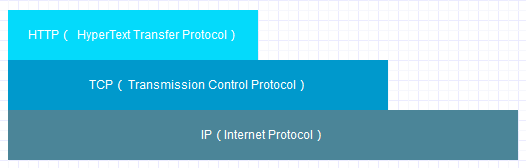
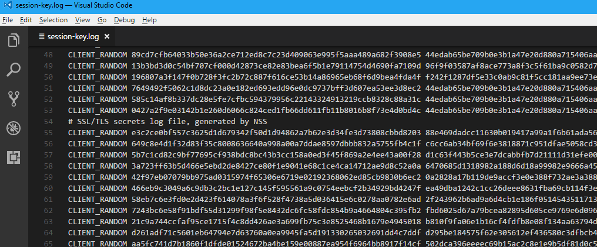

# 1 简单回顾 {#1.review}

在前面两篇博客中介绍了密码相关的一些基本工具，包括（[对称密码]，[公钥密码]，[密码散列函数]，[混合密码系统]，[消息认证码]，[数字签名]，[伪随机数]，[数字证书]）这几个。其中它们之间也是互相依赖的，我们来简单的梳理一下它们的依赖关系。

1. [对称密码] : 无。
2. [公钥密码] : 无。
3. [密码散列函数] : 无。
4. [伪随机数] : 可以利用[密码散列函数来]实现，也可以不使用。
5. [混合密码系统] : [对称密码] + [公钥密码] + [密码散列函数]。
6. [消息认证码] : [密码散列函数] + [对称密码]。
7. [数字签名] : [密码散列函数] + [公钥密码]。
8. [数字证书] : [公钥密码] + [数字签名]。

这篇要介绍的HTTPS，则把以上这些全都派上场了。

# 2 HTTPS 简史 {#2.https-history}

在早期HTTP诞生的这几年间，1990年~1994年，HTTP作为一个应用层协议，它是这样工作的：

后来网景公司开发了SSL（Secure Sockets Layer）技术，然后它就变成了这样的HTTP，也就是[HTTPS](https://en.wikipedia.org/wiki/HTTPS)了：

后来爆发了与IE的世纪大战，网景败北，SSL移交给了[IETF（Internat Engineering Task Force）互联网工程任务组](https://en.wikipedia.org/wiki/Transport_Layer_Security)，标准化之后变成了现在的TLS，现在一般会把它们两个放在一起称为[SSL/TLS](https://en.wikipedia.org/wiki/Transport_Layer_Security)。本篇并不关注SSL/TLS具体是如何工作的，只是抽象的解释下HTTPS的一个工作流程。

# 2 HTTPS 工作流程 {#3.https-flow}

1. Client发起一个HTTPS（https:/demo.linianhui.dev）的请求，根据RFC2818的规定，Client知道需要连接Server的443（默认）端口。
2. Server把事先配置好的[公钥证书]（`public key certificate`）返回给客户端。
3. Client验证[公钥证书]：比如是否在有效期内，证书的用途是不是匹配Client请求的站点，是不是在CRL吊销列表里面，它的上一级证书是否有效，这是一个递归的过程，直到验证到根证书（操作系统内置的Root证书或者Client内置的Root证书）。如果验证通过则继续，不通过则显示警告信息。
4. Client使用[伪随机数]作为加密所使用的`会话密钥`，然后用证书的`公钥=public_key`加密这个`会话密钥`，发给Server。
5. Server使用自己的`私钥=private_key`解密这个消息，得到`会话密钥`。至此，Client和Server双方都持有了相同的`会话密钥`。
6. Server使用`会话密钥`加密`明文内容A`，发送给Client。
7. Client使用`会话密钥`解密响应的密文，得到`明文内容A`。
8. Client再次发起HTTPS的请求，使用会话密钥加密请求的`明文内容B`，然后Server使用`会话密钥`解密密文，得到`明文内容B`。

简单总结下，HTTPS是使用了证书的一个混合密码系统，其中证书的作用在于传递会话密钥，以及验证网站的真实性；而HTTPS真正的加密操作是由对称密码这个工具负责的（有兴趣的可以找找每个步骤中都用到了密码工具箱中的那些工具）。在windows系统中，可以配置一个名为`SSLKEYLOGFILE`的环境变量，Chrome和Firefox在访问HTTPS站点的时候，会把第4步生成的会话密钥以及其他附属信息，写入到这个文件中：

比如下图：

具体的格式可以参考MDN的一个说明 https://developer.mozilla.org/en-US/docs/Mozilla/Projects/NSS/Key_Log_Format 。

以上只是一个抽象的HTTPS的一个工作流程，实际上SSL/TLS所做的工作远不止这这些，更详细的解释请参考这篇文章 : http://www.infoq.com/cn/articles/HTTPS-Connection-Jeff-Moser 。

如有错误之处，欢迎指正！

# 4 参考资料 {#4.summary}

SSL/TLS：https://en.wikipedia.org/wiki/Transport_Layer_Security

IETF：https://en.wikipedia.org/wiki/Internet_Engineering_Task_Force

HTTPS：https://en.wikipedia.org/wiki/HTTPS

HTTPS 连接最初的若干毫秒：http://www.infoq.com/cn/articles/HTTPS-Connection-Jeff-Moser

HTTPS on Stack Overflow: The End of a Long Road：https://nickcraver.com/blog/2017/05/22/https-on-stack-overflow/

SSL/TLS部署最佳实践：https://github.com/ssllabs/research/wiki/SSL-and-TLS-Deployment-Best-Practices

HTTP Over TLS：https://tools.ietf.org/html/rfc2818

SSLKEYLOGFILE：https://developer.mozilla.org/en-US/docs/Mozilla/Projects/NSS/Key_Log_Format

[对称密码]:../01-cryptography-toolbox-1/#1.symmetric-cryptography
[公钥密码]:../01-cryptography-toolbox-1/#2.asymmetric-cryptography
[密码散列函数]:../01-cryptography-toolbox-1/#3.cryptographic-hash-function
[消息认证码]:../01-cryptography-toolbox-1/#4.message-authentication-code
[数字签名]:../01-cryptography-toolbox-1/#5.digital-signature
[上篇的数字签名遗留的问题]:../01-cryptography-toolbox-1/#5.3.leftover-problem
[伪随机数]:../02-cryptography-toolbox-2/#1.pseudo-random-number
[混合密码系统]:../02-cryptography-toolbox-2/#2.hybrid-cryptosystem
[数字证书]:../02-cryptography-toolbox-2/#3.certificate
[公钥证书]:../02-cryptography-toolbox-2/#3.2.public-key-certificate