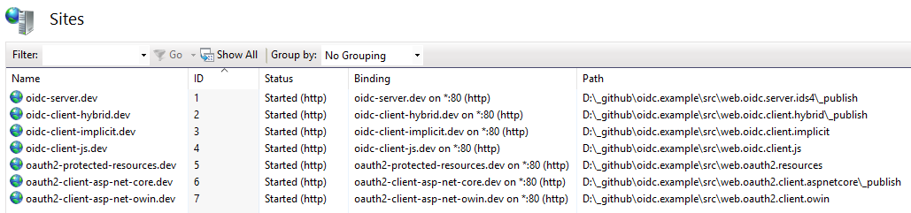
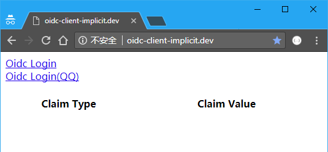
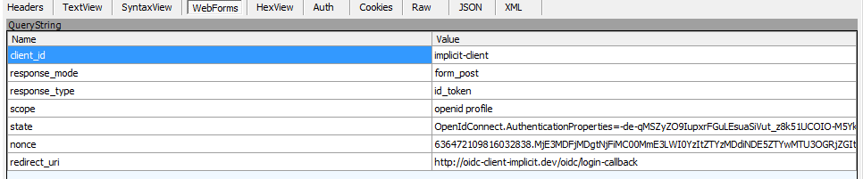
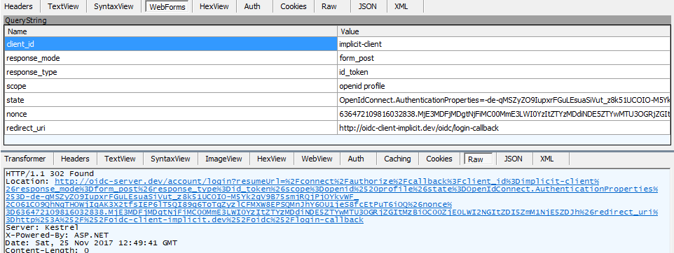
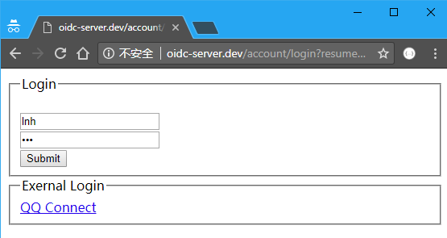
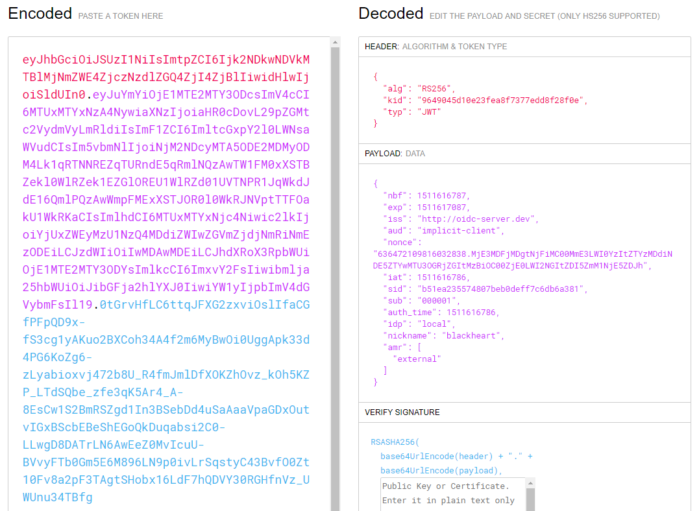
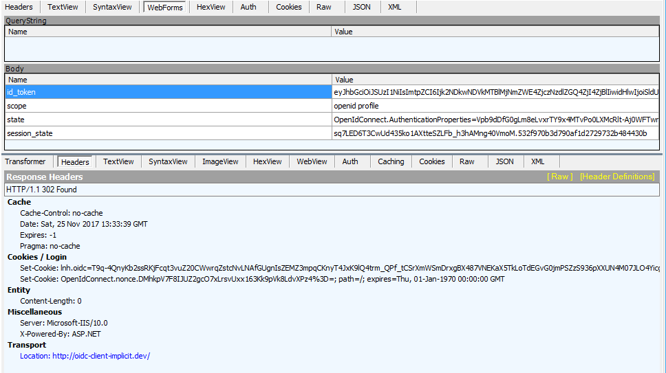
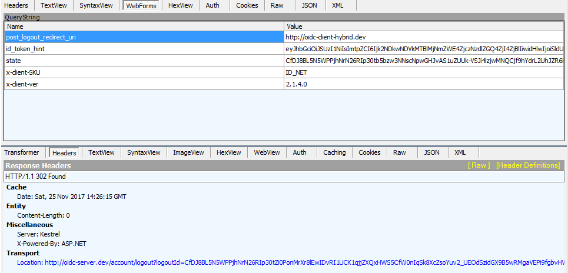

在[[认证&授权]][authc-and-authz]系列博客中，分别对OAuth2和OIDC在理论概念方面进行了解释说明，其间虽然我有写过一个完整的示例(<https://github.com/linianhui/oidc.example>)，但是却没有在实践方面做出过解释。在这里新开一个系列博客，来解释其各种不同的应用场景。因为OIDC是在OAuth2之上的协议，所以这其中也会包含OAuth2的一些内容。

OIDC协议本身有很多的开源实现，这里选取的是基于.Net的开源实现基于[IdentityServer4]。本系列的源代码位于<https://github.com/linianhui/oidc.example>。clone下来后用管理员身份运行build.ps1来部署整个系统，其中可能会弹出UAC警告(脚本会修改host文件，记得允许管理员读写这个文件先)。部署完后的样子如下 :




本文中主要是关注一下SSO这部分的内容，主要是`跨一级域`的`单点登录`和`统一登出`功能。其中涉及到的站点有一下4个 :

1. oidc-server.dev :利用oidc实现的统一认证和授权中心，SSO站点。
2. oidc-client-hybrid.dev :oidc的一个客户端，采用hybrid模式。
3. oidc-client-implicit.dev :odic的另一个客户端，采用implicit模式。
4. oidc-client-js.dev :oidc的又一个客户端，采用implicit模式，纯静态网站，只有js和html，无服务端代码。

# 1 单点登录 {#1-sso}

通常来讲，SSO包括`统一的登录`和`统一的登出`这两部分。基于OIDC实现的SSO主要是利用OIDC服务作为用户认证中心作为统一入口，使得所有的需要登录的地方都交给OIDC服务来做。更直白点说就是把需要进行用户认证的客户端中的用户认证这部分都剥离出来交给OIDC认证中心来做。具体的交互流程如下 :


其中这三个客户端是完全独立的位于不同的域名之下，且没有任何依赖关系，三者均依赖`oidc-server.dev`这个站点进行认证和授权，通信协议为HTTP，那么下面则通过它们之间的HTTP消息来解释其具体的流程。这个过程中使用fiddler来进行监视其所有的请求。

## 1.1 OIDC-Client 触发认证请求 {#1-1-oidc-client-trigger-authentication-request}

在浏览器打开<http://oidc-client-implicit.dev>这个站点，打开后如下(QQ这个先不管它，后面单独介绍)。


点击`Oidc Login`后，会触发一个302的重定向操作。具体的HTTP请求和响应信息如下 :


1. `HTTP Request` : Get后面的URL是我们点击Oidc Login的Url，这个URL包含一个参数，代表登录成功后所要回到的页面是哪里。
2. `HTTP Response` : 服务器返回了一个302重定向。
    1. Location的Url指向了oidc-server.dev这个站点，其中还携带了一大堆参数(参数后面一小节介绍)；
    2. Set-Cookie设置了一个nonce的cookie，主要目的用于安全方面。

## 1.2 OIDC-Client 发送认证请求 {#1-2-oidc-client-send-authentication-request}

紧接上一步，浏览器在接收到第1步的302响应后，会对Location所指定的URL发起一个Get请求。这个请求携带的参数如下 :


其中参数的含义在[OIDC的认证请求][authc-and-authz-oidc-authentication-request]有详细的解释(注 : 其中采用的认证类型不管是authorization code，或者implict，还是hybrid都无关紧要，它们的区别只是其适用场景的差异，并不影响整个流程)。

1. `client_id=implicit-client` :发起认证请求的客户端的唯一标识，这个客户端事先已经在oidc-server.dev这个站点注册过了。
2. `reponse_mode=form_post` :指示oidc服务器应该使用form表单的形式返回数据给客户端。
3. `response_type=id_token` :区别于oauth2授权请求的一点，必须包含有`id_token`这一项。
4. `scope=openid profile` :区别于oauth2授权请求的一点，必须包含有`openid`这一项。
5. `state` :oauth2定义的一个状态字符串，这里的实现是加密保存了一些客户端的状态信息(用于记录客户端的一些状态，在登录成功后会有用处)，oidc会在认证完成后原样返回这个参数。
6. `nonce` :上一步中写入cookie的值，这字符串将来会包含在`id_token`中原样返回给客户端。
7. `redirect_uri` :认证成功后的回调地址，oidc-server.dev会把认证的信息发送给这个地址。

## 1.3 OIDC-Server 验证请求信息  {#1-3-oidc-server-validation-authentication-request}

oidc-server.dev站点会验证第2步中传递过来的信息，比如client_id是否有效，redircet_uri是否合法，其他的参数是否合法之类的验证。如果验证通过，则会进行下一步操作。

## 1.4 OIDC-Server 打开登录页面 {#1-4-oidc-server-open-login-page}

在oidc-server.dev站点验证完成后，如果没有从来没有客户端通过oidc-server.dev登陆过，那么在[#1-2 OIDC-Client 发送认证请求](#1-2-oidc-client-send-authentication-request)的请求会返回一个302重定向重定向到登录页面。如果是已经登录，则会直接返回[#1-5 OIDC-Server 完成用户登录](#1-5-oidc-server-login-completed)中生产重定向地址。


浏览器会打开响应消息中Location指定的地址(登录页面)。如下 :


## 1.5 OIDC-Server 完成用户登录 {#1-5-oidc-server-login-completed}

在第四步输入账户密码点击提交后，会POST如下信息到服务器端。


服务器验证用户的账号密码，通过后会使用Set-cookie维持自身的登录状态。然后使用302重定向到下一个页面。

## 1.6 Browser 自动提交表单


form的地址是在第2步中设置的回调地址，form表单中包含(根据具体的认证方式authorization code，implict或者hybrid，其包含的信息会有一些差异，这个例子中是采用的implicit方式)如下信息 :

1. id_token : [id_token][authc-and-authz-id-token]即为认证的信息，OIDC的核心部分，采用[JWT格式][authc-and-authz-jwt]包装的一个字符串。
2. scope : 用户允许访问的scope信息。
3. state : [#1-2 OIDC-Client 发送认证请求](#1-2-oidc-client-send-authentication-request)中发送的state，原样返回。
4. session_state : 会话状态。

[id_token][authc-and-authz-id-token]包含的具体的信息如下 :


其中包含认证的服务器信息`iss`，客户端的信息`aud`，时效信息`nbf`和`exp`，用户信息`sub`和`nickname`，会话信息`sid`，以及[#1-2 OIDC-Client 发送认证请求](#1-2-oidc-client-send-authentication-request)中设置的`nonce`。还有其签名的信息`alg=RS256`，表示`id_token`最后的一段信息(上图中浅蓝色的部分)是oidc-server.dev使用RSA256对id_token的header和payload部分所生产的数字签名。客户端需要使用oidc-server.dev提供的公钥来验证这个数字签名。

## 1.7 OIDC-Client 接受表单参数



客户端验证`id_token`的有效性，其中验证所需的公钥来自[OIDC的发现服务][authc-and-authz-oidc-discovery]中的jwk_uri，这个验证是必须的，目的时为了保证客户端得到的id_token是oidc-sercer.dev颁发的，并且没有被篡改过，以及id_token的有效时间验证。[数字签名][digital-signature]的`JWT`可以保证id_token的不可否认性，认证和完整性，但是并不能保证其机密性，所以id_token中千万不要包含有机密性要求的敏感的数据。如果确实需要包含，则需要对其进行加密处理(比如JWE规范)。其中验证也包含对nonce(包含在id_token中)的验证([#1-2 OIDC-Client 发送认证请求](#1-2-oidc-client-send-authentication-request)设置的名为nonce的cookie)。

在验证完成后，客户端就可以取出来其中包含的用户信息来构建自身的登录状态，比如上如中`Set-Cookie=lnh.oidc`这个cookie。然后清除[#1-2 OIDC-Client 发送认证请求](#1-2-oidc-client-send-authentication-request)中设置的名为nonce的cookie。

最后跳转到客户端指定的地址(这个地址信息被保存在[#1-2 OIDC-Client 发送认证请求](#1-2-oidc-client-send-authentication-request)中传递给oidc-server.dev的state参数中，被oidc-server.dev原样返回了这个信息)。然后读取用户信息如下(这里读取的是id_token中的完整信息) :


## 1.8 其他客户端登录

登录流程是和上面的步骤是一样的，一样会发起认证请求，区别在于已经登录的时候会在第4步直接返回post信息给客户端的地址，而不是打开一个登录页面，这里就不再详细介绍了。大家可以在本地运行一下，通过fiddler观察一下它们的请求流程。贴一下oidc-client-hybrid.dev这个客户端登录后的页面吧 :


# 2. 统一退出 {#2-logout}

退出的流程相比登录简单一些。如下图 :


其中核心部分在于利用浏览器作为中间的媒介，来逐一的通知已经登录的客户端退出登录。

## 2.1 OIDC-Client 触发登出请求 {#2-1-oidc-client-trigger-logout-request}

点击Logout链接。


点击退出后会触发一个GET请求，如下 :


上图这个请求会返回一个302的响应，Location的地址指向oidc-server.dev的一个endsession的接口。同时会通过Set-Cookie来清除自身的cookie。

## 2.2 OIDC-Client 发送登出请求 {#2-2-oidc-client-send-logout-request}

浏览器通过GET访问上一步中指定的Location地址。


接口地址定义在[OIDC的发现服务][authc-and-authz-oidc-discovery]中的end_session_endpoint字段中，参数信息定义在[OIDC的Front-Channel-Logout规范](http://www.cnblogs.com/linianhui/p/openid-connect-extension.html#auto_id_3)中。

## 2.3 OIDC-Server 验证登出请求 {#2-3-oidc-client-validation-logout-request}

验证上图中传递的信息，如果信息无误则再一次重定向到一个地址(这里是IdentityServer4的实现机制，其实可以无需这个再次重定向的)。

## 2.4 OIDC-Server 处理登出请求 {#2-4-oidc-client-handler-logout-request}

浏览器打开第3步中重定向的地址 :


响应中会通过Set-Cookie(idsrv和idsrv.session)清除oidc-server.dev自身的登录状态。然后包含一个HTML表单页面，上图中iframe指向的地址是IdentityServer4内部维持的一个地址。访问这个地址后的信息如下 :

```html
<!DOCTYPE html>
<html>
<style>iframe{display:none;width:0;height:0;}</style>
<body>
<iframe src='http://oidc-client-implicit.dev/oidc/front-channel-logout-callback?sid=b51ea235574807beb0deff7c6db6a381&iss=http%3A%2F%2Foidc-server.dev'></iframe>
<iframe src='http://oidc-client-hybrid.dev/oidc/front-channel-logout-callback?sid=b51ea235574807beb0deff7c6db6a381&iss=http%3A%2F%2Foidc-server.dev'></iframe>
</body>
</html>
```

上面代码中的iframe是真正的调用已经登录的客户端进行登出的地址(IdentityServer4会记录下来已经登录的客户端，没有登陆过的和没有配置启用Front-Channel-Logout的则不会出现在这里)。其中iframe指向的地址是OIDC客户端在oidc-server.dev中注册的时候配置的地址。参数则是动态附加上去的参数。

最后页面中包含一个js脚本文件，在页面load完成后，跳转到第2步中指定的post_logout_redirect_uri指向的回调页面。

## 2.5 OIDC-Client 处理登出回调通知

在浏览器访问上面代码中iframe指向的地址的时候，被动登出的OIDC客户端会接收到登出通知。


响应中通过`Set-Cookie(lnh.oidc)`清除了需要被动登出的客户端的Cookie。至此，统一的登出完成。

# 3 总结 {#3-summary}

本文介绍了基于OIDC实现的SSO的工作原理和流程，但并未涉及到OIDC的具体实现IdentityServer4的是如何使用的(这部分通过读我提供的源码应该是很容易理解的)，旨在解释一下如何用OIDC实现SSO，而非如何使用OIDC的某一个实现框架。OIDC是一个协议族，这些具体每一步怎么做都是有标准的规范的，所以侧重在了用HTTP来描述这个过程，这样这个流程也就可以用在java,php,nodejs等等开发平台上。

# 4 参考资料 {#4-reference}

本文源代码 : https://github.com/linianhui/oidc.example

OIDC : http://openid.net/connect/

IdentityServer4 : https://github.com/IdentityServer/IdentityServer4

[认证&授权][authc-and-authz]

[Id Token][authc-and-authz-id-token]

[JWT][authc-and-authz-jwt]

[数字签名][digital-signature]


[authc-and-authz]:/authentication-and-authorization/
[authc-and-authz-oidc-authentication-request]:/authentication-and-authorization/04-openid-connect-core/#3-4-1-based-on-authorization-code-authentication-request
[authc-and-authz-id-token]:/authentication-and-authorization/04-openid-connect-core/#3-3-oidc-id-token
[authc-and-authz-jwt]:/authentication-and-authorization/02-oauth2-extensions-protocol-and-json-web-token/#4-5-oauth2-and-json-web-token
[authc-and-authz-oidc-discovery]:/authentication-and-authorization/05-openid-connect-extension/#1-oidc-discovery
[digital-signature]:information-security/01-cryptography-toolbox-1/#5-digital-signature
[IdentityServer4]:https://github.com/IdentityServer/IdentityServer4