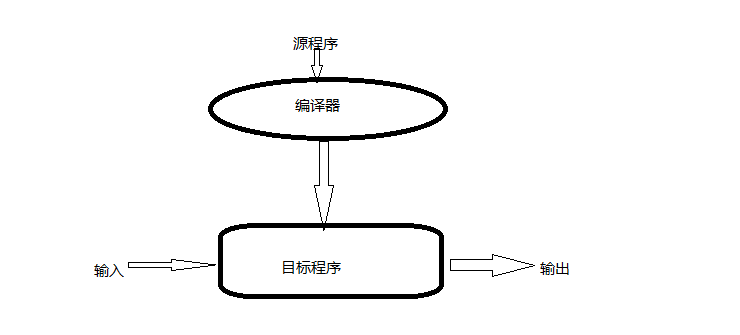
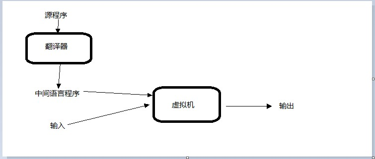

# 1 机器语言 > 汇编语言 > 高级语言 {#1.machine-assembly-high-level-language}

语言是人与人的一种交流工具，就比如我现在用汉语来写这篇博文来交流探讨技术问题；程序设计语言也是如此，只是交流对象不是人而是机器。我可以用汉语来写博文，也可以用英语来写（假如我英语熟练）；我可以用PHP来写一个网站，也可以用ASP.NET来写。这就说明**语言的本质就是一种交流工具**，而我选择哪种语言来交流并不会影响我要的结果。然而在实际中到底要选用那个语言确要根据具体情况而定，这是个成本问题，比如我如果今天脑子抽筋要用日语，那我写着也累（关键是也不会）、读者或许也会骂娘了。

早期的计算机是一台超级庞然大物，能耗抵得上一家小型工厂，而计算能力确不如今天的一台手持计算器。也就是当时人力成本要远远低于这台机器的机器成本，也就决定了当时是以机器为中心，而不是人。所以人们用计算机能直接理解的机器语言来编写程序。这里有一个计算两个整数的最大公约数的栗子（MIPS R4000处理器的机器语言），16进制形式如下：

```
2dbdffd0 afbf0014 oc1002a8 00000000 0c1002a8 afa2001c 8fa4001c
00401825 10820008 0064082a 10200003 00000000 10000002 00832023
00641823 1483fffa 0064082a 0c1002b2 00000000 8fbf0014 27bd0020
03e00008 00001025
```

这些机器语言对人的阅读和理解相当的不友好。当程序越来越复杂，人们迫切需要一种简单不易出错的记法形式，于是人们创造了汇编语言，用简短的词语来助记机器操作。用MIPS R4000处理器的汇编语言重写上面的栗子如下：

```assembly
   addiu  sp,sp-32
   sw     ra,20(sp)
   jal    getint
   nop
   jal    getint
   sw     v0,28(sp)
   lw     a0,28(sp)
   move   v1,v0
   beq    a0,v0,D
   slt    at,v1,a0
A: beq    at,zero,B
   nop    
   b      C
   subu   a0,a0,v1
B: subu   v1,v1,a0
C: bne    a0,v1,A
   slt    at,v1,a0
D: jal    putint
   nop
   lw     ra,20(sp)
   addiu  sp,sp,32
   jr     ra
   move   v0,zer
```

对于这个栗子，阅读和理解上明显要比机器语言要容易得多。然而这种编码形式计算机是不识别的，需要一种叫做**汇编器**的程序来翻译成对应的机器的机器语言才能执行。这种一个汇编指令对应一个机器之路的关系还是显而易见的，对于不同的计算机，则还需不同的汇编语言来编写；这个时代的程序设计仍然是以机器为中心，程序员也许要以机器的思维来解决问题。

就如同机器语言到汇编语言的过渡一样，程序越来越复杂、各种类型的计算机越来越多，为每一种机器都编写程序也越来越困难、人力成本也越来越大。

根据计算机科学领域惯用的抽象原则，人们**需要一个中间层来隔离某一个计算操作对具体机器的具体操作指令的这种对应关系**，也就是这个中间层需要独立于具体的机器操作。随后人们就创造出了高级程序设计语言来做这么一个中间层，由于剥离了计算操作到具体机器操作的对应关系，但是机器具体执行的依然还是机器操作，那么也就需要一个更**高级的翻译器**来做这项翻译工作，这个高级的翻译器就是现在所说的编译器。

由于这种翻译工作是由机器来完成的，在编译器出现的早期时候，人们总是能够写出比高级语言代码更高效的相应的汇编语言（毕竟早期的时候计算机的计算能力还一种奢侈的资源）。但是随着程序进一步的扩大、硬件性能的提升、编译器的优化、程序的维护成本等等变化，这种性能差异和人力成本相比慢慢也就显得微不足道了。现在想一想，当初c++面世的时候、基于虚拟机技术的java出现时也是这么一种情况。

**自从高级程序设计语言出现以后，程序设计慢慢开始从以机器为中心向以人为中心转变。**

# 2 编译器和解释器 {#2.compilers-and-interpreters}

按照抽象的观点来看，高级语言的编译和执行大致是如下的样子：

编译器把源程序翻译成目标程序（典型的是机器语言程序）后就隐退了，后面的程序的运行中就不在需要编译器的存在了。

解释器是另外一种实现高级语言的方式：

和编译器不同的是，解释器一直全程守候。解释器本身相当于一个**虚拟机**，它的**机器语言**就是源程序的高级语言。和编译器相比，解释器可以有更大的灵活性。它可以轻易地做到在程序运行初期来生成某一块新的代码，然后再后续的某一个时间去执行它；以及把一些决策推迟到运行时再去做决定。和解释器相对应，编译型的语言通常可以带来较好的性能，它可以在编译时期就把一些决策确定下来，比如一些内存布局。

虽然两者的概念很清晰，也有较大的差异性，然而现实中有些语言是**混合型**的，流程大致如下：

如果初期阶段的翻译器比较简单，则我们把它称为解释型语言；如果翻译阶段复杂，则成为编译型语言。然而简单和复杂本身是个形容词，而不能可量化。完全有可能出现一个复杂的翻译器负责中间语言程序的生成，一个复杂的虚拟机（解释器）来执行中间语言，JAVA、.NET也正是这种实现方式。

## 2.1 连接器和预处理器 {#2.linkers-and-preprocessor}

我们所用的高级语言所写的程序通常还需要一个库（包含一些IO、网络等等的操作），在编译的时候就需要把我们写的源程序和库程序链接到一起来生成目标代码，比如我要读写文件，则需要链接IO相关的库程序。通常情况下目标代码为汇编语言而不是机器语言，这种方式更有利于调试程序，也便于阅读，更能把编译器和机器语言文件格式的变化隔离开来。预处理器可以提供一种条件编译的功能，比如C#中编译条件#if DEBUG这些东西，再如C、C++中的宏机制也是属于预编译的范涛。

# 3 设计实现以及分类 {#3.spectrum}

现实中语言的设计和实现总是有不可调和的矛盾，从设计角度来看总是希望一个语言能有更强大的表达能力，然而却总是受到语言的实现制约。这根本原因大概也许是以人为中心和以机器为中心的矛盾吧，因为你的语言的执行最终还是离不开机器的执行，所以语言设计者也是不得不在这两者中间寻求平衡。

依据现有的计算模型（**运算产生结果或运算影响结果**），大致分为两大类（当然这些所谓的分类也是从不同角度得来的，如果你站在另外的角度看，或许就是另外一番景象了）说明式语言和命令式语言。从某种的角度看，说明式语言明显要更**高级**，因为它更贴近使用者-程序员，而更远离实现者-语言设计者。然而现在的语言还是命令式占据着统治地位，主要是因为实现的难度、性能的要求等原因制约着说明式语言的发展。上层是抽象的高级语言，下层是实现的细节，抽象层级越高，实现的难度则越大，因为你要隔离隐藏的细节越复杂。

函数式语言是说明式语言中的一个，近年它的热度也是急剧上升来着；我们熟知的C、C++、JAVA，C#等都是属于冯诺依曼体系的范涛，当然也是命令式语言的子集。和函数式语言中的把函数和数值作为语言的一等公民（可以赋值为给变量、作为参数传递、作为返回值处理）不一样的是，冯诺依曼语言的中的基本操作是赋值语句，它们通过**副作用**去影响后续的计算结果。

脚本语言比如JS，它们一般都是拥有强大灵活度的解释性语言，一般充当着**粘结剂**的角色。等等还有诸多的语言分类，就不在此赘述了。

# 4 总结 {#4.summary}

本篇介绍了语言的从机器语言到汇编再到高级语言的演进过程以及其发展的驱动力；以及高级语言的两种实现方式**解释**和**编译**的差异；以及按照语言的计算模型进行的语言分类。因为这些都是我个人理解的一家之言，难免会有一些错误或者不严谨的地方，欢迎园友们不吝赐教。