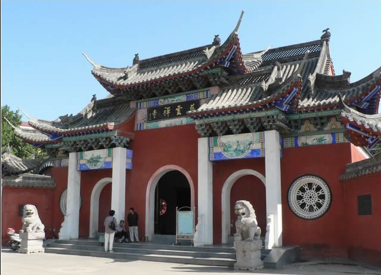

衔接上文[[理解REST] 01 REST的起源](../01-origin/)，介绍了REST的诞生背景。每当笔者遇到一个新事物的想去了解的时候，总是会问上自己第一个问题，这个新事物是干什么用的？在解释我所理解的REST这个过程中也不例外，这篇博客我们先关注一下REST是干什么用的，然后后续再解释REST是什么。好了，不说废话了，在上篇结尾处说到，REST是Web的架构风格，暂且不管REST和Web，我们先看看架构风格是什么东西？

# 1 什么是架构风格? {#1.what-is-architecture}

计算机科学中，[**架构（Architecture）**](https://en.wikipedia.org/wiki/Architecture)一词来源于建筑学，我相信大家在不少资料上都见过这样的解。那么同样的，**架构风格（Arvhitecture Style）**这个词语也和建筑学的建筑风格高度相似。比如我说起苏州园林、佛教建筑、古罗马建筑这几种风格的建筑。或许你可能和笔者一样对建筑学一窍不通，但是如果你面前有一栋建筑，你依然可以快速的分辨出这栋建筑到底是佛教建筑的还是古罗马建筑，为什么呢？**因为它们有着很明显的特点可以区分看来**，比如下图：

你总不会认为它是古罗马的建筑吧（虽然我说不上来具体有什么特征。。。但是它就是佛教建筑，你能把我咋滴）。

那么架构风格也是这么一个类似的概念，也有它自己的特征加以区分，我们把这些特征称为**架构约束。** 那么架构风格的定义就是：**一个架构风格是一组已命名的、相互协作的架构约束。** **所以，既然REST是Web的架构风格，那么也就是说有一组架构约束约束着Web？是的，正是如此。** 

# 2 Web的发展阶段 {#2.evolution-of-web}

上篇说到，世界上的第一个网站在1990年12月20日诞生于Tim Berners-Lee（web之父）的一台NeXT电脑上，由一个简单的浏览器，html组成。而如今的Web已经不是当初的那个纯静态的网站了，早已渗透到了社会的各个方面。

如今Web的规模在成几何指数的增长着，从早期的纯静态的网站 -> CGI -> 脚本语言（php,jsp,asp）-> AJAX -> RIA（Flash,Silverlight）-> SPA -> Web App -> PWA（Google提出的渐进式Web APP）。在这个发展过程中，有没有发现，其中支撑Web发展的核心标准规范（HTTP，URI和HTML），一直都没有根本性的变化。

> 1996年HTTP0.9的时候一直处于纯静态的网站的阶段；1996年HTTP1.0引入了POST，从此迈入了CGI的时代；再到1999年HTTP1.1发布的时候，脚本语言（php,jsp.asp）已经大展身手了（国内的BAT和早期的三大门户（网易，新浪，搜狐），国外的雅虎，谷歌均诞生于这几年间）。而自从1999年发布的HTTP1.1，到如今的2017年，支撑了整个Web快速发展的10几年，2015年正式发布的HTTP/2，几乎没有对HTTP1.1的协议语义方面做任何修改，而重点在于提升底层TCP的传输性能。
> 
> URI自从1998年以来，就没发生过什么变化。
> 
> HTML倒是变化不少，不过重点都是在于新标签，新API方面，而a，img，link，script和form这类超媒体控件元素一直都是非常稳定的。

再看看如今一个web应用运行的时候，都有那些部分会参与其中：

1. JS;
2. CSS;
3. 图片，视频，音频；
4. SOCKS，SSL/TLS；
5. 来源服务器（apache，ngnix，iis）
6. 应用服务器（tomcat）
7. 网关（CGI，反向代理）
8. 用户代理（chrome，firefox，ie，早期的网景）
9. 客户端库（curl，wget，各种语言平台的httpclient库）
10. 浏览器缓存，CDN，网络运营商缓存

等等，而这些部分在这20年间，发生了无数次的独立部署和升级，又有无数的组件已经退出了历史舞台。Web的面貌本身也以及发生了翻天覆地的变化，而Web的最核心的三部分（HTTP,URI,HTML）却保持着相对稳定的状态。**这里面是不是有些值得思考的东西**？有哪一个系统能像如今的Web系统这样，在20多年间，核心组成部分可以保持稳定，并且支撑了如此大的规模发展。

# 3 REST是用来干什么的？{#3.what-is-rest-used-for}

**Web得以如此规模的发展，这和Web诞生之初的架构设计是分不开的。而REST则是用来发现，识别Web的架构模型中，有哪些地方需要改善，哪些地方需要说不的。所以，想要理解REST是什么，必须要站在俯览Web的角度，以Web的上帝视角来看待Web，才能搞清楚REST对Web到底做了些什么。**

很多的人只关注于restful的web api，以api的角度去理解解释rest，最终只会发现到头来就是URL设计的漂亮一些，把HTTP动词用起来，然后你就会发现REST也不过如此，也不好用，还遗留一堆问题。或许你会觉得少了些什么，然而也说不上来到底少了什么。其根本原因在于看待REST的视角选的不合适。REST是用来指导Web架构的设计和开发的，REST关注组件的可伸缩性、接口的通用性、组件的独立进化部署以及通过减少交互带来的延迟等等，它的关注点是Web；而不是如何设计URI，如何使用http method；而这些仅仅只是REST的附属的一个外在特征而已，并非REST的核心关注点。

# 4 总结 {#4.summary}

笔者感觉这篇文章好像全是大空话，，，哈哈哈。不过也就只有一个目的，简单的类比解释下什么是架构风格，以及应该以怎样的视角看待REST（就像玩积木一样，开Web的上帝视角）。本篇均是笔者自己的一些理解，不免有错误之处，欢迎指正。。

# 5 参考资料 {#5.reference}

[[理解REST] 00 参考资料][reference]

[reference]:../00-reference/