**Socket**[^socket]是一套抽象的用于网络通信的API，它使得应用层可以不必关心底层繁琐的传输通信细节。
> 开始之前最好具备一些**计算机网络**[^computer-networking]的基础，**TCP**[^tcp]以及**网络字节序**[^endian]的相关知识储备。

# 1 基础简介 {#basic}

方便起见，这里假设底层是IPv4和TCP。
## 1.1 地址结构 {#sockaddr_in}

既然是建立通信，那么就需要知道对方的地址。socket使用`struct sockaddr_in`来存储连接一方的`ip`和`port`。

```c
typedef __uint32_t in_addr_t;     /* base type for internet address */
typedef __uint8_t  sa_family_t; 

struct in_addr {
    in_addr_t s_addr;              /* 32 bit Internet address */
};

/* IPv4专属的 */
struct sockaddr_in {
    __uint8_t       sin_len;       /* struct length */
    sa_family_t     sin_family;    /* address family */
    in_port_t       sin_port;      /* 16bit port number */
    struct in_addr  sin_addr;      /* 32bit IPv4 */
    char            sin_zero[8];   /* unused */
};

/* 通用的 */
struct sockaddr {
    __uint8_t       sa_len;         /* struct length */
    sa_family_t     sa_family;      /* address family */
    char            sa_data[14];    /* sin_port sin_addr sin_zero[8] */
};
```


# 2 函数 {#function}

## 2.1 socket函数 {#socket}

`socket`[^man-socket]用于创建一个用于通信的endpoint。使用方 **client** 和 **server**。

```c
#include <sys/socket.h>

int socket(int domain, int type, int protocol);
```

参数：
1. `int domain`：通信领域。比如`AF_UNIX`、`AF_INET`和`AF_INET6`分别代表unix本地通信、IPv4和IPv6。
2. `int type`：通信类型。比如`SOCK_STREAM`和`SOCK_DGRAM`分别代表向上层提供stream和datagram形式的数据。
3. `int protocol`：应用层协议类型。比如`IPPROTO_TCP`和`IPPROTO_UDP`。

返回值：
1. 成功：文件描述fd。
2. 失败：`-1`。`errno`[^man-errno]代表具体的错误类型。

示例：
```c
int listen_fd = socket(AF_INET, SOCK_STREAM, IPPROTO_TCP);
if (listen_fd == -1){
  // check errno
}
```

## 2.2 bind函数 {#bind}

`bind`[^man-bind]一个地址到sockfd上。使用方仅**server**。

```c
#include <sys/socket.h>

int bind (int sockfd, const struct sockaddr *myaddr, socklen_t addrlen);
```

参数：
1. `int sockfd`：已创建的sockfd。
2. `const struct sockaddr *myaddr`：绑定的地址。
3. `socklen_t addrlen`：地址struct的长度，用于指导bind函数内部应该在`myaddr`指针上读取多少数据作为地址。

返回值：
1. 成功：`0`。
2. 失败：`-1`。`errno`[^man-errno]代表具体的错误类型。

示例：
```c
struct sockaddr_in server_address;

bzero(&server_address, sizeof(server_address));
server_address.sin_family = AF_INET;
server_address.sin_addr.s_addr = htons(INADDR_ANY);
server_address.sin_port = htons(LISTEN_PORT);

int bind_result = bind(listen_fd, (struct sockaddr *)&server_address, sizeof(server_address);
if (bind_result == -1){
  // check errno
}
```

## 2.3 listen函数 {#listen}

`listen`[^man-listen]开始监听连接。使用方仅**server**。

```c
#include <sys/socket.h>

int listen (int sockfd, int backlog);
```

参数：
1. `int sockfd`：已bind的sockfd。
2. `int backlog`：最大的队列长度。如果连接数超过了最大队列长度，那么新的连接就会收到一个`ECONNREFUSED`错误。
    1. 在linux 2.2后，backlog指的是`accept queue` size.
    2. `syn queue` size的设置位于`/proc/sys/net/ipv4/tcp_max_syn_backlog`

返回值：
1. 成功：`0`。
2. 失败：`-1`。`errno`[^man-errno]代表具体的错误类型。

示例：
```c
int listen_result = listen(listen_fd, 10);
if (listen_result == -1){
  // check errno
}
```

## 2.4 connect函数 {#connect}

`connect`[^man-connect]一个处于listen状态的**server**。使用方仅**client**。一直阻塞到建立连接后才返回。

```c
#include <sys/socket.h>

int connect(int sockfd, const struct sockaddr *servaddr, socklen_t addrlen);
```

参数：
1. `int sockfd`：**client**创建的sockfd。
2. `const struct sockaddr *servaddr`：**server**的地址。
3. `socklen_t addrlen`：地址struct的长度，用于指导connect函数内部应该在`servaddr`指针上读取多少数据作为地址。

返回值：
1. 成功：`0`。
2. 失败：`-1`。`errno`[^man-errno]代表具体的错误类型。

示例：
```c
struct sockaddr_in server_address;

bzero(&server_address, sizeof server_address);
server_address.sin_family = AF_INET;
server_address.sin_port = htons(SERVER_PORT);
inet_pton(AF_INET, "127.0.0.1", &(server_address.sin_addr));

int connect_result = connect(client_sockfd, (struct sockaddr *)&server_address, sizeof(server_address));
if (connect_result == -1){
  // check errno
}
```

## 2.5 accept函数 {#accept}

`accept`[^man-accept]获取一个已经建立的连接。使用方仅**server**。一直阻塞到获取到一个连接后才返回。

```c
#include <sys/socket.h>

int accept (int sockfd, struct sockaddr *cliaddr, socklen_t *addrlen);
```

参数：
1. `int sockfd`：上面listen后的sockfd。
2. `struct sockaddr *cliaddr`：建立连接的**client**的地址。
3. `socklen_t *addrlen`：地址struct的长度，用于指导accept函数内部应该在`cliaddr`指针上写入多少数据。

返回值：
1. 成功：当着这个连接的文件描述符fd。
2. 失败：`-1`。`errno`[^man-errno]代表具体的错误类型。

示例：
```c
struct sockaddr_in client_address;
socklen_t client_length = sizeof(client_address);

int connect_fd = accept(listen_fd, (struct sockaddr *)&client_address, &client_length);
if (connect_fd == -1){
  // check errno
}
```

## 2.6 send函数 {#send}

`send`[^man-send]发送数据到内核的发送缓冲区。使用方 **client** 和 **server**。

```c
#include <sys/socket.h>

ssize_t send(int sockfd, const void *buf, size_t len, int flags);
```

参数：
1. `int sockfd`：上面connect后的或者accept后的sockfd。
2. `const void *buf`：准备发送的数据的指针。
3. `size_t len`：准备发送的数据的最大长度。
4. `int flags`：。

返回值：
1. 成功：发送成功的数据长度，可能会小于`size_t len`参数。
2. 失败：`-1`。`errno`[^man-errno]代表具体的错误类型。

示例：
```c
//
```

## 2.7 recv函数 {#recv}

`recv`[^man-recv]从内核的接收缓冲区中读取数据。使用方 **client** 和 **server**。

```c
#include <sys/socket.h>

ssize_t recv(int sockfd, void *buf, size_t len, int flags);
```

参数：
1. `int sockfd`：上面connect后的或者accept后的sockfd。
2. `const void *buf`：准备接收数据的buf指针。
3. `size_t len`：准备接收的数据的最大长度。
4. `int flags`：。

返回值：
1. 成功：接收成功的数据长度，可能会小于`size_t len`参数。当返回`0`时表示对方已经断开了连接。
2. 失败：`-1`。`errno`[^man-errno]代表具体的错误类型。

示例：
```c
//
```

## 2.8 close函数 {#close}

`close`[^man-close]关闭连接。使用方 **client** 和 **server**。

```C
#include <unistd.h>

int close (int fd);
```

参数：
1. `int fd`：待关闭的fd。

返回值：
1. 成功：`0`。
2. 失败：`-1`。`errno`[^man-errno]代表具体的错误类型。

示例：
```c
int close_result = close(connect_fd);
if (close_result == -1){
  // check errno
}
```
# 3 TCP State {#tcp-state}

下图展示了每个函数对应的调用时机以及**TCP**[^tcp]的状态流转。



# 4 Example {#example}

一个C语言编写的基于Socket API的Echo程序，由其中的两个文件构成：
1. [socket-server.c](https://github.com/linianhui/networking-programming/blob/io-multiplexing/src/socket-server.c)
2. [socket-client.c](https://github.com/linianhui/networking-programming/blob/io-multiplexing/src/socket-client.c)

> 源码中对socket原生函数添加了包装，命名方式为`xxx_e`，函数签名完全保持一致，不同之处在于包装函数内部增加了`log`和`error`记录处理。创建和初始化socket的代码比较简单，做成来通用方法放在了<https://github.com/linianhui/networking-programming/blob/io-multiplexing/src/cnp.c>中，这里就不做解释了。

## 4.1 client {#socket-client}


#include "cnp.h"

void cli(FILE *input, int connect_fd)
{
    char recv_buf[BUFFER_SIZE];
    char send_buf[BUFFER_SIZE];

    while (1)
    {
        // 打印用户输入提示符
        log_stdin_prompt();

        // 读取用户输入，阻塞
        bzero(send_buf, sizeof(send_buf));
        fgets(send_buf, BUFFER_SIZE, input);

        send_e(connect_fd, send_buf, strlen(send_buf) + 1, 0);

        // 接收server响应，阻塞
        bzero(recv_buf, sizeof(recv_buf));
        recv_e(connect_fd, recv_buf, BUFFER_SIZE, 0);
    }
}

int main(int argc, char *argv[])
{
    int connect_fd = socket_create_connect(argc, argv);
    cli(stdin, connect_fd);
    return 0;
}


上述client的逻辑非常简单，主要可以分成4部分：
1. 启动后使用TCP连接指定的服务器（*默认127.0.0.1:12345*）。
2. 连接成功开启一个`while`循环，循环内部阻塞在`fgets`[^man-fgets]调用处（*`fgets`可以从`stdin`[^man-stdin]获取用户输入的一行文字*）。
3. 当获取到用户输入后，`fgets`从阻塞中返回，把读取到的数据通过[send](#send)发送到`connect_fd`背后的服务器。
4. 随后阻塞在[recv](#recv)调用处，等待读取服务器的响应。然后回到第2步继续循环。

## 4.2 server {#socket-server}


#include "cnp.h"

void echo(int connect_fd)
{
    char buf[BUFFER_SIZE];
    int recv_size;

    while (1)
    {
        bzero(buf, sizeof(buf));
        // 读取接收的数据，阻塞
        recv_size = socket_revc_and_send(connect_fd, buf);
        if (recv_size == 0)
        {
            break;
        }
    }
}

void fork_handler(int listen_fd){
    int connect_fd;

    while (1)
    {
        // 获取已建立的连接，阻塞。
        connect_fd = accept_e(listen_fd, NULL, NULL);
        if (fork() == 0)
        {
            echo(connect_fd);
            exit(0);
        }
        close_e(connect_fd);
    }
}

int main(int argc, char *argv[])
{
    int listen_fd = socket_create_bind_listen(argc, argv);
    fork_handler(listen_fd);
    return 0;
}


server看起来更简单了一点（只处理一个fd）。主要也是4部分构成：

1. 启动后监听IPv4的TCP端口（默认0.0.0.0:12345）。
2. 使用`while`循环（*循环的目的在于服务器要处理客户端的多个连接*）调用[accept](#accept)。当没有客户端请求建立连接时，会一直阻塞在此处。
3. 客户端成功建立连接，`accept`函数从阻塞中返回一个`connect_fd`，代表这一个TCP连接。随后使用`fork`[^fork]开启一个新的线程处理这个连接。然后主线程进入下一次循环，继续阻塞在`accept`处。
4. 新线程执行`echo`函数，用循环执行[recv](#recv)和[send](#send)，`send`的内容是把`recv`到的数据转成大写再发回去。如果`recv`到了**0**个字节的数据，则表明收到了对方的`FIN`，此时退出循环，echo方法结束。新线程也结束了。

## 4.3 遗留问题 {#problem}

先说cleint：
1. `fgets`阻塞整个主线程，导致后面的`recv`即使有了数据，也无法读取。
2. `send`阻塞，导致`recv`跟着被阻塞。不过这个问题不大。
3. `recv`阻塞，导致用户一直不能输入，必须`recv`完成后才行。

总结来说就是`stdin`和`connect_fd`这两个不同的IO互相阻塞对方，同时只能处理一个，效率太差。

再说server：
1. 由于`accept`函数是阻塞的，并且一次只能获取一个连接。
2. 同时`recv`也是阻塞的，为了支持处理多个连接，不得不使用`fork`为每一个连接开启新的线程。线程成本高昂，无法支撑太多的线程。

总结来说是多线程虽然可以解决问题，但是性价比不高。

# 5 参考 {#reference}

[^socket]: Network Socket : <https://en.wikipedia.org/wiki/Network_socket>
[^computer-networking]: 计算机网络-系列博客 : <https://linianhui.github.io/computer-networking/>
[^tcp]: TCP : <https://linianhui.github.io/computer-networking/tcp/>
[^endian]: 网络字节序 : <https://linianhui.github.io/computer-networking/00-overview/#endian>
[^man-socket]: `man socket` <https://man7.org/linux/man-pages/man2/socket.2.html>
[^man-bind]: `man bind` <https://man7.org/linux/man-pages/man2/bind.2.html>
[^man-listen]: `man listen` <https://man7.org/linux/man-pages/man2/listen.2.html>
[^man-connect]: `man connect` <https://man7.org/linux/man-pages/man2/connect.2.html>
[^man-accept]: `man accept` <https://man7.org/linux/man-pages/man2/accept.2.html>
[^man-send]: `man send` <https://man7.org/linux/man-pages/man2/send.2.html>
[^man-recv]: `man recv` <https://man7.org/linux/man-pages/man2/recv.2.html>
[^man-close]: `man close` <https://man7.org/linux/man-pages/man2/close.2.html>
[^man-errno]: `man errno` <https://man7.org/linux/man-pages/man3/errno.3.html>
[^man-fgets]: `man fgets` <https://man7.org/linux/man-pages/man3/fgets.3p.html>
[^man-stdin]: `man stdin` <https://man7.org/linux/man-pages/man3/stdin.3p.html>
[^fork]: `man fork`: <https://man7.org/linux/man-pages/man2/fork.2.html>

