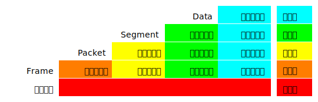

1969年11月美国国防部建立了一个名为**ARPANET**(Internet的雏形)的**分组交换**网络，当前时间是2019年，50年过去了，如今的网络已经融入了社会的方方面面，其重要性不言而喻。本系列博客专注于**计算机网络**的核心概念和体系结构，并不涉及网络编程的概念。

# 1 标准化 {#standardization} 

**计算机网络** 由 **节点(node : 计算机、集线器、交换机或路由器)** 和连接它们的 **链路(link)** 组成。这些众多的设备之间如何通信？其中离不开各种各样的标准，标准的意义在于统一的规则，遵循相同标准的设备之间可以互联互通，从而避免一些不兼容的问题。[IETF(Internet Engineering Task Force)][ietf]是负责标准化的一个重要机构，IP、TCP、UDP、DNS、HTTP等等众多协议都是由IETF标准化的。

# 2 常见的分类 {#categories}

按照地理上的区域位置来划分，有如下几个分类 :

1. `LAN` : Local Area Network(局域网)，比如连接家用路由器的所有设备就组成了一个LAN。
2. `WAN` : Wide Area Network(广域网)，比如路由器经过`PPPoE`连接到的宽带运营商的网络环境。
3. `WLAN` : Wireless LAN(无线局域网)，比如WiFi或WAPI。

# 3 分组交换(Packet Switching) {#packet-switching}

计算机网络没有采用传统的电话网络的 **~~电路交换~~** 的通信方式，而是采用了**分组交换**。理解**分组交换**是理解计算机网络最重要的一步(没有之一)。

1. **~~电路交换~~** : 核心原理是为通信双方建立一条可靠的专用的链路，供双方通信使用。
2. **分组交换** : 核心原理是把原始数据拆分成一个个小的数据包，然后通过**转发**、**转发**、**再转发**的方式在通信双方传递。

也正是**分组交换**这种设计思想，才得以支撑互联网的爆炸式增长。

# 4 性能指标 {#performance}

计算机网络的性能表现在一下几个指标上。

## 4.1 速率(Bit Rate) {#bit-rate}

速率是数据传输的比特率(bit rate): **单位时间(秒)内传输的bit(binary digit)数量**。单位是`bit/s`、`b/s`或者`bps`。

1. `Kbps` : 每秒**103**个bit。
2. `Mbps` : 每秒**106**个bit。
3. `Gbps` : 每秒**109**个bit。

## 4.2 带宽(Bandwidth) {#bandwidth}

带宽原指信号的频带宽度，比如**300Hz～600Hz**, 此时的单位是**赫兹(Hz)**。

在计算机网络中，带宽通常指的是链路的**最高速率**，对，就是上面提到的[# 4.1 速率(Bit Rate)](#bit-rate)。

## 4.3 吞吐量(Throughput) {#throughput}

吞吐量是单位时间(秒)内通过某个链路的实际的数据量。它的单位通常也是和[# 4.1 速率(Bit Rate)](#bit-rate)是一样的。

比如对于一个`10Gb/s`的网络，它的实际吞吐量可能是`100Mb/s`，但是最高不可能超过`10Gb/s`。

## 4.4 延迟(Delay) {#delay}

延迟是指数据从链路的一端到另一端所消耗的时间。延迟由几个不同的部分组成 : 

1. **排队延迟** : **数据帧**在**节点**上的排队等待被处理时所消耗的时间。
2. **处理延迟** : **节点**处理**数据帧**时所消耗的时间。
3. **发送延迟** : 发送**数据帧**所消耗的时间（比如一共100个bit，从发送第1个bit开始到第100个bit发送完毕的时间）。**发送延迟** = `数据帧长度(bit) / 发送速率(bit/s)`。
4. **传播延迟** : 电磁波在信道中传播所需的时间。**传播延迟** = `信道长度(m) / 传播速度(m/s)`。电磁波在真空中的的传播速度是光速`300000km/s`，在光纤中大概是`200000km/s`。比如光纤`200km`，那么延迟大约`1ms` = `(200000km/s) / 200km`。

**总延迟** = `排队延迟 + 处理延迟 + 发送延迟 + 传播延迟` 。速率相同的情况下，延迟越低越好。在速率不同的情况下，有时候一个**低速率 + 低延迟**的网络也优于一个**高速率 + 高延迟**的网络。

## 4.5 往返时间(RTT) {#round-trip-time}

一次往返通信所需的时间，粗略的等于2个([# 4.4 延迟(Delay)](#delay))的时间。

## 4.6 信道利用率(Channel Utilization) {#channel-utilization}

公式 : **信道利用率** = `发送延迟 / (发送延迟 + 往返传播延迟)`。比如要发送`10kb`的数据, 发送速率是`1000kb/s`, 光纤长度`20km`。那么 : 

1. **发送延迟** = `10/1000` = `10ms`。
2. **往返传播延迟** = `(20mk / 200000km/s) * 2` = `20ms`。
3. **信道利用率** = `10ms / (10ms + 20ms)` = `33.33%`。

# 5 分层的体系结构 {#layered-architecture}

在计算机领域解决复杂问题时，有两个屡试不爽的手段 : **抽象**和**分层**。如今现实中的计算机网络通常是如下的一个层次结构。

其中每一层都有各自专注解决的一个问题。 每一层都有各自的协议，各自也都有各自的`PDU(Protocol Data Unit)`。
1. 物理层 : 依托下层的传输媒介，为上层提供`01`bit流。
2. 链路层 : 依托下层的`01`bit流，为上层提供分组的数据帧，`PDU=Frame`。
3. 网络层 : 依托下层的数据帧，为上层提供虚拟的、无连接的、尽力交付的、分组交换的互联路由网络，`PDU=Packet`。
4. 传输层 : 依托下层的分组交换的数据报，为上层提供传输通道，`PDU=Segment`。
5. 应用层 : 依托下层的传输通道，为应用级别的提供专用的网络服务，`PDU=Data`。

# 6 总结 {#summary}

以上简单的介绍了一下计算机网络的基础概念，以及核心的设计理念**分组交换**和**分层体系**，后续则针对各层逐步展开。

[ietf]:https://www.ietf.org/
