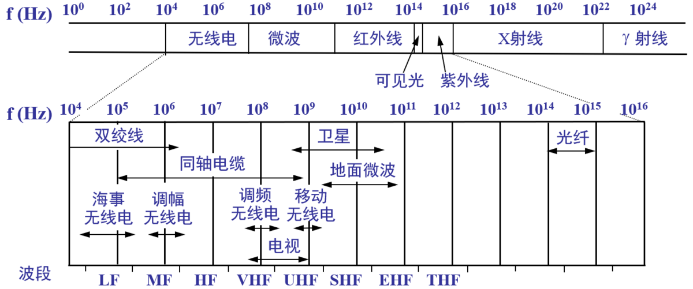

# 1 物理层的用途 {#physical-purpose}

上一篇中说到**计算机网络** 由 **节点(node : 计算机、集线器、交换机或路由器)** 和连接它们的 **链路(link)** 组成。本质上讲，网络通信就是双方互相传递信息，在计算机世界中，最本质的信息就是`01`这种bit，所有的通信都是基于此，那么物理层的用途就是传递这些bit信息。

传输媒体多种多样，比如同轴电缆、双绞线、光纤、无线电波等等。当物理层要向上层提供一致的`01`bit流时，它就要屏蔽这种底层的通道差异，这是物理层的任务。

# 2 基础概念 {#foundation-concept}

这里罗列一些比较重要的概念。

## 2.1 信道 {#channel}

简单来说就是信息的通道，根据通信的交互方式，可以分为一下3类：

1. 单向通信 : 也称为单工通信。表示只能单方向的通信，比如有线电视广播，无线电广播，GPS卫星等。
2. 双向交替通信 : 也称为半双工通信。表示双方都能发送信息，但是同时只能一方发送。
3. 双向同时通信 : 也称为全双工通信。表示双方同时都可以发送和接受数据。

# 3 下层的传输媒体 {#}

这部分其实才是真正的物理实体，比如上面提到的同轴电缆、双绞线、光纤、无线电波等。其实所有的这些物理实体，其传输的本质都是**电磁波**。

# 4 信道复用 {#channel-multiplexing}

1. 频分复用。
2. 波分复用。
3. 码分复用。

# 5 总结 {#summary}

学习计算机网络时物理层本身其实通常处于非常底层的位置，譬如事实上的标准`TCP/IP`4层模型中就没有物理层。所以本节内容不多，我们只需要知道这一层的用途是为上层提供`01`比特流就可以了。