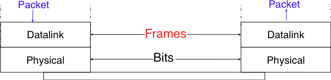
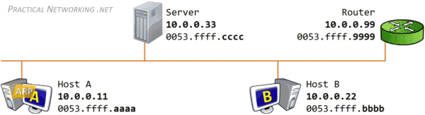
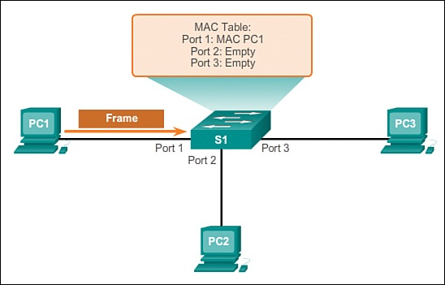

# 1 数据链路层的用途 {#data-link-purpose}

上一篇的遗留问题说到物理层仅仅提供`01`bit流是远远不够的，需要进行更高层的抽象。结合开篇中提到的计算机网络的核心设计理念**分组&交换**，这一层的用途就是分组 : 提供基于`01`bit流分组后的数据帧(`PDU=Frame`)。



# 2 三个基本问题 {#three-basic-question}

想要从下层的`01`比特中抽象出这样的结果，则需要解决一下的三个基本问题：

1. 封装成帧。
2. 透明传输。
3. 差错检测。

## 2.1 封装成帧 {#encapsulation-into-frame}

下层物理层提供的是`01`bit流，想要变成分组后的帧，就需要定义起始和结束的标记。

1. 起始标识 : `SOH(Start Of Headine)`，二进制`0000_0001`。
2. 结束标识 : `EOT(End Of Transmission)`，二进制`0000_0100`。


发送方会在Frame前后插入`SOH`和`EOT`。接受方会读取这2个标记中间的数据。每一个链路层协议对`Frame`的长度都有约束，称为`MTU(Maximum Transfer Unit)`.

## 2.2 透明传输 {#transparent-transmission}

有了`SOH`和`EOT`还是远远不够的，设想一下当你要传输的数据中正好也包含这两个标记，那么我们的起始和结束岂不就错乱了？对的，正是如此，所以就需要找一个办法来识别出这种数据。这个办法就是转义，即通过添加一个新的符号来改变`SOH`和`EOT`的含义。

- 转义符号 : `ESC(Escape)`，二进制`0001_1011`。


发送方会检查Frame，然后在需要转义的地方加入`ESC`。接受方读取`Frame`时会检查是否同时出现了`ESC SOH`、`ESC ESC`和`ESC EOT`，有的话就移除`ESC`，然后把后续的一个`Octet`当作正常的数据。

## 2.3 差错检测 {#error-detection}

终于可以完成的对下层的`01`进行分组了。但是在传输过程中可能会发生差错，比如把`0`处理成了`1`，或者过来，再或者丢了一些数据，为了保证其完整性，就需要对其进行差错检测。这时就需要把一些校验码放在`Frame`的后面(`EOT`的前面)，这个校验码称为帧检测序列`FCS(Frame Check Sequence)`。生成校验码的方式通常是`CRC(Cyclic Redundancy Check)`，具体的算法就不展开了。


如果接受方接收到数据后检测发现`FCS`对不上，则会丢弃这个`Frame`。从这个差错检测也可以反向推断出来，如果不分组成`Frame`，则就无法进行差错检测了。

# 3 MAC {#mac}

在`LAN`中，通信双方需要一个标识符来标识通信双方，这个标识符就是`MAC Address(Media Access Control Address)`[^mac]，也称为物理地址，后续就称为`MAC`了。这个标识符长度为`48bit`，是固化到硬件中的。前`24`位由IEEE负责分配（硬件厂商向其购买），后`24`位硬件厂商自己分配。MAC地址并不是全球唯一的，也不需要全球唯一，在一个`LAN`内唯一即可。


# 4 Ethernet Frame {#ethernet-frame}

`Enternet(以太网)`是美国施乐(Xerox)公司在1975年开发出来的一种`LAN(Local Area Network)局域网`技术。`Enter(以太)`来自于当时物理学中的`以太`理论(当时的科学家认为电磁波的传播介质是以太)。

1980年9月，DEC、Intel和Xerox三家公司联合制定了一个10Mbit/s的协议`DIX V1`。1982年又做了一些修改，也就是目前所使用的`DIX V2`[^ethernet-frame]。

## 4.1 DIX Ethernet V2 Frame {#dic-ethernet-v2-frame}

下面看一下`DIX V2`的Frame布局格式[^frame-parse]:

```txt
|                DIX Ethernet V2 Frame                          |
|- - - - - - - -+- - - 32 bits(4 octet) - - - -+- - - - - - - - |
|0 1 2 3 4 5 6 7+0 1 2 3 4 5 6 7+0 1 2 3 4 5 6 7+0 1 2 3 4 5 6 7|
|- - - - - - - -+- - - - - - - -+- - - - - - - -+- - - - - - - -|
|           Destination MAC Address (6 octet)                   |
|                               +- - - - - - - -+- - - - - - - -|
|                               |                               |
|- - - - - - - -+- - - - - - - -+                               |
|           Source MAC Address (6 octet)                        |
|- - - - - - - -+- - - - - - - -+- - - - - - - -+- - - - - - - -|
|        Type (2 octet)        |                                |
|- - - - - - - -+- - - - - - - -+                               |
|                                                               |
|               Payload (46-1500 octet)                         |
|                                                               |
|- - - - - - - -+- - - - - - - -+- - - - - - - -+- - - - - - - -|
|                        CRC (4 octet)                          |
|- - - - - - - -+- - - - - - - -+- - - - - - - -+- - - - - - - -|
```

这个协议中规定了Frame所包含的一些字段以及其字节布局，包括:
1. Destination MAC Address (6 octet) : 目标MAC地址。
2. Source MAC Address (6 octet) : 源MAC地址。
3. Type (2 octet) : PayLoad的类型字段。
4. PayLoad : `MTU=1500`。
5. CRC (4 octet) : 这部分并不会出现在链路层，而是底层使用的。

### 4.1.1 Enter Type {#entre-type}

常用到的几种Enter Type[^enter-type]。

| Enter Type | Protocol                                         |
| :--------- | :----------------------------------------------- |
| 0x_08_00   | `IPv4`(Internet Protocol Version 4)              |
| 0x_08_06   | `ARP`(Addreee Resolution Protocal)               |
| 0x_81_00   | `VLAN`(Virtual Local Area Network),`IEEE 802.1Q` |
| 0x_86_DD   | `IPv6`(Internet Protocal Version 6)              |
| 0x_88_63   | PPPoE Discovery Stage                            |
| 0x_88_64   | PPPoE Session Stage                              |

## 4.2 IEEE 802.3 Frame {#ieee-802-3-frame}

在`DIX V2`的基础上,IEEE 802委员会的802.3工作组制定了IEEE的Enternet标准`IEEE 802.3`。其并未对`DIX V2`的`Frame`格式做出变动，而只是扩充了一下`Type`字段的含义，是完全兼容`DIV V2`的。`IEEE 802.3`中`Type`字段表示两个含义，当它的值大于`0x0600`时，代表类型；小于时则代表Payload的长度。

## 4.3 Frame Type {#frame-type}

这里的`Frame Type`和上文中的`Enter Type`不是一个概念。`Enter Type`指的指一个`Frame`内的`Payload`是什么类型的协议。而`Frame Type`指的是接收方收到的`Frame`属于哪种类型 :

1. `Unicast`单播 : 1:1, 发给本LAN的一个节点。
2. `Broadcast`广播 : 1:N(全体), 发给本LAN所有节点。
3. `Multicast`组播 : 1:N, 发给本LAN指定的多个节点。

# 5 ARP {#arp}

有了`MAC`和`Frame`就可以在LAN内进行通信了，但是有个问题，发送发怎么知道对方的`MAC`呢？这时候就需要专门的协议来解决这个问题了：

1. IPv4 : `Broadcast`协议`ARP`(Addreee Resolution Protocal)[^arp]。
2. IPv6 : `Multicast`协议`ICMPv6`(Internet Control Message Protocol for IPv6)[^icmpv6]中的`NDP`(Neighbor Discovery Protocol)负责。

协议不同，但是解决的问题是同一个，一下有个简单的动图可以描述这个过程。



>如果`LAN`中充斥着大量的`Broadcast`时，就很容易形成广播风暴，严重影响正常的`LAN`通信。所以在`IPv6`协议中，已经抛弃了对`Broadcast`的使用，而是使用`Multicast`替代。

# 6 VLAN {#valn}

VLAN(Virtual Local Area Network)也可以缓解上述提到的广播风暴，其作用是可以在物理的LAN上建立一个虚拟的LAN。把原本一个LAN的广播域隔离为一个个的虚拟的广播域。`IEEE 802.1Q`是`IEEE 802`委员会制定的VLAN标准。

## 6.1 IEEE 802.1Q Frame {#ieee-802-1q-frame}

当`DIX V2`的`Type`字段的值为`0x_81_00`时，代表其Payload是VLAN(IEEE 802.1Q)[^vlan]的帧格式[^wireshark-vlan]。
```txt
|                          IEEE 802.1Q                          |
|- - - - - - - -+- - - 32 bits(4 octet) - - - -+- - - - - - - - |
|0 1 2 3 4 5 6 7+0 1 2 3 4 5 6 7+0 1 2 3 4 5 6 7+0 1 2 3 4 5 6 7|
|- - - - - - - -+- - - - - - - -+- - - - - - - -+- - - - - - - -|
| PCP |D| VID (VLAN identifier) |                               |
|3bits|E| 12 bits               +        Type (2 octet)         |
|     |I| max = 0xFFF = 4096    |                               |
|- - - - - - - -+- - - - - - - -+- - - - - - - -+- - - - - - - -|
|                                                               |
|               Payload (46-1500 octet)                         |
|                                                               |
|- - - - - - - -+- - - - - - - -+- - - - - - - -+- - - - - - - -|
PCP = Priority code point
DEI = Drop eligible indicator
```

# 7 设备 {#device}

工作在数据链路层中的设备有很多 : 网卡、集线器和网桥、二层交换机（已称为以太网交换机）。

> 集线器和网桥的组合它们的工作在**半双工模式**下，采用`CSMA/CD`协议检测冲突，虽然看起来是星型以太网，但是实际上还是总线型的。目前已被二层交换机替代了，所以就不再介绍集线器和网桥了。

## 7.1 交换机 {#switch}

一个交换机可以组建一个星型以太网，交换机识别`Frame`，根据协议中的目标`MAC`进行转发来通信（目前有专门的硬件来负责，效率非常高）。交换机内置有一个`MAC Address Table`，通过自学习的方式积累记录着每个`MAC`对应的`Port`。



> 注意`MAC Address Table`中`MAC`和`Port`的对应关系。其中`MAC`可以认为是key，`MAC`:`Port`是`1:1`; 但是反过`Port`:`MAC`则是1:N（也就是可能有N个`MAC`的`Port`是同一个）。

# 8 总结 {#summary}

链路层关注的是分组 : 把物理层的`01`bit流分组成`Frame`，以及对`Frame`的差错检测。完成了`分组&交换`的第一步`分组`。

# 9 遗留问题 {#leftover-problem}

但是如果传输过程中`Frame`丢失了、重复了或者乱序了等等，链路层对这种错误则是无能为力的，所以链路层并不能对上层提供**可靠传输(发送方按序发送，接收方按序接收)**。这些问题就留给了更高层的协议来完成了。

# 10 Reference {#reference}

[^enter-type]:Enter Type : <https://en.wikipedia.org/wiki/EtherType>
[^frame-parse]:Frame Parse : <https://github.com/linianhui/networking/blob/master/1-src/networking.model/DataLink>
[^arp]:ARP : <https://en.wikipedia.org/wiki/Address_Resolution_Protocol>
[^icmpv6]:ICMPv6 : <https://en.wikipedia.org/wiki/Internet_Control_Message_Protocol_for_IPv6>
[^vlan]:VLAN(IEEE 802.1Q) : <https://en.wikipedia.org/wiki/IEEE_802.1Q>
[^wireshark-vlan]: Wireshark VLAN : <https://wiki.wireshark.org/VLAN>
[^mac]:MAC Address : <https://en.wikipedia.org/wiki/MAC_address>
[^ethernet-frame]: Ethernet Frame : <https://en.wikipedia.org/wiki/Ethernet_frame>