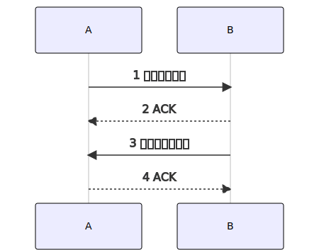

TCP(Transmission Control Protocol)是一种**全双工的**、**面向连接的**、**基于字节流的**、**可靠的（尽最大努力交付）**、**有状态的** 传输层通信协议。先看一TCP的数据包`Segment`[^segment]长什么样子，后续的介绍都会基于此：


# 1 特点介绍 {#feature}

1. **全双工的**：全双工指的是通信双方在同一时刻都可以发送和接收数据。
2. **面向连接的**：面向连接的意思是说，在双方通信之前，必须要建立一条通道，这个通道并不是说要铺设一条物理线缆，而是一条**逻辑通道**。
3. **基于字节流的**：底层的通信基础基于`分组交换`[^packet-switching]，数据是分成一组一组的，而TCP则是屏蔽了底层这些细节，而像上层提供了一个类似队列一样的byte-stream。
4. **可靠的（尽最大努力交付）**：因为`分组交换`和网络的天然不可靠状态，所以TCP只能做到尽最大努力可靠。
5. **有状态的**：指的是通信双方需要维持连接的状态。

# 2 连接管理 {#connection-management}

既然是面向连接的协议，那么TCP就需要负责连接的创建、维护和关闭。下图是TCP的状态流程图。


这里我们用`tcpdump port 80 -w nginx.pcap`[^tcpdump]来抓一个访问Nginx服务器首页(`curl http://172.17.0.2`)的[nginx.pcap](nginx.pcap)包来分析一下其中的关键信息。下面的信息是`tcpdump -r nginx.pcap -nSt`的打印结果。



其中的关键信息：
1. `ip`，`port`：通信双方的ip和port。
2. `flags`：`S=SYN`，`.=ACK`，`P=PSH`，`F=FIN`。标记位，每个标记1bit，代表不同的含义。
3. `seq`：`Sequence number (4 octets)`。序列号，长度32bit。 
4. `ack`：`Acknowledgment number (4 octets)`。确认号，长度32bit。
5. `win`：`Window Size (2 octets)`。窗口大小，长度16bit。
6. `length`：data部分的长度。

## 2.1 连接数 {#connection-number}

**理论上一台服务器最大可以支持多少个TCP连接呢**？TCP使用四元组 (`source_ip`, `source_port`, `destination_ip`, `destination_port`) 标识一个连接。

假设服务器只有一个IP`172.17.0.2`，端口号固定是`80`。那么`destination_ip`, `destination_port`) 就是固定的。因此最大连接数=`source_ip`的数量乘以`source_port`的数量。

1. IPv4 : <code>2<sup>32</sup> * 2<sup>16</sup> = 2<sup>48</sup> = 40亿+</code>
2. IPv6 : <code>2<sup>128</sup> * 2<sup>16</sup> = 2<sup>144</sup></code>

单单IPv4就可以支持多大40亿+的连接了。但是有时候才1000多个连接就会遇到这样的错误`Socket : Can't open so many files`。这是因为Linux系统默认限制了一个进程可以打开的fd(文件描述符，一个连接对应一个文件描述符)数量，其默认值是`1024`。
```sh
# 查看默认限制
ulimit -n
1024

# 临时修改
ulimit -n 1024000
# 查看修改
ulimit -n
1024000
```

## 2.2 建立连接 {#establish-connection}

TCP是基于`ACK`的协议，并且是[全双工的](#full-duplex)的协议，那么通信双方均需要确认`自身`和`对方`都具备`发送`和`接收`数据的能力。按最简化的模型来说需要<mark>4步</mark>才能建立连接。如下图，`A`和`B`是通信双方：



聪明的你明显就可以看出2和3可以合并处理，从而变成<mark>3步</mark>握手。至此双方都确认了自身和对方的收发功能是正常的。



那么我们就详细分析下上文的`nginx.pcap.txt`这部分tcpdump的结果的前3行。

1. 01行：client使用了一个随机的端口`40278`来连接server的`80`端口，同时设置了`SYN`flags（表示自己要求建立连接），随机的`seq`为`4068139125`，`win`为`64240`，`length`为0（建立连接阶段不携带数据，故而为0）。client此时进入`SYN_SENT`状态。
2. 02行：server设置了`SYN`和`ACK`flags（表示我已收到你的建立连接请求，并且同意建立连接）,同时生成了自己的`seq`为`4161524589`，然后设置`ack`为`4068139126`（client的seq`4068139125+1`），`win`为`65160`，`length`也是0。server此时进入`SYN_RECEIVED`状态。
3. 03行：client设置了`ACK`flags，然后设置`ack`为`4161524590`（server的seq`4161524589+1`），`win`为`502`，`length`也是0。此时双方都进入到`ESTABLISHED`状态，表示连接以及建立。

## 2.3 传输数据 {#transfer-data}

上文的`nginx.pcap.txt`的04行到09行均是实质性的数据传输部分。

4. 04行：client设置了`PSH`和`ACK`的flags。`PSH`的含义是指示server在收到数据后应该尽快交付给上层应用。`seq 4068139126:4068139200`看起来有点奇怪，不过其实际的seq是`4068139126`，冒号后面的数字是tcpdump用seq加length`74`自己计算出来的。ack`4161524590`和03行一样，因为目前还未收到server的数据，故而保持不变。
5. 05行：server回复了一个ack`4068139200`，表示自己收到了你的seq`4068139126`+length`74`这部分数据了。
6. 06行：server开始返回http response的数据，seq`4161524590`，length`238`。同时也携带了一个和05行一样的ack。
7. 07行：client收到了server发送的seq`4161524590`+length`238`的数据，回复了一个ack`4161524828`。
8. 08行：server继续返回http response的数据，这次是length`612`。
9. 09行：client收到了612的数据，回复ack`4161525440`=`4161524828+612`。

## 2.4 关闭连接 {#close-connection}

TCP是[全双工的](#full-duplex)，通信双方需要进行独立的关闭（半关闭：half-clone）。A方发送`FIN`只是代表A不再发送数据了，但是还可以接收B方发送的数据。当B收到A的`FIN`时：B需要给A发送一个ACK；但是TCP并不知道B方是否也需要关闭，而是要由上层应用来决定；故而不能像建立连接时那样合并ACK和自身的`FIN`。所以关闭时需要<mark>4步</mark>，但是如果B收到A的关闭请求时，正正好自己也要关闭，那么其实也是可以合并成<mark>3步</mark>（上文的`nginx.pcap.txt`的最后三行）。

10. 10行：client主动发起关闭，设置了`FIN`flags（表示自己要求断开连接），seq`4068139125`，client此时进入`FIN_WAIT_1`状态。此时client还能接收server发送的数据，但是自己已经不能发送了。
11. 11行：server碰巧这时候也要关闭连接，所以合并了对10行的ack和自己的`FIN`。server此时直接进入`LAST_ACK`状。
    > 如果server现在不想关闭连接，那么只对client的`FIN`回复ACK时，则是进入到`CLOSE_WAIT`状态，此时自身还可以继续发送数据给client。当自己也发送了`FIN`后，才会进入到`LAST_ACK`状态，这时server已经不能再发送数据了。
12. 12行：client同时收到了server的`ACK`和`FIN`。然后发出对server的`FIN`的最后一个`ACK`，此时cleint进入`TIME_WAIT`状态。通常此时client都会维持这个状态2`MSL`[^msl]时长后才会进入到`CLOSED`状态。
    > 两种特殊情况：
       1. client这时只收到了`ACK`，但是没有收到`FIN`，也就是说server目前还不想关闭连接，那么此时client进入到`FIN_WAIT_2`状态，这时client还依然可以接收server发送的数据。当收到server的`FIN`时，才会进入到`TIME_WAIT`状态。
       2. client这时只收到server的`FIN`，但是没有收到自己的`FIN`的`ACK`，非常罕见的情况，此时client会进入到`CLOSING`状态，待收到`ACK`后，进入到`TIME_WAIT`状态。

最后，server收到了client的ack，server则进入到`CLOSED`状态，致次server端已经彻底关闭连接。


# 3 流量控制 {#flow-control}

# 4 拥塞控制 {#congestion-control}

## 4.1 慢启动 {#slow-start}
## 4.2 拥塞避免 {#congestion-avoidance}
## 4.3 快速恢复 {#fast-recovery}

# 5 Reference {#reference}

<http://www.52im.net/thread-561-1-1.html>

[^packet-switching]:<https://linianhui.github.io/computer-networking/00-overview/#packet-switching>
[^segment]:<https://linianhui.github.io/computer-networking/00-overview/#layered-architecture>
[^tcpdump]:<https://www.tcpdump.org>
[^msl]:`MSL=Maximum Segment Lifetime`<https://en.wikipedia.org/wiki/Maximum_segment_lifetime>
