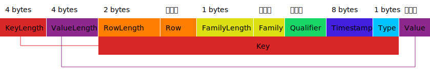

KeyValue[^keyvalue-source-code][^keyvalue-doc]是HBase的最底层的核心存储结构，也是数据最终格式持久化的格式。这里分析一下格式细节。

# 1 概述 {#overview}

一个KeyValue代表着一行数据中的具体的某一列。比如你的一行数据有10列，那么最终会有10个KeyValue存储下来（没有修改删除的情况下）。此外KeyValue只有添加操作，没有删除修改的操作。基于以上两点，使得HBase具备列一下的特性：

1. SchemaLess : 最小存储单元是列，所以可以不必事先定义好有那些行列结构。
2. 版本管理：只有添加操作，删除和修改是通过新增新版本的KeyValue来处理的。这点和git类似，只增加，不修改。


# 2 格式 {#format}

任何文件存储本质上都是一堆`byte[]`，KeyValue也不例外，它也是一个不固定长度的`byte[]`，按照如下的格式定义。



整体上看格式还是比较简单的，属于一个简版的TLV[^tlv-wiki]格式（无Type）。

## 2.1 Key {#format-key}

Key的总长度由KeyLength定义，具体由以下5部分构成。

### 2.1.1 Row {#format-key-row}


Row也就是我们常说的RowKey。2byte的RowLength决定了其最大长度`Short#MAX_VALUE=32KB`

### 2.1.2 Family {#format-key-family}

1byte的FamilyLength决定了其最大长度最大长度`Byte#MAX_VALUE=127byte`。

### 2.1.3 Qualifier {#format-key-qualifier}

没有独立存储Qualifier的长度，由`KeyLength-RowLength-2-FamilyLength-1-Timestamp8-Type1`的来。

### 2.1.4 Timestamp {#format-key-timestamp}

固定8byte的时间戳。
### 2.1.5 Type {#format-key-type}

固定1byte的类型[^keyvalue-source-code-type]。

```java
public static enum Type {
    Minimum((byte)0),
    Put((byte)4),

    Delete((byte)8),
    DeleteFamilyVersion((byte)10),
    DeleteColumn((byte)12),
    DeleteFamily((byte)14),

    // Maximum is used when searching; you look from maximum on down.
    Maximum((byte)255);

    private final byte code;

    Type(final byte c) {
      this.code = c;
    }
}
```


## 2.2 Value {#format-key}

4byte的ValueLength决定了其最大长度`Integer#MAX_VALUE=4GB`。


# 3 总结 {#summary}

KeyValue的设计带来了很大的灵活性，SchemaLess的核心支撑。不过代价也是巨大的，就是Key的大量冗余重复，HBase会使用压缩算法进行压缩。但是我们在设计Table(RowKey,Family，Qualifier)[^aliyun-hbase-schema]时，也需要尽量考虑其大小问题。

# 4 参考 {#reference}

[^keyvalue-source-code]: KeyValue Source Code: <https://github.com/apache/hbase/blob/rel/2.4.9/hbase-common/src/main/java/org/apache/hadoop/hbase/KeyValue.java#L44-L76>

[^keyvalue-doc]: KeyValue Doc: <https://hbase.apache.org/2.3/book.html#keyvalue>

[^tlv-wiki]:Type-Length-Value: <https://en.wikipedia.org/wiki/Type%E2%80%93length%E2%80%93value>

[^keyvalue-source-code-type]:KeyValue Type : <https://github.com/apache/hbase/blob/rel/2.4.9/hbase-common/src/main/java/org/apache/hadoop/hbase/KeyValue.java#L224-L236>

[^aliyun-hbase-schema]:阿里云 RowKey 设计 <https://help.aliyun.com/document_detail/59035.html>