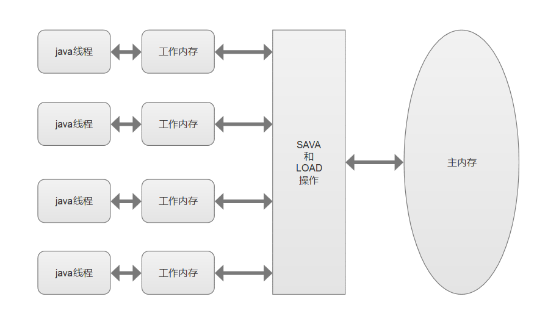

Java内存模型JMM(Java Memory Model)在Java中由两份规范文档定义:
1. JLS(Java Language Specification)的Chapter 17. Threads and Locks][^jls-jmm]。
2. JSR-133: Java Memory Model and Thread Specification Revision[^jsr-133]。JSR-133(JDK 5实现了)是对JLS中的补充和完善。

>A memory model describes, given a program and an execution trace of that program, whether the execution trace is a legal execution of the program. The Java programming language memory model works by examining each read in an execution trace and checking that the write observed by that read is valid according to certain rules.

以上部分是JLS中关于JMM的总结性解释。简单来说就是**规定了Java中的各种变量的读写访问规则**。

>这里的变量指的是实例字段，静态字段等；并不包含局部变量[^local-reference]或者方法的参数。因为后者是线程私有的，不会被共享，也就无需定义访问规则，串行的访问就可以了。

JMM规定了：
1. 所有变量都存储在主内存中。
2. 每个线程有自己的工作内存（保存了使用的变量的主内存的副本），所有操作都必须在工作内存中进行。
3. 那么不同的线程之间如果需要共享变量的值，就都需要通过主内存来完成。



需要值得注意的地方是这里的主内存和工作内存于Java的内存区域中的堆、栈、元数据区等并无任何关系，属于不同层次的视角。如果一定要对应起来的化，那么根据变量、主内存和工作内存的定义来看：
1. 主内存对应的是堆中的Java的对象的实例数据。物理中的内存。
2. 工作内存对应着Java线程栈中的局部变量表等部分区域的数据。为了提升速度，工作内存可能存储在CPU的高速缓存中或者寄存器中。

# 1 指令重排和happens-before {#happens-before}

为了提供性能，编译器和CPU通常会对指令进行重排：
1. 编译器级别的重排。不改变单线程代码语义的情况下，优化指令的顺序。
2. 指令并行的重排。把原本是串行的指令调整为并行执行，不改变依赖性。
3. 内存系统的重排。cpu缓存。

JMM提供的是语言级别的内存模型，所以可以确保在不同的编译器和CPU平台上，通过禁止一些重排，来提供一致的内存可见性。
编译器禁止重排是通过添加一些内存屏障指令，来标记不能重排。

JDK 1.5时引入了happens-before的规则，通过它来描述操作的可见性。比如
```java
int i=1;    // A
int j=i+1;  // B
```
上面就是A happens-before B。JMM可以保证B在执行时，A的结果对B是可见的。

1. 程序顺序：一个线程中，每个操作都before于后续的操作。
2. 监视器锁：每一个监视器的解锁，before于后面的加锁。
3. volatile关键字: 对一个volatile的写，before后续任意的读。
4. 传递性: A before B, B before C，那么A before C。

# 2 volatile 关键字 {#volatile}

两个特征：
1. 保证被修饰的变量对所有线程的可见性。
2. 禁止指令重排优化。

实现原理：
1. 写操作强制同步到主内存。
2. 写操作强制失效其他线程的工作内存中的变量值。

四种类型的内存屏障（lock前缀的指令，把缓存同步到主内存，同时使得处理器的其他核心的缓存无效，这样读取的时候就会从主内存重写加载）：
1. LoadLoad : Load1—>LoadLoad—>Load2 Load1的结果对Load2可见。
2. StoreStore : Store1—>StoreStore—>Store2 Store1的结果对其他处理器可见
3. LoadStore : Load1—>LoadStore—>Store2 Load1的结果对后续的操作可见
4. StoreLoad : Store1—>StoreLoad—>Load2  Store1的结果对其他处理器可见。


# 参考资料

[^jls-jmm]: Java Language Specification ：<https://docs.oracle.com/javase/specs/jls/se8/html/jls-17.html#jls-17.4>

[^jsr-133]: JSR-133：Java Memory Model and Thread Specification Revision <https://www.jcp.org/en/jsr/detail?id=133>

[^local-reference]: 如果局部变量是一个reference引用类型，那么它引用的对象在Java堆中可以被各个线程共享，但是reference本身在Java栈的局部变量表中是线程私有的。 

深入理解Java内存模型 : <https://www.infoq.cn/minibook/java_memory_model>

深入浅出Java多线程 : <http://concurrent.redspider.group/RedSpider.html>

