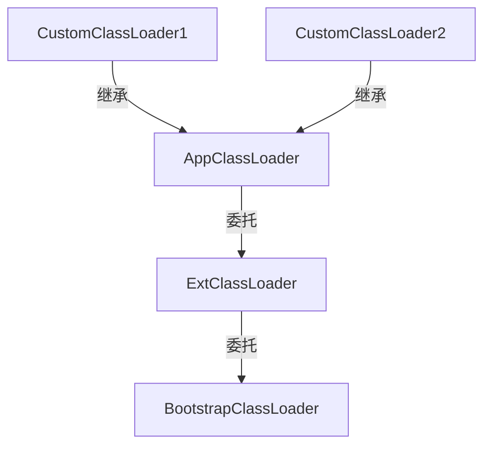

Java是一个跨平台的语言，当初的口号**编译一次，到处运行**。那么它是如何实现跨平台运行的呢？计算机领域有个有个著名的定理**中间层定律**：计算机科学领域的任何问题都可以通过增加一个中间层来解决。那么Java的跨平台也不例外，它就是通过添加了一个中间层来解决跨平台运行的问题的。

我们知道计算机是无法直接运行我们编写的程序设计语言[^pl]的代码的，需要编译为计算机可理解的特定底层汇编或者机器码指令才可以。所以Java从诞生之初就没有编译成平台相关的代码，而是编译为了平台无关的`bytecode`字节码（文件扩展名`.class`）。然后交由Java虚拟机JVM(Java Virtual Machine)来执行字节码文件，而JVM则需要在每个支持的平台上独立的编写，由它充当我们的**中间层**，以此达到我们编写的代码跨平台运行的目的。

故而，我们编写的Java代码从面向特定的平台而转换为了编写JVM平台。JVM[^jvms]来负责加载编译后的`.class`文件、并且执行它们，它就是我们Java代码运行的一个假象计算机。

# 1 Data Type {#date-type}

JVM支持两种数据类型`Primitive Type`和`Reference Type`，这两种类型都是Java语言的一等公民[^first-class]。

不管是那种类型，Java中调用方法传参时都是采用的值传递的方式：`Primitive Type`传递的时值的副本；`Reference Type`传递的是引用的副本。

## 1.1 Primitive Type {#primitive-type}

JVM支持的`Primitive Type`有三种：`numeric`、`boolean`、`returnAddress`。

| type    | bits | default value |
| ------- | ---- | ------------- |
| byte    | 8    | 0             |
| short   | 16   | 0             |
| char    | 16   | 0             |
| int     | 32   | 0             |
| long    | 64   | 0             |
| float   | 32   | 0             |
| double  | 64   | 0             |
| boolean | 8    | false         |

JVM没有对`boolean`类型定义专门的操作指令,而是使用`int`的指令进行操作的。当使用`boolean[]`时，HotSpot虚拟机会把它映射为`byte[]`，这时每一个元素占据8bit。编译器也可以直接把`boolean`类型的字段映射为`int`类型，这时它占据32bit。

`returnAddress`类型被JVM的`jsr`、`ret`和`jsr_w`指令所使用，它的值是指向JVM指令操作码的指针。与上述的其他类型不同的是这时编译器所使用的，Java语言层面接触不到它。

## 1.2 Reference Type {#reference-type}

JVM支持的`Reference Type`也有三种：`class`、`array`、`interface`。分别对应着类实例、数组实例和接口引用。引用类型的默认值是`null`，`null`可以转换为任意的引用类型，但是转换后还是`null`。
```java
// str还是null，但是类型转换不会失败和抛出异常。
String str = (String)null;
```

# 2 Compiling {#compiling}

HotSpot虚拟机包含一个java编译器**javac**，负责把我们编写的Java源码编译为JVM可理解的指令集(`*.class`文件)。

## 2.1 this Argument {#this-argument}

Java是一个面向对象的语言，在方法调用上与面向过程的语言一个显著的区别，那就是编译器会自动的为实例方法安插`this`引用(指针)这个参数[^this-argument]。比如如下的一个实例方法：
```java
int add12and13() {
    return addTwo(2, 3);
}

// 编译后
Method int add12and13()
0   aload_0             // Push local variable 0 (this)
1   bipush 2            // Push int constant 2
3   bipush 3            // Push int constant 3
5   invokevirtual #4    // Method Example.addtwo(II)I
8   ireturn             // Return int on top of operand stack;
                        // it is the int result of addTwo()
```
在调用`addTwo(2,3)`方法是，隐含的代码是通过`this.addTwo(2,3)`来调用的，所以第一个指令`aload_0`的含义就是加载`this`这个引用。当然如果这个方法内没有使用到`this`时，就不会生成这个`aload_0`的指令了。

如果`addTwo`方法是静态方法时，也是不需要this的。

## 2.2 Synchronization {#synchronization}

如果一个方法是用`synchronized`标记的[^synchronization]，那么这个方法的的访问修饰符标记上就会添加一项`ACC_SYNCHRONIZED`。

```java
synchronized void onlyMe() {
}

// javap -p xxx.class
synchronized void onlyMe();
  descriptor: ()V
  flags: ACC_SYNCHRONIZED
  Code:
    stack=0, locals=1, args_size=1
        0: return
    LineNumberTable:
      line 3: 0
```

如果是用`synchronized(obj)`，编译器则会安插进去一些额外的指令`monitorenter`和`monitorexit`,来指示JVM如何加锁和释放锁。

```java
void onlyMe(Foo f) {
    synchronized(f) {
        doSomething();
    }
}

// 编译后
Method void onlyMe(Foo)
0   aload_1             // Push f
1   dup                 // Duplicate it on the stack
2   astore_2            // Store duplicate in local variable 2
3   monitorenter        // Enter the monitor associated with f
4   aload_0             // Holding the monitor, pass this and...
5   invokevirtual #5    // ...call Example.doSomething()V
8   aload_2             // Push local variable 2 (f)
9   monitorexit         // Exit the monitor associated with f
10  goto 18             // Complete the method normally
13  astore_3            // In case of any throw, end up here
14  aload_2             // Push local variable 2 (f)
15  monitorexit         // Be sure to exit the monitor!
16  aload_3             // Push thrown value...
17  athrow              // ...and rethrow value to the invoker
18  return              // Return in the normal case
Exception table:
From    To      Target      Type
4       10      13          any
13      16      13          any
```

# 3 Runtime Data Areas {#runtime-data-areas}

JVM定义了一些在程序执行期间使用的各种运行时数据区域。其中一些区域是随着Java虚拟机启动而创建的，只有在Java虚拟机退出时才会销毁。而其他的一些区域则是随着线程的创建而创建，在随着线程的退出而销毁。

## 3.1 Program Counter {#program-counter}

JVM支持多线程，每个线程创建后，都有它自己的PC计数器(program counter)，伴随着线程的创建和结束。

PC记录着当前线程的代码执行的位置（非native代码），当线程中断、阻塞或者让出CPU时间片后可以利用它来恢复到之前的执行点。

## 3.2 JVM Stack {#jvm-stack}

每个线程创建后，都有它自己的栈内存区域，伴随着线程的创建和结束。

Java的线程`1:1`映射到OS的线程。linux的每个线程默认的栈大小为`8MB`，Java的线程默认大小为`1MB`。栈中存放时的是栈帧Frame。当栈大小固定时，如果没有足够的空间存放栈帧Frame了，那么就会抛出`StackOverflowError`。当栈大小是非固定时，则会抛出`OutOfMemoryError`。

每一个方法执行时就会创建一个栈帧Frame，随着方法的执行完毕而退出，都包含如下部分。
1. 局部变量表
2. 操作数栈
3. 动态连接
4. 返回地址
5. 异常处理


## 3.3 Heap {#heap}

JVM中只有一个堆，伴随着JVM的启动和结束，所有线程共享此部分数据区域。

对象和数组的数据分配在此区域中。堆中的数据不会显示的释放，而是由GC负责回收。堆的大小可以时固定的，也可以时动态扩展的，这和具体的GC收集器有关。

如果堆内存不足，则会抛出`OutOfMemoryError`。

## 3.4 Methad Area {#methad-area}

JVM中只有一个方法区，伴随着JVM的启动和结束，所有线程共享此部分数据区域。

class文件、运行时常量、静态字段、代码等存放在此区域。大小也是可以固定或者动态扩展。GC可以自由选择是否回收此区域。

如果内存不足，也会抛出`OutOfMemoryError`。

## 3.5 Native Method Stack {#native-method-stack}

在调用本地方法时，需要JVM分配本地方法栈内存区域。它和JVM栈类似，也是伴随着线程的创建和销毁。有可以固定大小和动态大小，内存不足时抛出`StackOverflowError`或者`OutOfMemoryError`。

## 3.6 Direct Memory {#direct-memory}

严格来说，这部分不属于JVM管理的内存数据区域。1.4 NIO引入后，基于缓冲区的I/O。直接在堆外分配内存，然后通过DirectByteBuffer这个引用操作堆外内存。

## 3.7 Memory Allocation {#memory-allocation}

1. TLAB(Thread Local Allocation Buffer)
2. 堆
3. 栈

# 4 Class File Format {#class-file-format}

笔者之前用Rust语言编写过一个class文件的解析器[^class-file-div](还未完工)。在编写的过程中对字节码又了更进一步的理解。字节码其实就是我们编写的java代码，只是它是基于栈的一种类似汇编语言的二进制格式。JVM规范中规定了这个二进制文件的结构。一个完整的Class文件结构如下（采用大端/网络字节序存储）：
```java
ClassFile {
    u4             magic;
    u2             minor_version;
    u2             major_version;
    u2             constant_pool_count;
    cp_info        constant_pool[constant_pool_count-1];
    u2             access_flags;
    u2             this_class;
    u2             super_class;
    u2             interfaces_count;
    u2             interfaces[interfaces_count];
    u2             fields_count;
    field_info     fields[fields_count];
    u2             methods_count;
    method_info    methods[methods_count];
    u2             attributes_count;
    attribute_info attributes[attributes_count];
}
```

1. `magic` : 文件魔数,标识此文件是一个class文件，固定值: 0xCA_FE_BA_BE。
2. `minor_version`：次版本号，
3. `major_version`：主版本号，比如Java 8是52，版本号标识着JVM支持的规范的版本，以及Class文件的结构。
4. `constant_pool_count`：常量池元素数量
5. `constant_pool[constant_pool_count-1]`：常量池数组, 索引从1开始，0代表无效的。
6. `access_flags`：类的访问标识符，比如:是否public,interface,abstract等等
7. `this_class`：当前类符号信息在常量池中的索引
8. `super_class`：父类符号信息在常量池中的索引
9. `interfaces_count`：实现的接口的数量。
10. `interfaces[interfaces_count]`：接口的数组，数组中的元素也是指向常量池中的索引。
11. `fields_count`：字段的数量。
12. `fields[fields_count]`: 字段信息的数组。
13. `methods_count`：方法的数量。
14. `methods[methods_count]`: 方法信息的数组。
15. `attributes_count`：attribute的数量。
16. `attributes[attributes_count]`: attribute信息的数组。

其中field,method,attribute这些数组中的信息记录着的也是指向`constant_pool`的索引。除此之外是`attributes`这个数组，我们的代码最终是体现在这里的（也包括我们的代码行号等信息）。这个文件结构是Java得以跨平台的根基。更详细的信息就不展开了，具体细节可以参考JVM规范[^jvms-class-format]和上面提到的我编写的一个解析器。

# 5 Loading Linking and Initializing  {#loading-linking-and-initializing}

有了`*.class`文件，那么JVM就负责转载，解析，并且执行它。加载由ClassLoader来负责，Java中有三类ClassLoader。

1. BootstrapClassLoader : 由c++编写，复杂加载Java的核心类库。
2. ExtClassLoader : Java编写，负责加载Java的扩展类库。
3. AppClassLoader : Java编写，负责应用程序成名的类。
   
ClassLoader采用双亲委派的模型来装载class文件。即先用父类加载器去加载，加载不到时才让自己加载。



这样做可以有一下好处：
1. 避免重复加载某些类型。
2. 避免核心类型不被随意替换。

一个class文件的完整生命周期如下：


1. 加载: 从磁盘文件或者网络中得到class文件的二进制数据，生成一个`java.lang.Class`文件。
2. 验证：检查Class是否符合当前虚拟机的要求，有没有危害。
3. 准备：为类变量分配内存。在方法区给这些变量分配内存并且设置零值。
4. 解析：把常量池中的符号引用替换成直接引用。
5. 初始化：执行编译时自动生成的类的构造器方法`<clinit>()`，为静态变量赋值。
6. 使用：至此就可以使用这个class了。
7. 卸载：不再使用时，可以卸载此class。

JVM执行class时分两种情况：
1. 解释执行
2. 热点代码经过JIT编译为本机代码直接执行。

# 6 JVM Options {#options}

| name                             | JEP       | version    | usage                                                |
| :------------------------------- | :-------- | :--------- | :--------------------------------------------------- |
| -XX:+PrintFlagsFinal             |           |            | 打印最终生效的Options                                |
| -XX:+UnlockExperimentalVMOptions |           |            | 启用实验性的Options                                  |
| -XX:+UnlockDiagnosticVMOptions   |           |            | 启用诊断性的Options                                  |
| -XX:+UseG1GC                     |           |            | GC : 启用G1                                          |
| -XX:+UseContainerSupport         |           | 8  [8u191] | JVM: 启用容器支持（自动感知容器的cpu和memory限制）   |
| -XX:MaxRAMPercentage             |           | 8  [8u191] | JVM: Heap可使用的最大内存比例                        |
| -XX:ParallelGCThreads            | [JEP-307] | 10         | GC : G1改进,允许设置并行GC线程数                     |
| -XX:G1PeriodicGCInterval         | [JEP-346] | 12         | GC : G1改进,在空闲时自动将Java堆内存返还给操作系统。 |


```sh
java -XX:+UnlockDiagnosticVMOptions -XX:+UnlockExperimentalVMOptions -XX:+PrintFlagsFinal -version

# 开启容器支持，并且设置最大内存占用为容器上限的75%。
java -XX:+UseG1GC -XX:+UseContainerSupport -XX:MaxRAMPercentage=75.00 -jar app.jar
```


# 7 参考资料 {#reference}

[^jvms]: Java® Virtual Machine Specification : <https://docs.oracle.com/javase/specs/jvms/se8/html/index.html> 

[^jvms-class-format]: JVMS - Chapter 4. The class File Format : <https://docs.oracle.com/javase/specs/jvms/se8/html/jvms-4.html>

[^class-file-div]: class file 解析器 : <https://github.com/linianhui/div/tree/master/src/class>

[^pl]: 程序设计语言：<https://linianhui.github.io/programming-language/>

[^first-class]: First-class citizen : <https://en.wikipedia.org/wiki/First-class_citizen>

[^this-argument]: JVMS - Chapter 3. Compiling for the Java Virtual Machine - this Argument : <https://docs.oracle.com/javase/specs/jvms/se8/html/jvms-3.html#jvms-3.7>

[^synchronization]: JVMS - Chapter 3. Compiling for the Java Virtual Machine - Synchronization : <https://docs.oracle.com/javase/specs/jvms/se8/html/jvms-3.html#jvms-3.14>

[JEP-307]:<https://openjdk.java.net/jeps/307>
[JEP-346]:<https://openjdk.java.net/jeps/346>
[8u191]:<https://www.oracle.com/technetwork/java/javase/8u191-relnotes-5032181.html>
