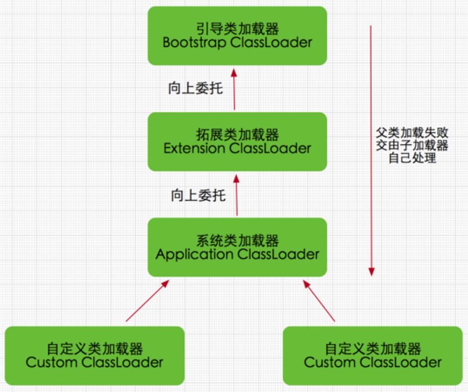
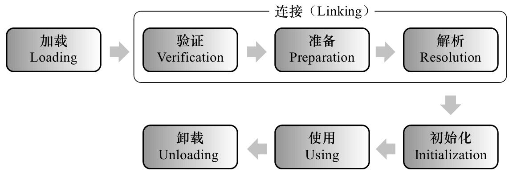

Java是一个跨平台的语言，当初的口号**编译一次，到处运行**。那么它是如何实现跨平台运行的呢？计算机领域有个有个著名的定理**中间层定律**：计算机科学领域的任何问题都可以通过增加一个中间层来解决。那么Java的跨平台也不例外，它就是通过添加了一个中间层来解决跨平台运行的问题的。

我们知道计算机时无法直接运行运行我们编写的程序设计语言[^pl]的代码的，需要编译成计算机可理解的特定底层汇编或者机器码指令才可以。那么如果我们编写的Java代码如果直接编译成了平台相关的代码，那么肯定就无法跨平台而运行了。所以Java从诞生之初就没有编译成平台相关的代码，而是编译为了平台无关的`bytecode`，也就是我们常说的字节码文件（文件扩展名`.class`）。然后交由Java虚拟机JVM(Java Virtual Machine)来执行编译好的字节码文件，而JVM则需要在每个支持的平台上独立的编写，由它充当我们的**中间层**，以此达到我们编写的代码可以跨平台运行的目的。

故而，我们编写的Java代码从面向特定的平台而转换为了编写JVM平台。JVM来负责加载编译后的`.calss`文件、并且执行它们。

那么JVM[^jvms]就包含了字节码、内存管理、多线程等相关的概念和规范，它就是我们Java代码运行的一个假象计算机，它由如下几个部分构成。

# 1 class文件 {#class-file}

笔者之前用Rust语言编写过一个class文件的解析器[^class-file-div](还未完工)。在编写的过程中对字节码又了更进一步的理解。字节码其实就是我们编写的java代码，只是它是基于栈的一种类似汇编语言的二进制格式。JVM规范中规定了这个二进制文件的结构。其中包含了我们编写的源码的所有信息，以及编译器帮我们生成的各种代码。

这个文件结构是Java得以跨平台的根基。详细的信息就不展开了，具体细节可以参考JVM规范[^jvms-class-format]和上面提到的我编写的一个解析器。

# 2 执行class文件 {#exec-class}

有了`*.class`文件，那么JVM就负责转载，解析，并且执行它。加载由ClassLoader来负责，Java中有三类ClassLoader。

1. BootstrapClassLoader : 由c++编写，复杂加载Java的核心类库。
2. ExtClassLoader : Java编写，负责加载Java的扩展类库。
3. AppClassLoader : Java编写，负责应用程序成名的类。
   
ClassLoader采用双亲委派的模型来装载class文件。即先用父类加载器去加载，加载不到时才让自己加载。

这样做可以有一下好处：
1. 避免重复加载某些类型。
2. 避免核心类型不被随意替换。

一个class文件的完整生命周期如下：

1. 加载: 从磁盘文件或者网络中得到class文件的二进制数据，生成一个`java.lang.Class`文件。
2. 验证：检查Class是否符合当前虚拟机的要求，有没有危害。
3. 准备：为类变量分配内存。在方法区给这些变量分配内存并且设置零值。
4. 解析：把常量池中的符号引用替换成直接引用。
5. 初始化：执行编译时自动生成的类的构造器方法`<clinit>()`，为静态变量赋值。
6. 使用：至此就可以使用这个class了。
7. 卸载：不再使用时，可以卸载此class。

JVM执行class时分两种情况：
1. 解释执行
2. 热点代码经过JIT编译为本机代码直接执行。

# 2 内存管理 {#memory}

加载完class文件，当new一个对象时，JVM就负责为这个对象分配和管理内存。

## 2.1 Runtime Aata Areas {#runtime-data-areas}

JVM定义了一些在程序执行期间使用的各种运行时数据区域。其中一些区域是随着Java虚拟机启动而创建的，只有在Java虚拟机退出时才会销毁。而其他的一些区域则是随着线程的创建而创建，在随着线程的退出而销毁。

### 2.1.1 Program Counter {#program-counter}

JVM支持多线程，每个线程创建后，都有它自己的PC计数器(program counter)，伴随着线程的创建和结束。

PC记录着当前线程的代码执行的位置（非native代码），当线程中断、阻塞或者让出CPU时间片后可以利用它来恢复到之前的执行点。

### 2.1.2 JVM Stack {#jvm-stack}

每个线程创建后，都有它自己的栈内存区域，伴随着线程的创建和结束。

Java的线程`1:1`映射到OS的线程。linux的每个线程默认的栈大小为`8MB`，Java的线程默认大小为`1MB`。栈中存放时的是栈帧Frame。当栈大小固定时，如果没有足够的空间存放栈帧Frame了，那么就会抛出`StackOverflowError`。当栈大小是非固定时，则会抛出`OutOfMemoryError`。

每一个方法执行时就会创建一个栈帧Frame，随着方法的执行完毕而退出，都包含如下部分。
1. 局部变量表
2. 操作数栈
3. 动态连接
4. 返回地址
5. 异常处理


### 2.1.3 Heap {#heap}

JVM中只有一个堆，伴随着JVM的启动和结束，所有线程共享此部分数据区域。

对象和数组的数据分配在此区域中。堆中的数据不会显示的释放，而是由GC负责回收。堆的大小可以时固定的，也可以时动态扩展的，这和具体的GC收集器有关。

如果堆内存不足，则会抛出`OutOfMemoryError`。

### 2.1.4 Methad Area {#methad-area}

JVM中只有一个方法区，伴随着JVM的启动和结束，所有线程共享此部分数据区域。

class文件、运行时常量、静态字段、代码等存放在此区域。大小也是可以固定或者动态扩展。GC可以自由选择是否回收此区域。

如果内存不足，也会抛出`OutOfMemoryError`。

### 2.1.5 Native Method Stack {#native-method-stack}

在调用本地方法时，需要JVM分配本地方法栈内存区域。它和JVM栈类似，也是伴随着线程的创建和销毁。有可以固定大小和动态大小，内存不足时抛出`StackOverflowError`或者`OutOfMemoryError`。

### 2.1.6 Direct Memory {#direct-memory}

严格来说，这部分不属于JVM管理的内存数据区域。1.4 NIO引入后，基于缓冲区的I/O。直接在堆外分配内存，然后通过DirectByteBuffer这个引用操作堆外内存。

## 2.2 内存分配 {#memory-allocation}

1. TLAB(Thread Local Allocation Buffer)
2. 堆
3. 栈


## 2.3 GC {#gc}

参见[GC](../gc/)。

# 3 线程同步机制 {#thread-sync}

# 4 JVM Options {#options}

| name                             | JEP       | version    | usage                                                |
| :------------------------------- | :-------- | :--------- | :--------------------------------------------------- |
| -XX:+PrintFlagsFinal             |           |            | 打印最终生效的Options                                |
| -XX:+UnlockExperimentalVMOptions |           |            | 启用实验性的Options                                  |
| -XX:+UnlockDiagnosticVMOptions   |           |            | 启用诊断性的Options                                  |
| -XX:+UseG1GC                     |           |            | GC : 启用G1                                          |
| -XX:+UseContainerSupport         |           | 8  [8u191] | JVM: 启用容器支持（自动感知容器的cpu和memory限制）   |
| -XX:MaxRAMPercentage             |           | 8  [8u191] | JVM: Heap可使用的最大内存比例                        |
| -XX:ParallelGCThreads            | [JEP-307] | 10         | GC : G1改进,允许设置并行GC线程数                     |
| -XX:G1PeriodicGCInterval         | [JEP-346] | 12         | GC : G1改进,在空闲时自动将Java堆内存返还给操作系统。 |


```sh
java -XX:+UnlockDiagnosticVMOptions -XX:+UnlockExperimentalVMOptions -XX:+PrintFlagsFinal -version

# 开启容器支持，并且设置最大内存占用为容器上限的75%。
java -XX:+UseG1GC -XX:+UseContainerSupport -XX:MaxRAMPercentage=75.00 -jar app.jar
```


# 5 参考资料 {#reference}

[^jvms]: Java® Virtual Machine Specification : <https://docs.oracle.com/javase/specs/jvms/se8/html/index.html> 

[^jvms-class-format]: Java® Virtual Machine Specification - Chapter 4. The class File Format : <https://docs.oracle.com/javase/specs/jvms/se8/html/jvms-4.html>

[^class-file-div]: class file 解析器 : <https://github.com/linianhui/div/tree/master/src/class>

[^pl]: 程序设计语言：<https://linianhui.github.io/programming-language/>


[JEP-307]:<https://openjdk.java.net/jeps/307>
[JEP-346]:<https://openjdk.java.net/jeps/346>
[8u191]:<https://www.oracle.com/technetwork/java/javase/8u191-relnotes-5032181.html>
