k8s是一个开源的容器编排系统，源自于Google15年的运维经验[^borg]。具备一下几个特点：
1. 自动化的上线和回滚。
2. 服务发现和负载均衡。
3. 水平扩展。
4. 自我修复。
5. 配置管理。
6. 管理容器资源。

# 1 component {#component}

一个k8s集群是由一组worker node和管理它们的control plane以及一些插件构成。

## 1.1 control plane {#control-plane}

控制面板掌控整个集群的调度管理，是整个集群的大脑。主要有一下4个组件构成：
1. `api-service`：一组REST APIs，它是管理k8s集群的唯一入口，同时也是各个组件交互时的桥梁。
2. `etcd`：高可用的KV数据库，用才存储集群的各种数据。
3. `controller-manager`：
4. `scheduler`：根据用户的声明性要求（资源需求，亲和性等等）负责pod的创建和调度。

为了保证其高可用性，控制面板通常是由奇数个(master node)构成，每个节点上部署上述的全部组件，并且不会在这些节点上运行用户容器。

## 1.2 worker node {#worker-node}

工作节点负责运行用户容器。主要由一下3个组件构成：

1. `kubelet`：负责管理pod、volume等。
2. `kube-proxy`：负责服务发现的底层实现和流量转发。
3. `container-runtime`：容器运行时。

## 1.3 addon {#addon} 

利用DaemonSet或者Deployment部署在kube-system命名空间内的供集群使用的基础服务。

1. DNS：提供基于service name的dns服务，负责默认的服务注册和发现。
    1. CoreDNS[^coredns]。 
2. 网络插件：
    1. flannel[^flannel]。 
    2. calico[^calico]。 
4. 可视化管理GUI：
    1. dashboard[^dashboard]。
5. 监控：
    1. metrics-server[^metrics-server]. 
7. 日志。

# 2 runtime architecture {#runtime-architecture}

kong。

# 3 design concept {#design-concept}

k8s利用api-service提供了一组声明式的API[^kubernetes-object]，通常我们会采用yaml格式的文件来描述我们需要部署的应用。每一个API对象具有三种典型的状态：
1. `desired state`: 期望的状态（也就是yaml的声明式要求），比如部署一个3个实例的web服务。
2. `current state`: 当前的状态。比如当前刚刚部署成功了2个，还差一个实例。

k8s会尽力的保证系统维持在我们的期望状态种，比如3个实例中有一个实例意外挂掉了，那么k8s就会再启动一个实例，以达到期望的状态。

# 4 reference {#reference}

[^borg]:Borg, Omega, and Kubernetes: <https://queue.acm.org/detail.cfm?id=2898444>
[^coredns]:DNS插件-CoreDNS: <https://coredns.io/>
[^dashboard]:Web GUI-kubernetes dashboard: <https://github.com/kubernetes/dashboard>
[^calico]:网络插件-calico: <https://www.projectcalico.org/>
[^flannel]:网络插件-flannel: <https://linianhui.github.io/k8s/networking-flannel/>
[^metrics-server]:监控-metrics-server: <https://github.com/kubernetes-sigs/metrics-server/>
[^kubernetes-object]:声明式的kubernetes-object: <https://kubernetes.io/zh/docs/concepts/overview/working-with-objects/kubernetes-objects/>