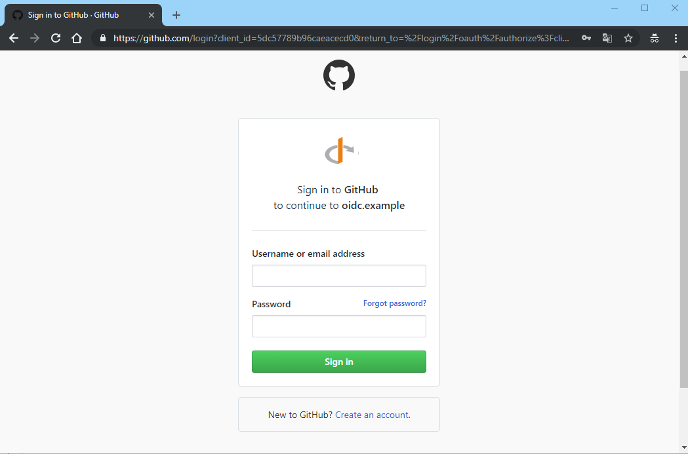
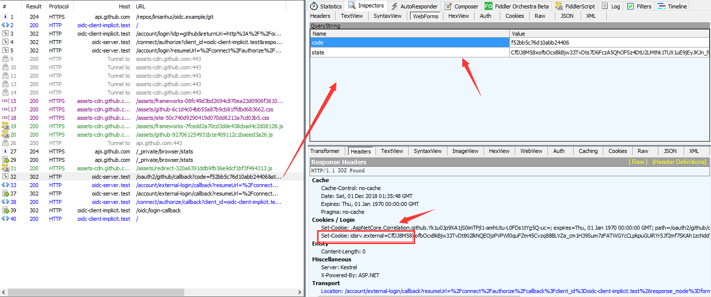

在上上一篇[[OIDC in Action] 01 基于OIDC的SSO][01]的登录页面的截图中有出现QQ登录的地方。这个其实是通过扩展OIDC的OpenID Provider来实现的，OpenID Provider简称OP，OP是OIDC的一个很重要的角色，OIDC用它来实现兼容众多的用户认证方式的，比如基于OAuth2，SAML和WS-Federation等等的用户认证方式。关于OP在[[认证&授权] 04 OIDC(OpenId Connect)身份认证(核心部分)][authc-and-authz-oidc-core]中有提到过，但是并未详细解释。

> 由于QQ的开发者账号申请不方便，故而在一下的示例中使用了Github的OAuth 2.0作为替代(原理是一模一样的)，源码[Add Github OAuth2 as OIDC OpenID Provider](https://github.com/linianhui/oidc.example/pull/14)。
> 
> 由于dev顶级域名已被Google所持有并且强制Chrome对dev使用https(不便于查看http消息)，故而[改为了test顶级域名](https://github.com/linianhui/oidc.example/commit/60f8da75a237144d5ab5c06d17aae3cd739792cb)。

上一篇博客中的登录时采用的本地的账户和密码来运行的。本篇则为OIDC Server添加一个OP :  `Github OAuth 2.0`。这就使得oidc-server.test可以使>Github来登录，并且SSO的客户端可以不做任何改动(除非客户端需要指定采用何种认证方式，即使如此也是非常非常微小的改动)。本篇涉及到的部分有(本系列的源代码位于<https://github.com/linianhui/oidc.example>) :  

1. [oauth2.github.aspnetcore](https://github.com/linianhui/oidc.example/blob/master/1-src/oauth2.github.aspnetcore)这个项目，它基于aspnetcore2实现了Github OAuth 2.0认证。
2. [oidc-server.test](http://oidc-server.test)站点，对应的是[web.oidc.server.ids4](https://github.com/linianhui/oidc.example/blob/master/1-src/web.oidc.server.ids4)这个项目，引用了上面的这个项目。
3. [oidc-client-implicit.test](http://oidc-client-implicit.test)站点，作为oidc的客户端，Github登录的最终消费者(它无需关注Github登录的任何细节)。

# 1 OIDC Client {#oidc-client}

## 1.1 指定oidc-server.test使用Github认证(可选) {#use-github-idp}

下图是上一篇中起始页面，这次我们点击Oidc Login(Github)这个链接(客户端也可以不指定采用Github进行认证，推迟到进入[oidc-server.test](http://oidc-server.test)之后进行选择)。


我们知道这个链接会返回一个302重定向，重定向的地址是发往[oidc-server.test](http://oidc-server.test)的认证请求，我们看下这个请求和[上一次][01-authc]有什么差异 :  


除了红色部分之外，其他地方并没有任何的不同。那么我们就可以理解为时`acr_values=idp:github` (_其中idp是Identity Provider的缩写，即身份提供商，和OP的OpenId Provider属于一类含义，只是不同的叫法_)这个参数改变了oidc-server.test的认证行为，使其选择了Github进行登录。

至此我们可以得出一个结论，那就是Github登录无需在[oidc-server.test](http://oidc-server.test)的客户端这边进行处理，只需指定一个参数即可，比如如果[oidc-server.test](http://oidc-server.test)还支持了微信登录，那么客户端就可以通过传递`acr_values=idp:wechat`即可直接使用微信登录。但是oidc-server.test内部是怎么实现的呢？这里有两件事情需要处理 :  

1. [oidc-server.test](http://oidc-server.test)要能够识别oidc客户端传递过来的这个参数，如果参数有效，则使用参数指定的OP进行登录，如果没有指定，则采用默认的登录方式(本地的用户和密码体系)。参数是 [acr_values(Authentication Context Class Reference values)](http://openid.net/specs/openid-connect-core-1_0.html#rfc.section.3.1.2.1)，它是oidc协议规定的一个参数，Ids4实现了对这个参数的支持。
2. [oidc-server.test](http://oidc-server.test)需要支持使用Github进行登录，并且关联到ids4组件。

下面我们看看[oidc-server.test](http://oidc-server.test)这个站点是如何完成这两件事情的。

# 2 OIDC Server {#oidc-server}

## 2.1 识别客户端发送的IDP信息 {#oidc-server-idp}

在[oidc-server.test](http://oidc-server.test)这个站点中，在集成ids4组件的时候，有这么一段代码 :  

```csharp
public static IServiceCollection AddIds4(this IServiceCollection @this)
{
    @this
        .AddAuthentication()
        .AddQQConnect("qq", "QQ Connect", SetQQConnectOptions)
        .AddGithub("github", "Github", SetGithubOptions);

    @this
        .AddIdentityServer(SetIdentityServerOptions)
        .AddDeveloperSigningCredential()
        .AddInMemoryIdentityResources(Resources.AllIdentityResources)
        .AddInMemoryApiResources(Resources.AllApiResources)
        .AddInMemoryClients(Clients.All)
        .AddTestUsers(Users.All);

     return @this;
}


private static void SetGithubOptions(GithubOAuthOptions options)
{
    options.SignInScheme = IdentityServerConstants.ExternalCookieAuthenticationScheme;
    options.ClientId = GlobalConfig.Github.ClientId;
    options.ClientSecret = GlobalConfig.Github.ClientSecret;
}
```

`AddGithub`这个扩展方法是我自己写的，位于文章开始提到的[oauth2.github.aspnetcore](https://github.com/linianhui/oidc.example/blob/master/1-src/oauth2.github.aspnetcore)项目中。我们暂且先不关注其内部是如何实现的，这里有两个重要的信息。

1. `github`，这是方法的第1个参数，指定了Github作为aspnetcore这个框架种支持的一种认证方式的唯一标识符，也就是一个scheme名字。
2. `options.SignInScheme = IdentityServerConstants.ExternalCookieAuthenticationScheme;` 其含义是把上面指定的`github`这个认证方式，作为ids4的外部登录来使用。其实ExternalCookieAuthenticationScheme 也是个字符串而已 `public const string ExternalCookieAuthenticationScheme = "idsrv.external";` ，这个字符串是ids4定义的一个外部登录的sheme名字。所有的外部登录如果想要和ids4集成，都需要使用它来关联。

## 2.2 集成Github登录 {#github-login}

有了上述两个信息，ids4就可以在接收到`acr_values=idp:github`这样的参数时，自动的从aspnetcore框架中已经注册的认证scheme中查找名为`gtihub`的认证方式，然后来触Github登录的流程。并且在Github认证完成后，进入ids4定义的外部登录流程中。从Fiddler中可以看到这个重定向的过程 :  


然后Github就打开了它的登录页面 :  


这部分的控制代码位于[GithubOAuthHandler](https://github.com/linianhui/oidc.example/blob/master/1-src/oauth2.github.aspnetcore/GithubOAuthHandler.cs)继承的[OAuthHandler](https://github.com/aspnet/AspNetCore/blob/master/src/Security/src/Microsoft.AspNetCore.Authentication.OAuth/OAuthHandler.cs#L220)基类`BuildChallengeUrl(AuthenticationProperties properties,string redirectUri)`方法中 :  

```csharp
protected virtual string BuildChallengeUrl(AuthenticationProperties properties, string redirectUri)
{
    var scopeParameter = properties.GetParameter<ICollection<string>>(OAuthChallengeProperties.ScopeKey);
    var scope = scopeParameter != null ? FormatScope(scopeParameter) : FormatScope();

    var state = Options.StateDataFormat.Protect(properties);
    var parameters = new Dictionary<string, string>
    {
         { "client_id", Options.ClientId },
         { "scope", scope },
         { "response_type", "code" },
         { "redirect_uri", redirectUri },
         { "state", state },
    };
    return QueryHelpers.AddQueryString(Options.AuthorizationEndpoint, parameters);
}
```

`BuildChallengeUrl`方法返回的URL地址，正是上图中Github的认证页面。

## 2.3 处理Github OAuth 2.0 的回调 {#github-login-callback}

然后输入账号密码登录Github,随后Github会采用OAuth 2.0的流程，重定向到[oidc-server.test](http://oidc-server.test)的回调地址上。


这个回调地址是标准的OAuth 2的流程，返回了code和state参数，[OAuthHandler](https://github.com/aspnet/AspNetCore/blob/master/src/Security/src/Microsoft.AspNetCore.Authentication.OAuth/OAuthHandler.cs#L45)类的`protected override async Task<HandleRequestResult> HandleRemoteAuthenticateAsync()`方法会根据code得到github的access_token，然后进一步的获取到github的用户信息(位于[GithubOAuthHandler](https://github.com/linianhui/oidc.example/blob/master/1-src/oauth2.github.aspnetcore/GithubOAuthHandler.cs))。

```csharp
protected override async Task<AuthenticationTicket> CreateTicketAsync(
    ClaimsIdentity identity,
    AuthenticationProperties properties, 
    OAuthTokenResponse tokens)
{
     var httpRequestMessage = new HttpRequestMessage(HttpMethod.Get, base.Options.UserInformationEndpoint);
     httpRequestMessage.Headers.Authorization = new AuthenticationHeaderValue("Bearer", tokens.AccessToken);
     var httpResponseMessage = awaitbase.Backchannel.SendAsync(httpRequestMessage, base.Context.RequestAborted);
    if (!httpResponseMessage.IsSuccessStatusCode)
    {
        throw new HttpRequestException($"An error occurred when retrieving Github user information ({httpResponseMessage.StatusCode}).");
    }
    var user = JObject.Parse(await httpResponseMessage.Content.ReadAsStringAsync());
    var context = new OAuthCreatingTicketContext(new ClaimsPrincipal(identity), properties, base.Context, base.Scheme, base.Options, base.Backchannel, tokens, user);
    context.RunClaimActions();
    await base.Events.CreatingTicket(context);
    return new AuthenticationTicket(context.Principal, context.Properties, base.Scheme.Name);
}
```

随后把这些信息加密保存到了名为`idsrv.external`(还记得在一开始的时候设置的`options.SignInScheme = IdentityServerConstants.ExternalCookieAuthenticationScheme`吧)的cookie中。

## 2.4 关联Github用户 {#association-github-user}

在上一步保存完github的用户信息到cookie中后，ids4便开始根据github的用户信息查找是否已经绑定了已有的用户，如果没有则新建一个。我这里模拟了一个新建用户的页面(简单的设置了下昵称和用户头像-来自github) :  


随后，ids4保存这个新用户的信息，并且用它登录系统(并清空保存的github的用户信息)。


## 2.5 构造id_token & 重定向到客户端 {#redirect-to-client}

随后的流程就和[[OIDC in Action] 01 基于OIDC的SSO - 2.1 OIDC-Client 触发登出请求][01-login-completed]时一样的了，这里就不介绍了，完成后客户端或得到了id_token，读取到了其中的github的用户信息。


# 3 总结 {#summary}

剖析oidc-server.test如何利用ids4来扩展第三方的登录认证方式。文章中的例子是利用ids4来处理的，其他的比如node.js或者java等等平台，代码也许不一样，但是核心流程是一样的 :  

1. 即先使用github登录，获取到认证用户的信息。
2. 然后利用这些信息链接到自有账号体系，最终使用自有的账号体系完成认证。
3. 扩展登录的信息可以根据需要放到发放给客户端的idtoken中，但是只是作为辅助信息存在的。

本例只是使用OAuth 2.0(IDP)作为了OIDC的OP，但是并不仅限于此，还支持SAML，WS-Federation，Windows AD，或者常用的手机短信验证码等等方式，其实OIDC并不关系是如何完成用户认证的，它关心的只是得到用户认证的信息后，按照统一的规范的流程把这个认证信息(id_token)安全的给到OIDC的客户端即可。

如有错误指出，欢迎指正!

# 4 参考资料 {#reference}

idp vs op  :  http://lists.openid.net/pipermail/openid-specs/2006-November/003807.html

acr_values :  http://openid.net/specs/openid-connect-core-1_0.html#rfc.section.3.1.2.1

Github OAuth文档 :  https://developer.github.com/apps/building-oauth-apps/authorizing-oauth-apps/

ids4 Sign-in with External Identity Providers :  https://identityserver4.readthedocs.io/en/release/topics/signin_external_providers.html


[01]:../01-oidc-sso/
[01-authc]:../01-oidc-sso/#oidc-client-send-authentication-request
[01-login-completed]:../01-oidc-sso/#oidc-server-login-completed

[authc-and-authz-oidc-core]:/authentication-and-authorization/04-openid-connect-core/