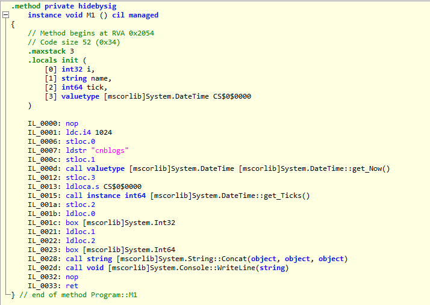

# 1 名字、约束时间(Binding Time) {#names-and-binding-time}

在本篇博文开始前先介绍两个约定：第一个是**对象**，除非在介绍面向对象语言时，本系列中出现的对象均是指任何可以有名字的东西，比如变量、常量、类型、子程序、模块等等。第二个是**抽象的**，因为我们讨论的是语言的核心概念，所以**抽象的**具体指代的是语言特征与任何计算机体系结构分离的程度。

如果可以给名字下个定义，那么它是代表某东西的一些助记字符序列。就好比张三、李四，对应到大部分语言中一般可以等价为**标识符**。名字可以让我们用一个符号来表示变量、子程序、类型等等，其实名字就是一种抽象，比如一个变量名就帮助我们隐藏了背后的一些存储相关的复杂细节、子程序是控制抽象(帮助我们隐藏一个复杂的代码逻辑处理过程)、面向对象中的类属于数据抽象(把对数据的复杂操作逻辑隐藏到一系列方法背后)等等。

看到有人在豆瓣上说Binding不应翻译成约束，而应该是绑定。我不这样认为，绑定是个动词的感觉，但是实际上作者要表达的Binding有一些名词的意思，其实也都无所谓，能理解他要表达的是什么就是了，借用暴漫王尼玛的那句话**不要在意这些细节**。

约束是表示两个东西之间的关联，而约束时间是指约束建立起来的时间。一般而言，约束建立的越早，也就意味这更好的性能；越晚的约束则能提供更大的灵活性。基于编译的语言通常会比基于解释的语言要高效，也就是因为更早一些决策提前建立起了约束。基于编译的语言通常可以在编译阶段就确定出一些内存布局，从而生成高效的访问代码；而解释语言则很难做出这种高效的安排，必须等到在运行前的那一刻才能确定出访问一些变量的地址。

# 2 对象生存期和存储管理 {#object-lifetime-and-storage-management}

约束为名字和其背后具体的对象之间建立了关联，那么这种关联的创建、销毁、隐藏等一些列概念可以用一下几个关键的事件来表示。

1. 对象的创建；
2. 约束的创建；
3. 约束的失效以及激活；
4. 约束的撤销；
5. 对象的销毁；

一个名字与对象之间的约束从建立到撤销的这个时间段称为**约束的生命周期**。

一个对象从创建到销毁的这个时间段称为**对象的生命周期**。

有点绕哈，两个生命周期之间有相同的时候，比如看下面的代码：
```csharp
void Write1024()
{
    String str = "我这个字符串对象的生命周期和约束的生命周期一样长";
    Console.WriteLine(str);
}
```
这个子程序中的字符串的对象的生命周期、和str之间的约束的生命周期，都是随着子程序的调用而开始、调用结束而结束。也会有对象的生命周期比约束的生命周期要长的时候，如下代码：
```csharp
String _str = "我这个字符串对象的生命周期要比和str的约束的生命周期要长";
void Write1024()
{
    String str = _str;
    Console.WriteLine(str);
}
```
由于_str所代表的对象是全局的，而在`Write1024`子程序内与str建立约束的时间仅限于子程序调用过程中，则可以看出此对象的生命周期要长于`Write1024`内与str所建立的约束。当然，也有约束的生命周期长于对象的生命周期的时候，不过这种情况都是程序出错的象征了，如下：
```csharp
class Program
{
    String str = "我是对象的一个字段";
    static void Main()
    {
        Program p = new Program();
        Console.WriteLine(p.str);//正常
        DeleteP(ref p);
        Console.WriteLine(p.str);//P所指的对象和名字p的约束还在，但是对象已经不在了
    }
    static void DeleteP(ref Program p)
    {
        p = null;
    }
}
```

new出来的对象和p之间的约束存活时间是在Main方法内，然而在执行完DeleteP后，对象已经被销毁，然而与p的约束还在(称为悬空引用)，这时对p.str的访问则是不可达的，会抛出null的异常。熟悉C++的朋友应该没少吃过**野指针**的苦头吧，野指针就是约束的生命周期大于对象的生命周期的情况。对象的创建同时也会伴随着系统为其分配存储空间，根据语言需要大致有三类主要的分配方式，静态分配、基于栈的分配、基于堆的分配。

## 2.1 静态分配 {#static-allocation}

静态分配通常情况下是意味着高效的访问性能，因为在程序运行过程中静态分配的对象的位置是不会变动的、只需一次创建开销的，生命周期也超长(与程序共生死)。

一般而言，静态对象、常量、一些字面量对象、程序代码都是静态分配，因为它们在运行中一直一成不变。但是同时也有一些子程序内部的局部变量也会使用静态分配，这是为何呢？我们现在的普遍认知都是子程序的局部变量会在子程序每次调用的时候来分配创建，然后在结束的时候销毁。我们假设一下，假如一个语言它不支持递归，，，你没看错，不支持递归噢(比如早期的Fotran语言就不支持递归)。这种情况下子程序在某一时刻只会有一个实例在运行，，，因为它不能调用它自己(好忧桑的感觉)，那么这些子程序内部的局部变量便可以静态分配，从而能减少频繁的创建、撤销操作代来的开销。

## 2.2基于栈的分配 {#stack-based-allocation}

由于现在的高级语言绝大多数都支持了递归，故而在某一时刻就可能会出现一个子程序的多个实例，显然上面介绍的静态分配是无法满足这种需要了。幸运的是子程序的调用时具有嵌套性质的，这样人们就可以利用栈这个特殊的结构来管理子程序空间的分配。

一个子程序在栈中都有自己的**帧(也称活动记录)**，帧里面包含当前子程序实例的参数和返回值、局部变量、临时量和一些薄记信息等，如下面的一个图例：


上图中的调用顺序是A-B-C-D。sp(栈指针)总是指向栈上第一个未使用的位置，而sp(帧指针)指向当前子程序的帧的已知位置。帧图中的各种信息的排列顺序仅供参考，因为各各语言的编译器的实现或许会有不同的顺序安排。栈的维护是由子程序的调用序列来维持的，其中各种子程序内部所需的对象会随着调用而创建、结束调用而销毁。编译时虽然不能确定帧的位置，但是对其中各各对象的偏移量则是可以做出安排的。如下面的代码：
```csharp
void M1()
{
    Int32 i = 1024;
    String name = "cnblogs";
    Int64 tick = DateTime.Now.Ticks;
    Console.WriteLine(i + name + tick);
}
```


编译把代码中的三个变量以及一个临时量给安排好了顺序。即使是在没有递归的语言中，把局部变量放在栈也会比静态分配有空间上的优势。因为静态分配通常会把程序中所有的子程序的局部变量都分配出来而不管在运行中会不会被调用，基于栈的这种方式则是按需所取，则所需的空间会比静态分配要小的多。

## 2.3 堆分配和垃圾收集 {#heap-based-allocation-and-garbage-collection}

**堆是一块连续的存储区域，可以在程序运行的任意时刻进行对象的分配和销毁**。如常用的数组、类的实例、字符串等需要大块存储区域的数据结构。

堆空间的管理有多种的实现策略，比如最先适配、最佳匹配、伙伴系统等等多种具体的实现算法，这里就不去具体的讨论了。我们主要关注两点，就是堆的速度和空间，这两者存在着此消彼长的关系，这也是算法中最重要的两个平衡点。

C#程序员熟知的托管堆就是基于堆分配的一种实现，只是它附加一些额外的垃圾收集功能等。上述的静态分配是随着程序的运行而分配、结束而销毁；基于栈的分配也是有调用序列来管理对象的创建与撤销；这两种方式都不需要我们(程序员)负责。而堆不一样，因为它的创建是由我们决定的，必如我在C++中new一个类的实例出来，那么它就会被分配在堆区域中，C++中的创建和销毁都由程序员负责。这种方式带来的好处就是语言实现方面简单和执行效率两点，同是也来带内存泄漏和悬空引用两中缺点(野指针也属于此类)，因为你释放的早就会带来悬空引用、而忘记释放则会造成内存泄漏，通常这种错误的代价也是高昂的。so,一些现代语言通常会牺牲一些性能来自动管理堆空间，这些性能损耗也就是垃圾收集功能带来的。具体的实现策略各有千秋，大致也都是属于标记引用计数的策略，如OC中的ARC会在编译期间做很多代码安插工作来做计数、C#为了提升GC效率引入的代龄概念等。

# 3 作用域规则 {#scope-rules}

前面讨论了名字、约束、对象的生命周期和对对象的存储管理。那么下一步就是讨论名字和约束之间的相关概念，在讨论和之前先引入几个术语:

1. **约束的作用域**：为名字和对象之间建立起了约束，那么这个约束起作用的那块程序正文区域称为这个约束的作用域。
2. **作用域**：它不指代具体的某个约束，大致的概念是程序里约束关系不会发生变化的最大区域就叫作用域。
3. **引用环境**：在程序运行的某一个时刻，所有处于活动状态的约束的集合构成了当前的引用环境，这个集合可以是静态或者动态确定。

C#程序员都会知道在这个语言有两个关于对象创建的术语：**声明和定义**。大致可以这样认为，**一个声明引进它的名字，进而表明它的作用域**；**定义则描述了与名字建立约束的事物**。如下面的代码：

```csharp
class A
{
    //声明了一个age的全局变量，其作用域是A的内部；
    Int32 age;
    void Display()
    {
        //到这一步才算是完成了名字age到25这个对象的约束的建立，也就是定义。
        age = 25;
        Console.WriteLine(age);
    }
}
```

## 3.1 静态作用域 {#static-scoping}

在大多数现代语言中，约束的作用域都是静态确定的 : 即在程序编译时确定，这一类可以成为**静态作用域**。

例如在C语言中，子程序的入口引入一个新的作用域，我们在这里建立局部对象的约束，与局部变量同名的全局变量的约束就会失效，它们被局部的约束给屏蔽掉了。在子程序退出时撤销所有的局部变量的约束，并重新激活那些被屏蔽的全局对象的约束。**对约束的这些操作看似需要在运行时来处理，单实际则完全不需要执行任何代码，一个约束处于活动状态的那个程序区域完全是由纯粹的正文规则所决定，由于这个原因，静态作用域也被称为词法作用域**。典型的情况就是：对于一个特定的名字，其**当前的约束**就是程序里包围这个名字的，距离该名字最近的那个代码区域里面的那个约束。

比较简单的是早期Basic语言里，只有一个全局作用域。复杂点的会引入局部作用域，拿熟知的C#来说：
```csharp
class A
{
    Int32 age = 12;
    public void Display()
    {
        Int32 age = 25;
        //输出的是25而非12，则是因为在Display这个子程序内部已经出现了一个age，从而屏蔽了全局的age。
        Console.WriteLine(age);
    }
}
```

## 3.2 嵌套子程序 {#nested-subroutines}

在一些支持子程序嵌套的语言中，作用域一般采用规则是**最内嵌套作用域规则** : 由一个声明引进的名字在这个声明所在的区域可见，以及其内部所嵌套的每个子作用域中可见，除非因为同名而被屏蔽掉。如下面一个的例子(伪代码)：

```js
function A() {
    //a1在A,BB，D子程序内部均可见
    //a2在A,B,C子程序内部均可见
    var a1, a2;

    function B() {
        //这里不能访问BB中的bb1和bb2，因为它们是属于“平行”作用域
        var b1, b2;
        var a1;
        function C() {
            //仅在C内部可见
            var c1, c2;
        }
    }

    function BB() {
        var bb1, bb2;
        //此处的a2声明屏蔽掉了外部的a2
        var a2;
        function D() {
            var d1, d2;
            //此处访问a2则只能访问到BB中的a2。
        }
    }
}
```

由于前面介绍到子程序的执行是基于栈帧的，编译器可以安排好帧指针始终指向当前正在运行的子程序实例，用它来访问局部变量。那么问题来了，我在调用B的时候，它如何访问得到外围的a2。为了找到它们，我们需要一种方法能在运行时找到这些外围作用域的帧，最简单的方法就是在每一个帧中维护一个静态链接，让它指向对应的**父**帧(比如C的父帧就是B，B的是A)，通过这样一个间接层就可以达到目的了。实际上还有一些语言会把某个嵌套子程序的引用保存起来，而后在其外围作用域已经不活跃的时候调用这个子程序，这套做法的结果就是产生了**闭包**这个强大的语言特性。

## 3.3 动态作用域 {#dynamic-scoping}

在采用动态作用域的语言中，名字和对象间的约束依赖于运行时的控制流，特别是子程序的调用顺序，与静态的作用域相比，动态作用域显得更加简单：**一个名字的当前约束就是在运行时期最近遇见的那个、且没有因为作用域的退出而撤销的那个约束**。这种做法能给语言带来很大的灵活性，比如动态的切换子程序执行的引用环境。也是由于这种动态切换的能力，使得编译器无法在编译时期确定更无法确定名字和对象之间的约束，更无法确定引用了非局部变量的程序段的引用环境**。**所以这也是采用动态作用域的语言通常是解释型的而不是编译型的主要原因。如下面的伪代码的例子：

```js
int a;
function first() {
    a = 1;
}

function second() {
    int a=0;
    first(second);
}

a = 2;
if (/条件/) {
    first();
} else {
    second();
}
//如果条件是true，那么结果会是1，a=1的a指向的是int a的a,修改了全局的a=1。
//如果条件是false，那么结果会是2,a=1的a指向的second中的int a=0,修改它并不会影响外部的a=2。
alert(a);
```

# 4 引用环境的约束 {#the-binding-of-referencing-environments}

在前面的几节中我们看到作用域规则如何确定子程序中一个语句的引用环境。依据静态作用域规则，引用环境依赖于可以出现名字声明的程序块的词法嵌套关系；而动态作用域规则的引用环境依赖于运行时遇到各种声明的顺序。在那些允许创建子程序引用(例如把子程序当参数传递)的语言里，还有一个问题未得到解释，那就是什么时候把这种作用域规则应用于这种子程序，创建这种引用时还是最终调用时？对于动态作用域规则的语言，这个问题特别重要了，即使是静态作用域的语言，这个问题也是关系重大。这个问题也就是**引用环境依赖所谓的约束规则，在创建时建立引用环境称为深约束，而推迟到调用时建立引用环境称为浅约束。**用文字描述起来比较抽象，下面看一个伪代码例子吧 : 

```js
//一个临界条件值
var threshold = 0;

//过滤年龄大于threshold指定的person
function filterAge(person) {
    return person.age > threshold;;
}

//打印person
function printPerson(person) {
    //如果需要格式化打印
    if (isNeedFormat) {
       //格式化输出...
    }
    else {
       //非格式化输出...
    }
}

//一个通用的子程序，打印选择的记录
function printSelectedRecords(recordList, filter, printfun) {
    var isNeedFormat = true;
    for (var i = 0; i < recordList.length; i++) {
        if (filter(recordList[i])) {
            printfun(recordList[i]);
        }
    }
}

/*调用程序*/
threshold = 20;
var persons = [
    { name: "乱舞春秋", age: 25 },
    { name: "小明", age: 13 }
];
printSelectedRecords(persons,filterAge,printPerson);
```

我们可以看到`printSelectedRecords`接受一个集合参数`recordList`，一个filter的过滤打印记录的子程序，一个printfun的打印程序。

我们首先来看`printPerson`这个子程序，它的内部依赖一个isNeedFormat的变量来控制是否格式化打印还是常规打印，如果需要保证代码正常执行，那么if(isNeedFormat)中的isNeedFormat这个名字与其所建立约束的具体对象必须延迟到调用时才可，也就是执行`printSelectedRecords`子程序时，`printfun`中的`isNeedFormat`需要向外围动态查找，找到`var isNeedFormat=true`,然后建立其约束。这种推迟到调用时建立约束的方式就是上面所说的浅约束。一般动态作用域的语言默认是浅约束，当然动态作用域和深约束也是可以组合到一起的，4.1小节会介绍这种组合。

再来看看`filterAge`这个子程序，它内部依赖threshold这个对象，在调用前我们设置了`threshold=20`，也就是说我们希望在`filterAge`真正执行的时候依然是保持着对这个外围`threshold`的约束(也就是说在传递给`printSelectedRecords`的那一刻`filterAge`要能**抓住**`threshold=20`中的`threshold`,并把它拖到以后的执行环境中)。然而，假如在`printSelectedRecords`内部有一个同名的对象，如果还是按照上面介绍的浅约束的方式，则我们设置的`threshold=20`就会永远得不到正确的使用。所以要保证程序的可用，那么就必须在把`filterAge`当参数传递时一起将其引用环境一块打包传递过去，**让其执行时依然使用传递时的引用环境，而非执行时的引用环境**。那么这种规则称为深约束，一般静态作用域的语言默认是深约束，静态作用域+浅约束的组合看起来没什么意义，也没发现有语言采用这种方式。``

## 4.1 子程序闭包 {#subroutine-closures}

要想实现深约束，那么就需要一种能够显示的表示引用环境的东西，也就是子程序在将来运行时就像在现在运行一样，并将它与有关的子程序的引用打包捆绑在一起，这个被捆绑起来产生的整体称为**闭包**。具体闭包在语言方面怎么实现，这里就不做讨论了，想了解的朋友可以看看书中的这一章节。下面看个例子吧，JavaScript中闭包的应用：

```js
function getEqCount(array, eqFilter) {
    var count = 0;
    for (var i = 0; i < array.length; i++) {
        //当makeEqFilter创建的闭包返回的eqFilter时，这个eqFilter已经是一个处在闭包环境（包含一个对参数i的引用）。
        //它一直是运行在makeEqFilter当初创建它的环境中.
        if (eqFilter(array[i]))
            count++;
    }
    return count;
}
function makeEqFilter(i) {
    //创建一个闭包环境，让返回的这个子程序抓住i，以便在后续执行时可以保持对这个i的引用。
    return function (j) {
        return i == j;
    }
}
var count = getEqCount([1, 2, 3, 4, 5, 1], makeEqFilter(1))
console.log(count);//输出2
```

园子中好多的用C#的，我也用C#代码写了一下，想了解C#的**闭包**真相的可以看看：

```csharp
class Program
{
    static void Main()
    {
        Int32[] arrays = { 1, 2, 3, 4, 5, 1 };
        Int32 i = 1;
        Int32 count = GetEqCount(arrays, (v) => v == i);
        //我们知道(v) => v == i是一个lambda表达式，但是它本质是个语法糖，我们一步一步展开看看,等同于如下
        //Func<Int32, Boolean> filter = new Func<Int32, Boolean>(Eq);
        //GetEqCount(arrays, filter);
        //那么问题来了，i怎么传递进去？
        Console.WriteLine(count);
        Console.ReadKey();
    }
    //static Boolean Eq(Int32 v)
    //{   
    //    //这里的i怎么来？
    //    return v == i;
    //}
    static Int32 GetEqCount<T>(IEnumerable<T> array, Func<T, Boolean> filter)
    {
        Int32 count = 0;
        foreach (T item in array)
        {
            if (filter(item))
            {
                count++;
            }
        }
        return count;
    }
}
```

怎么回答上面的问题呢，i怎么传递过去了，想弄清楚就只有看看编译后的IL代码，这里就不贴出来了，附一个等效的IL展开后的代码如下。

```csharp
class Program
{
    static void Main()
    {
        Int32[] arrays = { 1, 2, 3, 4, 5, 1 };
        Int32 i = 1;

        //展开结果
        FuncFilter ff = new FuncFilter();
        ff.i = i;
        Int32 count = GetEqCount(arrays, new Func<Int32,Boolean> (ff.Eq));

        Console.WriteLine(count);
        Console.ReadKey();
    }
    static Int32 GetEqCount<T>(IEnumerable<T> array, Func<T, Boolean> filter)
    {
        //略
    }
    //模拟编译器生成的代码
    class FuncFilter {
        public Int32 i;
        public Boolean Eq(Int32 v) {
            return v == i;
        }
    }
}
```

## 4.2 一级和二级子程序 {#first-class-values}

一般而言，在语言中，如果一个值可以赋值给变量、可以当作参数传递、可以从子程序返回，那么它被称为具有**一级状态**(和我们在js中说函数是一等公民一个含义)。大多数的语言中数据对象都是一级状态。二级状态是只能当作参数传递、不能做返回值、不能赋值给变量(笔者觉得这点好像不对，但也没查到相关资料)；三级值则是连参数也不能做，比如C#中一些+-*/等符号。

在具有嵌套作用域的语言中，一级子程序会带来很大的实现上的复杂性，比如上面js闭包的例子，在makeEqFilter执行完毕后，它的作用域是不能撤销的，如果撤销，那么闭包中抓住的引用就变成悬空引用了。为了避免这一问题，大部分函数式语言都表示局部变量具有**非受限的生命周期**，它们的生命周期无限延长，直到GC能证明这些对象再也不使用了才会撤销。那么不撤销带来的问题就是这些子程序的存储分配基于栈帧是不行了，只能是基于堆来分配管理。为了维持能基于栈的分配，有些语言会限制一级子程序的能力，比如C++，C#，都是不允许子程序嵌套，也就从根本上不会存在闭包带来的悬空引用问题。

# 5 作用域里的约束 {#names-within-a-scope}

在以上的讨论中，我们假设的情况都是一个名字约束一个对象，其实我们发现在语言中不是这样子。一个对象可以有多个名字(好比一个人可叫张三、也可以叫狗蛋)，一个名字也可以代表多个对象，前者是别名，后者称为重载。重载一般会有操作符的重载、子程序名字的重载。其实操作符重载也是属于子程序名字重载，比如C#中你可以对+-等符号定义一个静态方法，这也只是编译器的一个语法糖而已。

```csharp
//别名
String zhangsan="我是张三";
String goudan=zhangsan;

//子程序名重载
void print(int);
void print(double);
void print(string)
```

重载比如print等此类子程序名，编译器也都会根据上下文决定你真正要调用的是那个函数。由重载带来的还有两个常见的特性，多态性和强制，就比如上面的print三个子程序就构成了多态性(参数的多态性)，如果我为print(double)传递了一个int,那么还会出现强制 (数据类型的转换)。如果在面向对象语言中，还会有子类型的多态性以及强制，比如一个接受接口类型参数的方法，可以通过传递一个子类类型来调用。还有一种多态称之为类型化参数的多态性(通常我们称之为**泛型**)，具体例子就不列举了。

# 6 总结 {#summary}

本篇从名字入手，介绍了名字与其背后的对象的约束关系、以及约束时间的概念；然后介绍了对象的分配策咯(静态、栈、堆)；紧接着讨论了名字与对象之间建立的约束的生命周期，并由此引出了作用域的概念；进一步延伸出多个约束组成的引用环境的相关概念以及问题。这一篇中术语、概念繁多，我也适当的精简了一些，无奈觉得文字还有点晦涩，还是功力不够。其实我觉得这些术语概念不一定需要记得，能理解它要表达式什么就可以了，因为术语概念无非就是给一些要表达的含义起了一个简短的名称而已，有时你觉得名称不恰当，那也是正常，理解就够了，不必在意这些不影响理解的小细节。
