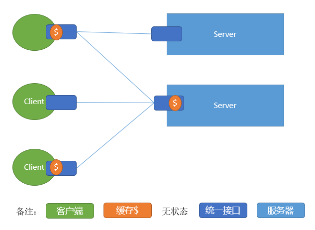
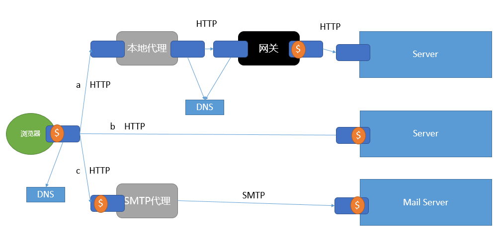

衔接上文[[理解REST] 04 基于网络应用的架构风格](../04-network-based-software-architecture-style/)，上文总结了一些适用于基于网络应用的架构风格，以及其评估结果。在前文的基础上，本文介绍一下Web架构的需求，以及在对Web的关键协议进行设计和改进的过程中遇到的问题；以及在对基于网络应用的架构风格进行评估的过程中的领悟；结合Web的需求进而推导出REST这种架构风格，随后使用REST来指导Web架构的设计和改进工作。

# 1 Web的需求 {#web-domain-requirements}

在本系列博客的第一篇博客[[理解REST] 01 REST的起源](../01-origin/)中，Web之父Berners-Lee在世界上第一个网站写下的第一句话 :  **The WorldWideWeb (W3) is a wide-area[ hypermedia ](http://info.cern.ch/hypertext/WWW/WhatIs.html) information retrieval initiative aiming to give universal access to a large universe of documents.** 阐述了创建Web的目的在于形成一种链接众多文档的广域的超媒体信息检索系统，使得人类和机器都可以通过它来进行沟通和交流。这个系统最初的目标用户是分散在世界各地的、通过互联网链接的各个大学和政府的高能物理研究实验室。他们的机器是不同类型的终端、工作站、服务器和超级计算机的大杂烩，所以他们的操作系统和文件格式也是一个大杂烩。构建一个这样的系统所面临的挑战是为这些信息文档提供统一的接口，使得这些信息可以在众多的平台上进行交流通信，以及当新的设备接入到这个系统时，可以进行增量的部署。

## 1.1 低门槛 {#low-entry-barrier}

参与为Web创建信息是自愿的，对于信息的创作者、阅读者以及应用开发者而已，Web都应该是"低门槛"，以方便Web的各类使用者接入Web系统。

选择超媒体(比如最常见的超媒体HTML)作为用户界面(UI)，是因为其简单性和通用性。首先无论信息来源于何处，都能使用相同的界面进行呈现；其次超媒体的关系(链接)允许对其进行无限的链接构造，从而形成一个巨大的"网状结构"；对这个网状结构的文档的直接操作可以引导用户浏览整个应用。

对于创作者而言，超媒体的创作语言也必须是简单的，能够使用现有的编辑工具来进行创建，无论是否链接到网络，都可以使用此超媒体格式来保存创作的内容。因此所有的协议都被定义为文本格式，以方便对通信进行观察和测试。

## 1.2 可扩展性 {#extensibility}

即使可以创建一个完美匹配用户需求的软件系统，那些需求也会随着时间而发生变化(唯一不变的事物就是变化其本身)，如果一个系统想要像Web那样长寿，它就必须做好应对变化的准备。因此可扩展性可以使我们避免陷入已部署的系统的局限之中，避免受到遗留系统的束缚。

## 1.3 分布式超媒体 {#distributed-hypermedia}

超媒体是由应用控制信息来定义的，这些信息内嵌在信息的表述之中。分布式超媒体系统允许在远程地点存储表达控制信息，因此分布式超媒体系统中的用户操作需要将大量的数据从其存储地移交到其使用地，所以Web的架构必须支持大粒度的数据移交。超媒体交互的可用性很容易影响到用户感知的性能(比如用户选择了一个链接，到链接的界面呈现之间的时间)，因为Web的交互的信息是跨域整个互联网的，则Web的架构必须尽量的减少网络交互的次数以改善用户感知的性能。

## 1.4 互联网规模 {#internet-scale}

Web的旨在形成一个互联网规模的分布式超媒体系统，这意味着它是不但是跨越地理上的分布，而且是跨越组织边界的(互联网是跨域组织边界的信息网络。于此相对的是可控的局域网，比如企业内部的私有网络)。信息服务的提供商必须满足无法控制的可伸缩性和独立部署这两方面的要求。

大多数我们接触到的系统都存在一个隐含的假设，那就是这个系统是完全可控的。当一个系统在互联网上允许时，则无法满足这样的假设。无法控制的可伸缩性指的是架构元素可能会于其组织边界之外的元素进行通信，当它们遇到如下的情况时仍能正常运行 :  未曾预料到的负载、收到错误的数据或者恶意的数据等等。这一点适用于所有的架构元素，不能期望用户保持所有的服务的信息，也不能期望服务保持跨越多个请求的状态信息。架构元素在跨越多个组织边界进行通信时，其安全性也是不能忽视的，应该允许中间应用(比如防火墙)来检查其通信，并阻止安全策略不允许的交互。系统的参与者都应该假设其接收到的信息是不可信的，那么就需要架构能够提供认证和授权的机制，然而认证会降低可伸缩性，那么架构的默认操作应该是限制在一组定义好的安全操作中(这里的安全操作指的是不会对服务器造成危害的操作，因此并不需要进行认证)。

多个组织边界也意味着系统应该可以应对新旧组件的共存，而不妨碍新组件使用它们的新功能。同时现有的架构元素在设计的时候需要考虑到以后会添加新功能，旧的实现也必须能够方便的识别出来，从而把这些遗留的行为封装起来，不会对新元素造成不利影响。对于Web这样的系统来说，强制要求架构中的所有组件都整齐划一的来部署是不现实的事情。

## 1.5 Web急速发展带来的问题 {#problem}

自从1990年Berners-Lee发布了第一个网站一来，到1993年末。Web的目标用户已经远远的超出最初计划的目标群体(高能物理研究实验室)了。延伸到了学校、个人主页和校园信息系统等等，Web迎来了指数级的增长。最早的HTTP0.9是一个非常简单的协议，是为单个请求响应设计的，新的站点越来越多的采用了图片作为网页的一部分，导致出现了不同的浏览模式。此时的Web架构已经无法满足这样的需求了，随后在IETF形成了三个工作小组HTTP,URI和HTML。**这些工作组的主要任务是定义现有架构性通信的子集(早期Web中普遍的一致的实现)，然后指定一组规范来解决这些问题。这些工作带来的挑战是如何把一组新功能引入到一个已经被广泛部署的系统中；以及如何确保新功能的引入不会对那些使得Web成功的架构属性带来不利的影响甚至是毁灭性的影响。**

## 1.6 解决之道 {#approach}

早期的Web基于一些可靠的设计原则 :  分离关注点、简单性、通用性，但是缺乏对于架构的描述和理论基础。可以使用一种架构风格来定义Web架构背后的设计原则，那么这些设计原则对于未来的架构而言就是可见的了。如同在之前的博客中解释道的那样，一种架构风格是一组已命名的架构元素之上的架构约束，由它会产生一组所期待的架构属性。而这组期望架构属性，则正是Web所期待的需求的体现。

这个解决之道的第一步就是识别出来现有的(http1.0和http1.1开发之前)Web架构中的架构约束，这些架构约束负责产生出所期待的架构属性。

第二步则是识别出在互联网规模的分布式超媒体系统中所期待的架构属性，然后选择会产生这些架构属性的架构约束，把这些架构约束添加到现有的架构风格之上，形成一种新的风格。

第三步则是使用新的架构风格作为指导，对修改和扩展Web架构的提议进行评估，看其是否存在冲突，如果存在冲突则表明这个提议违反了一个或多个Web背后的设计原则。

修正后的协议规范是根据 **新的架构风格** 的指导来编写的，最后通过修订后规范，开发实现它，然后进行部署。这些解决之道是源自于Fielding博士直接参与了Apache Http服务器的项目和libwww-perl客户端库，以及为网景的Navigator、Lynx和微软的IE的开发者提供建议得到的经验。

# 2 推导REST {#deriving-rest}

上一小节提到的 **新的架构风格** 就是专门为分布式超媒体系统设计的 **REST(Representational State Transfer=表述性状态移交)** ，它由上一篇博客中描述的几中架构风格([[理解REST] 04 基于网络应用的架构风格](../04-network-based-software-architecture-style/))衍生而来，添加了一些额外的架构约束。Web架构的设计理论，是由一组应用于架构元素之上的架构约束组成的，当逐步将每个架构约束添加到这个架构风格上时，会对架构风格产生一些影响，通过检查这些影响，可以识别出来其产生的架构属性。这里就从一个 `空风格` 开始，它代表一个空的架构约束集合(即是一个没有明显边界的系统)，而这也正是推导REST的起点。

## 2.1 客户端-服务器 {#client-Server}

首先添加一个[客户端-服务器 风格][Client-Server-Styles] :  其背后的原则是分离关注点。通过分离分离用户界面和数据存储两个关注点，可以改善用户界面的 **可移植性** ；同时可以简化服务器组件，改善系统的 **可伸缩性** 。不过对于Web来说，最重要的则是这种分离使得组件可以 **独立部署** ，从而支持跨域多个组织边界的 **互联网规模的需求** 。

## 2.2 无状态 {#stateless}

接下来在添加一个架构约束 :  通信必须在本质上是 [无状态][Client-Stateless-Server-Styles] 的。也就是说从客户端到服务器的每个请求都必须包含理解该请求所必须的所有信息，不能利用服务器存储会话的上下文信息，会话状态全部保存在客户端。这一约束可以**改善可见性**(监视系统不必为了确定一个请求的全部性质而去查看请求之外的其他请求)；**改善可靠性**(减轻了从局部故障中恢复的任务量)；**改善可伸缩性**(服务端不必在多个请求直接保存状态，从而允许服务器迅速释放资源)。但是无状态也有相应的缺点，由于服务器不能保持会话状态数据，则会造成在每一次请求中发送大量重复的数据，可能会**降低网络性能**。

## 2.3 缓存 {#cache}

为了改善网络效率，添加了 [缓存][Cache-Styles] 这个架构约束。它要求一个请求的响应中的数据被隐式或者显式的标记为可缓存或不可缓存，如果可缓存，则客户端可以为以后相同的请求重用这个响应的数据。缓存的好处在于可以消除一部分网络交互，从而**提高效率、可伸缩性和用户感知的性能**。但是代价则是缓存中如果存在过期的旧数据，则会**降低可靠性**。

**早期的Web架构(1994年之前)，是通过客户端-缓存-无状态-服务器这组架构约束来定义的**。如下图所示 :  

也就是说，1994年之前的Web架构设计基础理论聚焦的是在互联网上交换静态文档的无状态的客户端-服务器风格，通信信息仅包含了对非共享缓存初步支持，但是并没有限接口要求所有的资源提供一组一致的语义。相反，Web依赖一个公共的客户端-服务器的实现库(CERN的libwww)来维持Web应用的一致性。然而Web的实现者则早已超越了这组设计，除了静态的文档之外，还要求识别动态生成的响应，也以代理和共享缓存的形式开展了对中间件的开发工作，但是必须对现有的协议进行扩展，这样中间件才能可靠的通信。以下三个架构约束(**统一接口，分层系统，按需代码**)则是早期Web架构的扩充，以便用来对新的Web架构的扩展和改进加以指导。

## 2.4 统一接口 {#uniform-interface}

REST区别于其他的基于网络的架构风格的核心特征是 :  强调组件之间要有一个统一的接口。通过在组件接口上应用通用性的原则，简化了整体的系统架构，也改善了交互的可见性。实现和它们所提供的服务是解耦的，这也促进了组件的独立可进化性。当然得到这些好处也是要付出代价的 :  统一接口降低了效率，因为信息都是使用标准的形式来移交的，而不是特定于应用需求的形式。REST接口被设计为可以高效的移交大粒度的超媒体数据，并对Web的场景情况做了优化，但是这也导致该接口对于其他形式的架构交互而言并不是最优的。

为了获得统一接口，需要多个架构约束来指导组件的行为，REST由四个接口架构约束来定义 :  

1. 资源的识别；
2. 通过表述来操作资源；
3. 自描述的信息；
4. 超媒体作为应用程序状态的引擎(HATEOAS)。

## 2.5 分层系统 {#layered-system}

为了进一步满足互联网规模这个需求，添加了 [分层系统][Layered-System] 这个架构约束。分层系统通过限制组件的行为(每个组件只能看到与其交互的相邻层)，将架构分解成若干层级。通过将组件对整个系统的认知限制在单一的层级内，为整个系统的复杂性划分了边界，并且可以提高底层的独立性，也可以通过层级来封装遗留的旧组件，以免新的组件受到到旧的影响。中间件还可以支持负载均衡来 **改善系统的可伸缩性** 。然而，分层系统会增加数据处理的开销和延迟，因此 **降低用户感知的性能** 。不过对于一个支持缓存的架构来说，则可以通过在中间层使用共享缓存来弥补这一缺点。此外还可以通过这些中间层实施安全策略(比如防火墙)。

[分层系统](#layered-system) 和 [统一接口](#uniform-interface) 相结合后，产生了类似 [统一管道和过滤器][Uniform-Pipe-And-Filter] 相似的架构属性。在REST中，中间件能够主动的转换消息的内容，因为这些消息是自描述的，并且其语义对于中间件而言是可见的。

## 2.6 按需代码 {#code-on-demand}

为REST添加的最后一个架构约束是 [按需代码][Code-On-Demand] 。REST允许下载并执行applet(如今最广泛的是js脚本)代码，对客户端的功能进行扩展。这样则可以减少预先实现的功能的数目，简化客户端的开发，也 **改善了系统的可扩展性** 。但是这样做 **降低了可见性(REST的连接器和组件并无法理解这些脚本)**。因此按需代码只是REST的一个可选的架构约束。

## 2.7 推导小结 {#style-derivation-summary}

REST是由一组经过选择的架构约束组成的架构风格，通过这些架构约束产生了期待的架构属性。完整的REST的推导流程图如下 :  

# 3 REST的架构元素 {#rest-architectural-elements}

REST是对 **分布式超媒体系统** 中的架构元素的一种抽象，REST忽略了组件的实现以及协议语法的细节(比如html,http的具体协议细节)，以便聚焦于一下几个方面 :  组件的角色、组件之间的交互、组件对于重要数据元素的解释。

## 3.1 数据元素 {#data-elements}

在分布式对象风格中，所有的数据都被封装和隐藏在数据的处理组件中。于分布式对象不同的是，REST的关键特征在于其架构的数据元素的形式和状态。在分布式超媒体的特性中，当一个用户选择了一个链接后，该链接所指向的信息需要从其存储地移动到其使用地。对于一个分布式超媒体系统的架构师而言，他只能在三种选项中做出选择 :  

1. 在数据所在地对数据进行呈现，并向接收者发送一个固定格式的镜像；
2. 把数据和呈现引擎封装起来，一起发送给接收者；
3. 发送原始数据可一些描述数据类型的元数据，让接收者自己去呈现。

每一个选项都有其优缺点，第1个选项对应于传统的客户端-服务器风格，它把数据的呈现结果发送给接收者，这样可以简化其他组件对数据结构做出假设，并且简化了客户端的实现，但是也严重限制了接收者的功能，并且把绝大部分的负担都放在了发送者这一边，从来导致伸缩性的问题。第2个选项对应可移动对象风格，它支持对于信息的隐藏，同时还可以通过唯一的呈现引擎支持对数据的处理，但是这将会把接收者的功能限制在呈现引擎的范围之内，也会大量的增加需要移交的数据量。第3个选项允许发送者保持简单性和可伸缩性，但是它丧失了信息隐藏的优点，并且要求发送者和接收者都必须理解相同的数据类型。

REST聚焦于 **分享对于数据类型的理解**，但是对其标准的操作接口做了限制。通过这样的方式，REST所采用的是这三个选项的一个混合体。REST通过一种数据格式来移交资源的表述来进行通信，这可以基于接收者的能力以及其所期待的格式以及内容中动态的选择所使用的数据格式。至于表述是否资源的原始格式相同，则被隐藏在了接口的背后。**通过发送一个表述，可以获得近似移动对象风格的好处；这个表述由一个标准的数据格式的执行组成(供呈现引擎使用)，因此获得了客户端-服务器风格的分离关注点的好处，而且不存在服务器的可伸缩性问题；表述允许通过一个通用的接口来隐藏信息，从而支持封装和服务的进化，并且可以通过按需代码来扩展功能。**REST的数据元素如下 :  

| 数据元素   | 实例                             |
| ---------- | -------------------------------- |
| 资源       | 一个超文本引用所指向的概念性目标 |
| 资源标识符 | URL,URN                          |
| 表述       | HTML，图片，音视频               |
| 表述元数据 | 媒体类型，修改时间等             |
| 资源元数据 | source link,alterbates           |
| 控制数据   | 一个超文本引用所指向的概念性目标 |

REST对于信息的核心抽象是 **资源**  :  任何可以被命名的信息都能够作为一个资源，比如一个文档，一个图片，今天的天气情况等等。资源标识符则是对一个资源的唯一标识，由命名权威来为资源分配标识符，映射的语义同样由命名权威来负责。REST使用 **表述** 来表述资源的当前状态或者预期状态，随后在各个组件之间移交该表述，通过这种方式在资源上执行各自操作，表述通常由数据以及描述数据的元数据组成。控制数据则是定义在组件之间交互的数据的用途以及其行为，比如控制缓存行为等。表述的数据格式成为媒体类型(media type)，发送者可以把一个表述包含在一个响应之中，移交给接收者，接收者收到响应之后，根据消息中的控制数据和媒体类型的性质，对消息进行处理(比如呈现一个jpg的图片，执行一个js脚本等)。媒体类型的设计会之间影响到用户感知的性能，比如HTML支持增量呈现的话，浏览器就可以一边接收html，一遍呈现接收到的部分内容，而不必等到其完全接收完毕。

由这些数据元素可以组成一个操作资源的通用接口，而无需关系其成员函数或者其处理软件是何种类型的。

## 3.2 连接器 {#connectors}

REST使用多种不同类型的连接器来对资源和其表述进行封装，连接器代表了一个组件通信的抽象接口。

| 连接器 | 实例                            |
| ------ | ------------------------------- |
| 客户端 | libwww、libwww-perl、httpclient |
| 服务器 | libwww、apache api              |
| 缓存   | 浏览器缓存、CDN                 |
| 解析器 | DNS                             |
| 隧道   | SSL                             |

所有的REST的交互都是无状态的。这就使得每个请求都包含理解该请求的全部信息，而不必查找其关联的请求。这一个约束得到了一下4点好处 :  

1. 连接器无需在请求之间保持应用状态，改善可伸缩性；
2. 允许对交互进行并行处理；
3. 允许中间件查看和理解单独的一个请求，并对其进行动态的安排(比如负载均衡)；
4. 强制了每个请求都包含可能会影响缓存的信息。

主要的连接器是客户端和服务器，客户端发起请求，服务器监听请求并做出响应。其次是缓存连接器，它位于客户端和服务器接口处，用来复用可缓存的响应，比如浏览器缓存，和共享的CDN缓存。解析器负责把部分或者完整的资源标识符翻译成具体的网络地址信息，比如DNS把一个域名翻译成一个IP地址。隧道是一种简单的跨域连接边界的一种机制，比如SSL。

## 3.3 组件 {#components}

REST的组件可以根据它们在整个应用中的角色来分类，比如 :  

| 组件       | 实例                          |
| ---------- | ----------------------------- |
| 来源服务器 | Apache,Ngnix,IIS              |
| 网关       | CGI，反向代理，SMTP网关       |
| 代理       | CERN代理，Fiddler             |
| 用户代理   | chrome,firefox,ie，httpclient |

来源服务器是资源的命名权威所在地。网关则是前置在来源服务器的一个组件，用来执行数据转换(HTTP到SMTP的网关)，安全增强、性能增强(负载均衡)等。代理和网关的差异在于这是客户选择的组件，必须调试http的时候使用的fiddler。用户代理是使用客户端连接器发起请求，并作为响应的最终接收者，一般而言是Web浏览器，或者网络爬虫。

# 4 REST的架构视图 {#rest-architectural-views}

第3小节孤立的了解了REST的架构元素，这一小节则把这些元素组合起来，形成一个架构。

## 4.1 过程视图 {#process-view}

过程视图的主要作用是展示数据在系统中的流动路径，得出组件之间的交互关系。下面是一个典型的REST的过程视图 :  

一个用户代理处理三个并行的交互，用户代理的客户端连接器的缓存无法满足请求，则它根据每个资源标识符的属性和客户端的连接配置，把每个请求路由到资源的来源服务器 :  

1. 请求a被发送到一个本地代理，然后代理通过DNS查找到了一个网关，该网关把这个请求发送到了一个能满足该请求的来源服务器。
2. 请求b被之间发送到了一个来源服务器。
3. 请求c被发送到了一个SMTP的代理，这个代理之间把请求转换为了一个SMTP的请求，发给了一个邮件服务器。

## 4.2 连接器视图 {#connector-view}

REST的连接器视图聚焦于组件之间的通信机制。客户端连接器检查资源标识符，以便为每一个请求选择一个合适的通信机制，比如标识符如果是一个本地资源，则链接到一个处理本地资源的代理组件。REST并不限制通信的协议，比如上面的请求c把一个http的请求，转换为了邮件协议。

## 4.3 数据视图 {#data-view}

数据视图展示的时信息在组件之间流动时的应用状态。REST把所有的控制状态都集中在表述之中，目的在于使服务器无需维护当前请求之外的客户端状态，从而改善服务器的可伸缩性。应用的下一个控制状态位于第一个请求的响应的表述之中，从一个表述迁移到下一个表述，因此这样的一系列表述可以构造出一个资源的有限状态机，即超媒体作为应用程序的状态引擎(HATEOAS)。

# 5 总结 {#summary}

本篇博客在前几篇的基础上，介绍了Web诞生的目标，以及在早期发展中遇到的问题，进而推导出了其解决之道，即专门为分布式超媒体系统设计的REST(表述性状态移交)架构风格。REST强调组件交互的可伸缩性、接口的通用性、组件的独立部署、以及减少交互延迟、增强安全性、封装遗留系统的组件等。

REST架构风格由 [客户端-服务器](#client-Server)、[无状态](#stateless)、[缓存](#cache)、[统一接口](#uniform-interface)、[分层系统](#layered-system) 和 [按需代码](#code-on-demand) 这**6个架构约束**构成，同时统一接口这个架构约束由**资源的标识**、**通过表述操作资源**、**自描述的消息**和**HATEOAS**这4个接口约束构成。**其中REST的核心特征在于统一接口，而统一接口的核心在于HATEOAS**。前面说过，REST是Web的架构风格，Web由HTTP,HTML,URI和MIME这四个核心部分构成，那么我们看一下这四部分是如何体现REST的6个架构约束以及4个接口约束的。

1. 客户端-服务器 :  HTTP的请求响应方式体现了客户端-服务器这个约束。
2. 无状态 :  HTTP的无状态性。
3. 缓存 :  HTTP有完整的丰富的缓存控制功能。
4. 分层系统 :  客户端代理，网关，反向代理，SSL，安全防火墙这些中间件体现了分层系统(得益于统一接口、HTTP的自描述性和可见性，使得这些组件可以透明的存在于整个Web系统中)。
5. 按需代码 :  最常见的Javascript脚本。
6. 统一接口 :  这是最为核心的约束，其由众多部分组成
    1. 资源的标识 :  URI；
    2. 通过表述操作资源 :  通过HTML操作资源。
    3. 自描述的消息 :  HTTP中包含有资源的元数据，表述的元数据的header，URL中包含资源的标识。
    4. HATEOAS :  超媒体作为应用程序状态的引擎，体现在HTML中的具体例子是a,form,link,img,input等这些超媒体控件构成的HTML表单，可以由这个表单(作为资源的表述)操作资源，而且a元素提供了当前表述中所允许的后续操作集合，这样链接起来形成的一个资源状态迁移流程，可以认为是一个资源的有限状态机，既是应用程序状态的引擎，也就是HTML这个超媒体是如今Web的应用状态的引擎。

上面说到的这些都是匹配REST的部分，其实现实中也有很多不匹配的部分，下面一篇博客则描述下把REST落实到Web的架构设计，协议规范的制定，以及部署的过程中的经验和教训。

# 6 参考资料 {#reference}

[[理解REST] 00 参考资料][reference]

[reference]:../00-reference/

[Client-Server-Styles]:../04-network-based-software-architecture-style/#client-server
[Client-Stateless-Server-Styles]:../04-network-based-software-architecture-style/#client-stateless-server
[Cache-Styles]:../04-network-based-software-architecture-style/#cache
[Layered-System]:../04-network-based-software-architecture-style/#layered-system
[Uniform-Pipe-And-Filter]:../04-network-based-software-architecture-style/#uniform-pipe-and-filter
[Code-On-Demand]:../04-network-based-software-architecture-style/#code-on-demand